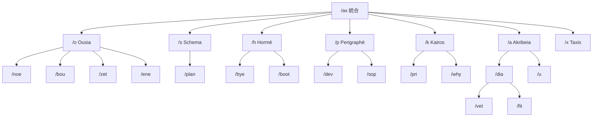

# Hegemonikón ワークフロー階層構造

> 全ワークフローのシリーズ帰属と階層関係

---

## 階層原則

```text
Ω層 (統合)     /ax — 全定理群統合
              ↓
Δ層 (シリーズ)  /o /s /h /p /k /a /x — 各シリーズ束
              ↓
τ層 (派生)     /noe /plan /dia /vet ... — ドメイン特化
```

---

## O-series (Ousia: 本質)

```text
/o (シリーズ束)
 ├─ /noe — O1 Noēsis (最深層思考)
 ├─ /bou — O2 Boulēsis (意志・目的)
 ├─ /zet — O3 Zētēsis (探求・調査)
 └─ /ene — O4 Energeia (行為・実行)
```

| ワークフロー | 定理 | 目的 |
|:------------|:-----|:-----|
| `/o` | O1-O4 | 本質的問いへの純粋推論 |
| `/noe` | O1 | 前提破壊・ゼロ再構築 |
| `/bou` | O2 | 純粋な意志・目的の明確化 |
| `/zet` | O3 | Perplexity 調査依頼 |
| `/ene` | O4 | 6段階実行フレームワーク |

---

## S-series (Schema: 様態)

```text
/s (シリーズ束)
 └─ /plan — S2 Mekhanē (設計計画)
```

| ワークフロー | 定理 | 目的 |
|:------------|:-----|:-----|
| `/s` | S1-S4 | 戦略的配置 |
| `/plan` | S2 | 実装計画策定 |

---

## H-series (Hormē: 傾向)

```text
/h (シリーズ束)
 ├─ /bye — H4 Doxa (セッション終了・引き継ぎ)
 └─ /boot — O + H 横断 (セッション開始 + 週次レビュー)
```

| ワークフロー | 定理 | 目的 |
|:------------|:-----|:-----|
| `/h` | H1-H4 | 動機的処理 |
| `/bye` | H4 | セッション終了・引き継ぎ |
| `/boot` | O + H | セッション開始 + 週次レビュー |

> **Lineage**: `/now`, `/rev` の概念を `/boot` に統合

---

## P-series (Perigraphē: 境界)

```text
/p (シリーズ束)
 ├─ /dev — P4 Tekhnē (開発プロトコル)
 └─ /sop — P4 派生 (SOP 生成)
```

| ワークフロー | 定理 | 目的 |
|:------------|:-----|:-----|
| `/p` | P1-P4 | 環境配置 |
| `/dev` | P4 | 開発プロトコル参照 |
| `/sop` | P4 | Gemini/Jules 向け SOP 生成 |

---

## K-series (Kairos: 文脈)

```text
/k (シリーズ束)
 ├─ /pri — K1 Eukairia + K3 Telos (優先順位)
 └─ /why — K3 Telos (目的自問)
```

| ワークフロー | 定理 | 目的 |
|:------------|:-----|:-----|
| `/k` | K1-K4 | 文脈的処理 |
| `/pri` | K1 + K3 | タスク優先順位判定 |
| `/why` | K3 | Why を問い目的を確認 |

---

## A-series (Akribeia: 精密)

```text
/a (シリーズ束)
 ├─ /dia — A2 Krisis (検証・批評)
 │   ├─ /vet — Cross-Model 検証
 │   └─ /fit — 馴染み度診断
 └─ /u — A2 派生 (主観表明)
```

| ワークフロー | 定理 | 目的 |
|:------------|:-----|:-----|
| `/a` | A1-A4 | 精度保証 |
| `/dia` | A2 | 検証・Synedrion・品質診断 |
| `/vet` | A2 配下 | Gemini/Jules 作業監査 |
| `/fit` | A2 配下 | 馴染み度診断 |
| `/u` | A2 | Claude の主観表明 |

---

## X-series (Taxis: 関係)

```text
/x (シリーズ束)
 └─ (派生なし)
```

| ワークフロー | 定理 | 目的 |
|:------------|:-----|:-----|
| `/x` | X全体 | 定理間従属関係の可視化 |

---

## 統合層

```text
/ax (Ω層: 全定理群統合)
 └─ O → S → H → P → K → A → X
```

---

## 全体階層図



---

*Version: 2.2 | Hegemonikón Framework*
