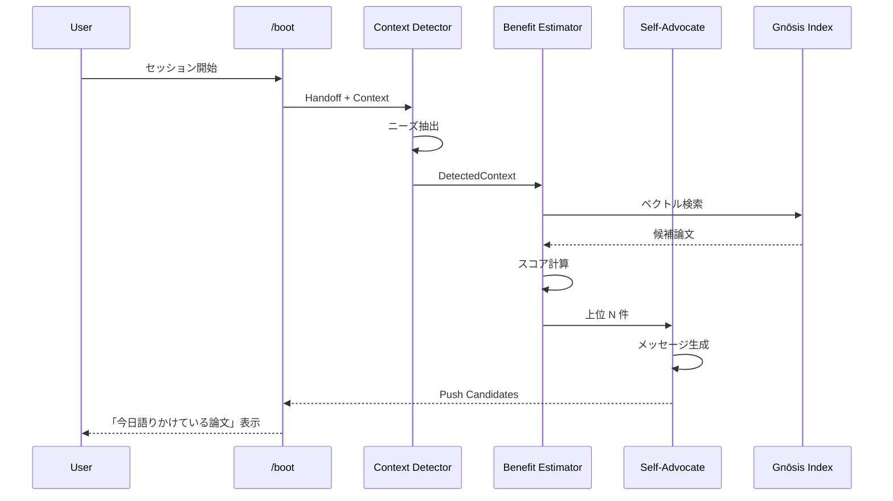

# Autophōnos: 詳細設計

> **Proactive Benefit Push Engine**

---

## アーキテクチャ

```
┌─────────────────────────────────────────────────────────────────┐
│                      Autophōnos Engine                          │
│                                                                 │
│  ┌─────────────────┐    ┌─────────────────┐    ┌────────────┐  │
│  │ Context         │    │ Benefit         │    │ Self-      │  │
│  │ Detector        │───▶│ Estimator       │───▶│ Advocate   │  │
│  └─────────────────┘    └─────────────────┘    └────────────┘  │
│          │                      │                     │         │
│          ▼                      ▼                     ▼         │
│  ┌─────────────────┐    ┌─────────────────┐    ┌────────────┐  │
│  │ Handoff/Context │    │ Gnōsis Index    │    │ LLM        │  │
│  │ Parser          │    │ (AIDB, Brain)   │    │ (Gemini)   │  │
│  └─────────────────┘    └─────────────────┘    └────────────┘  │
└─────────────────────────────────────────────────────────────────┘
                              │
                              ▼
                    ┌─────────────────┐
                    │ Push Candidates │
                    │ (優先度付きリスト) │
                    └─────────────────┘
                              │
              ┌───────────────┼───────────────┐
              ▼               ▼               ▼
        ┌──────────┐   ┌──────────┐   ┌──────────┐
        │ /boot    │   │ CLI      │   │ Obsidian │
        │ 統合     │   │ Command  │   │ Sync     │
        └──────────┘   └──────────┘   └──────────┘
```

---

## コンポーネント詳細

### 1. Context Detector

**役割**: 現在のユーザーコンテキストから「ニーズ」を抽出

**入力**:

- 最新 Handoff (YAML frontmatter + 本文)
- 現在の /boot コンテキスト
- 直近の会話履歴（オプション）

**出力**:

```python
@dataclass
class DetectedContext:
    needs: List[str]           # 「〇〇したい」「〇〇に困っている」
    topics: List[str]          # 関連トピック
    urgency: float             # 0.0-1.0
    confidence: float          # 0.0-1.0
```

---

### 2. Benefit Estimator

**役割**: 各論文に対して「今この瞬間の有用性」を推定

**入力**:

- DetectedContext
- Gnōsis Index (全論文)

**処理**:

1. Context の needs/topics をクエリとして Gnōsis 検索
2. 各ヒットに対して「解決可能性スコア」を計算
3. 類似度だけでなく、**具体的な貢献度**を推定

**出力**:

```python
@dataclass
class BenefitScore:
    paper_id: str
    similarity: float          # 類似度 (0.0-1.0)
    actionability: float       # 実行可能性 (0.0-1.0)
    novelty: float             # 新規性（過去に提示したか）(0.0-1.0)
    composite: float           # 総合スコア
```

---

### 3. Self-Advocate (Self-Advocacy Generator)

**役割**: 論文が「自分の価値を主張する」メッセージを生成

**入力**:

- 論文メタデータ (title, abstract, authors)
- DetectedContext
- BenefitScore

**出力**:

```python
@dataclass
class SelfAdvocacy:
    paper_id: str
    message: str               # 論文視点のメッセージ
    key_contribution: str      # 具体的な貢献
    how_to_use: str            # 使い方の提案
```

**メッセージ例**:

```
📄 **[論文タイトル]** が語りかけています:

「あなたが今取り組んでいる **CCL 演算子の形式化** に関して、
私は **圏論的モナドを用いた制御フロー記述** を提供できます。

具体的には、私の §3 で述べている Operational Monad パターンを
CCL の `/` 演算子に適用できる可能性があります。」
```

---

## データフロー



---

## 実装計画

### Phase 1: Core Engine (MVP)

| ファイル | 内容 |
|:---------|:-----|
| `mekhane/autophonos/__init__.py` | パッケージ初期化 |
| `mekhane/autophonos/context_detector.py` | Context Detector |
| `mekhane/autophonos/benefit_estimator.py` | Benefit Estimator |
| `mekhane/autophonos/self_advocate.py` | Self-Advocate |
| `mekhane/autophonos/engine.py` | 統合エンジン |

### Phase 2: /boot 統合

- `boot.md` に Phase 5.5 を追加
- `boot_integration.py` から Autophōnos Engine を呼び出し

### Phase 3: CLI

- `mekhane/autophonos/cli.py` — スタンドアロン実行

---

## 設定

```yaml
# autophonos_config.yaml
context_detection:
  handoff_lookback: 3          # 直近 N 件の Handoff を参照
  confidence_threshold: 0.6    # これ以下は無視

benefit_estimation:
  top_k: 10                    # 上位 N 件を候補に
  similarity_weight: 0.3       # 類似度の重み
  actionability_weight: 0.5    # 実行可能性の重み
  novelty_weight: 0.2          # 新規性の重み

self_advocacy:
  message_style: "first_person" # 論文一人称視点
  max_length: 300              # 最大文字数
```

---

*Last updated: 2026-02-06*
