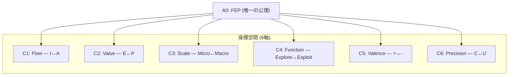

# 📐 公理階層構造 v3.0 (1公理 + 6座標)

> **"FEP から全てが演繹される"**
> Beauty = 演繹量 / トークン数 → FEP は唯一の真の公理

---

## 変更の根拠

v2.1 では7要素を「公理」と呼んでいたが、演繹的運動量の分析により:

| 要素 | Beauty値 | 評価 |
|:-----|:---------|:-----|
| FEP | **10.0** | 唯一の真の公理 |
| Flow | 0.67 | 座標軸 |
| Value | 0.33 | 座標軸 |
| Scale | 1.5 | 座標軸 |
| Function | 1.0 | 座標軸 |
| Valence | 0.75 | 座標軸 |
| Precision | 0.83 | 座標軸 |

> Beauty = 演繹可能性 / 表現コスト (kernel/on_refinement.md)

---

## 総数

| 項目 | 数 | 変更 |
|------|---|------|
| 公理 | **1** | 7→1 |
| 座標 | **6** | NEW |
| 定理 | **24** | 変更なし |
| 関係 | **36** | 変更なし |
| **総計** | **67** | 60→67 |

---

## 唯一の公理

### A0: FEP (自由エネルギー原理)

```
自己組織化システムは内部エントロピーを最小化する
（予測誤差最小化）
```

> これが全ての起点。位置エネルギーの頂点。
> ここから24定理と36関係が演繹される。

---

## 6座標 (Coordinates)

> 座標は公理ではない。FEP が展開される空間を記述する軸である。



| ID | 座標 | Question | Opposition | 旧Level |
|----|------|----------|------------|---------|
| C1 | Flow | Who | I (推論) ↔ A (行為) | L1 |
| C2 | Value | Why | E (認識) ↔ P (実用) | L1 |
| C3 | Scale | Where/When | Micro ↔ Macro | L1.5 |
| C4 | Function | How | Explore ↔ Exploit | L1.5 |
| C5 | Valence | Which | + ↔ - | L1.75 |
| C6 | Precision | How much | C ↔ U | L1.75 |

---

## 定理群（24 = 6×4）— 変更なし

### Poiēsis: 内容の具現化（生成層12）

| 記号 | 名称 | 生成 | 定理 |
|------|------|------|------|
| O | **Ousia** | C1×C2 | O1-O4 |
| S | **Schema** | C1×C3 | S1-S4 |
| H | **Hormē** | C1×C5 | H1-H4 |

### Dokimasia: 条件の詳細化（審査層12）

| 記号 | 名称 | 生成 | 定理 |
|------|------|------|------|
| P | **Perigraphē** | C3×C4 | P1-P4 |
| K | **Kairos** | C3×C5 | K1-K4 |
| A | **Akribeia** | C5×C6 | A1-A4 |

> 定理は座標の組み合わせから生成される。
> 6座標から C(6,2) = 15 ペアが可能だが、
> 実際に有意味な6ペアのみが定理群を生成する。

---

## 個別定理名（24）— 変更なし

### O-series (Ousia)

| ID | 名称 | 意味 |
|----|------|------|
| O1 | Noēsis | 認識推論 (Recursive Self-Evidencing) |
| O2 | Boulēsis | 意志推論 |
| O3 | Zētēsis | 探索行動 |
| O4 | Energeia | 実用行動 |

### S-series (Schema)

| ID | 名称 | 意味 |
|----|------|------|
| S1 | Metron | スケール流動 |
| S2 | Mekhanē | 方法流動 |
| S3 | Stathmos | スケール価値 |
| S4 | Praxis | 方法価値 |

### H-series (Hormē)

| ID | 名称 | 意味 |
|----|------|------|
| H1 | Propatheia | 流動傾向 |
| H2 | Pistis | 流動確信 |
| H3 | Orexis | 価値傾向 |
| H4 | Doxa | 価値確信 |

### P-series (Perigraphē)

| ID | 名称 | 意味 |
|----|------|------|
| P1 | Khōra | スケール場 |
| P2 | Hodos | スケール方法 |
| P3 | Trokhia | 方法スケール |
| P4 | Tekhnē | 方法場 |

### K-series (Kairos)

| ID | 名称 | 意味 |
|----|------|------|
| K1 | Eukairia | スケール傾向 |
| K2 | Chronos | スケール確信 |
| K3 | Telos | 方法傾向 |
| K4 | Sophia | 方法確信 |

### A-series (Akribeia)

| ID | 名称 | 意味 |
|----|------|------|
| A1 | Pathos | 二重傾向 |
| A2 | Krisis | 傾向確信 |
| A3 | Gnōmē | 確信傾向 |
| A4 | Epistēmē | 二重確信 |

---

## X-series: 関係層（36）— 変更なし

| X | 接続 | 数 | 意味 |
|---|------|---|------|
| X-OS | O→S | 8 | 本質→様態 |
| X-SH | S→H | 4 | 様態→傾向 |
| X-SP | S→P | 4 | 様態→条件 |
| X-PK | P→K | 8 | 条件→文脈 |
| X-KA | K→A | 8 | 文脈→精密 |
| X-HA | H→A | 4 | 傾向→精密 |
| **計** | | **36** | |

---

## v2.1 → v3.0 対照表

| v2.1 | v3.0 | 変更理由 |
|:-----|:-----|:---------|
| 7公理 | 1公理 + 6座標 | Beauty値の差 (10.0 vs 0.3-1.5) |
| L0/L1/L1.5/L1.75 | A0 + C1-C6 | 階層表現 → フラット座標 |
| 総数60 | 総数67 | 座標を明示的に計上 |
| 定理24 | 定理24 | **変更なし** |
| 関係36 | 関係36 | **変更なし** |

> **内容は同一。表現がより誠実になった。**

---

*Hegemonikón v3.0-experimental — 1公理体系*
