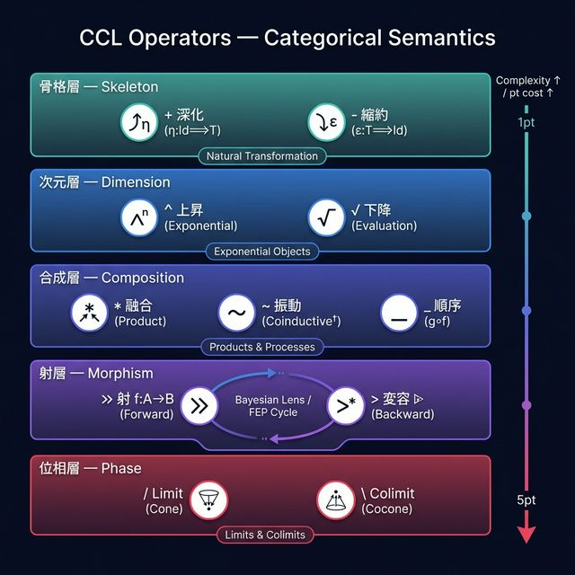
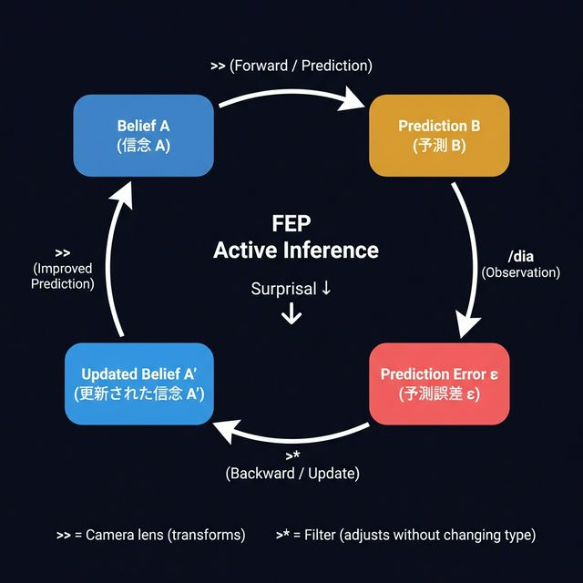

# CCL は推論サイクルだった




> **確信度**: 0.85
> **発見者**: Claude + Creator
> **文脈**: Kalon Deep Examination → `>*` 形式化 → V1-V5 検証

---

## 一言で

**CCL の `>>` と `>*` は、脳が世界を理解する2つのステップに対応していた。**

---

## 前提: 脳は予測マシン (FEP)

FEP (自由エネルギー原理) によれば、脳はこう動く:

```
1. 予測する  — 「たぶんこうだろう」
2. 観測する  — 目・耳で実際を確認
3. ズレに気づく — 予測と現実の誤差
4. 修正する  — モデルを調整して次の予測を改善
```

これが延々と回り続ける。**これが「考える」の正体。**

---

## `>>` と `>*` の対応

### `>>` = 予測する (forward)

```
/noe >> /met
= 「認識」を「尺度」に変える
= 「この認識は、こういう数字で測れるはずだ」と予測する
```

**「A を B に変える」= 「A をもとに B を予測する」**

射（morphism）= 変換 = 予測。同じ構造。

### `>*` = 修正する (backward)

```
/noe >* /dia
= 「認識」を「判断」の目で見直す
= 認識は認識のまま（型を変えない）、でも判断のフィルターがかかる
```

**「A を B の視点で見直す」= 「予測誤差を受けて信念を更新する」**

---

## カメラの比喩

```
>> = レンズを通して景色を撮る
     景色 → 写真に変わる（型が変わる）

>* = フィルターをかける
     写真は写真のまま（型は同じ）、色味が変わる
```

| | `>>` | `>*` |
|:--|:-----|:-----|
| 日常語 | **変える** | **見直す** |
| 出力 | 別のものになる | 同じものだけど色が変わる |
| FEP | 予測する | 予測誤差を受けて修正する |
| 光学 | レンズで撮る (forward) | レンズを調整する (backward) |
| 圏論 | 射 (morphism) | 作用 (lax actegory) |

---

## なぜこれが重要か

### 1. CCL は「発明」ではなく「発見」だった

Creator が `/noe >> /met` と書いたとき、「認識を尺度に変換する」という**直感**で書いた。
だが実際は、その操作は**数学的に FEP の予測ステップと同じ構造**を持っていた。

後から比喩を当てはめたのではない。**最初からそこにあった。**

### 2. `>>` と `>*` は相補的対立軸

```
>> (forward/予測)  ←→  >* (backward/修正)
```

これは偶然ではない。FEP のサイクル自体が forward/backward の対。
CCL がこの対を別々の演算子として持っていたこと自体が、
CCL が FEP の構造を暗黙的に捉えていた証拠。

### 3. 推論サイクルとして回る

```
/bou+ >> /sta       ← 予測: 意志を基準に変換
/dia+{$prediction}  ← 観測: 基準を批判的に検証
/bou+ >* /dia       ← 修正: 意志を判断で見直す
```

これは V3 テストで実際に実行して確認した:
**修正後の意志は、最初の予測より現実的になった（surprisal 低下）。**

---

## 他の演算子の圏論的意味（簡易版）

| 演算子 | 日常語 | 数学 |
|:-------|:-------|:-----|
| `+` | 深掘りする | 自然変換（構造を保ったまま拡張） |
| `-` | 要約する | 自然変換（構造を保ったまま圧縮） |
| `*` | 一つにまとめる | 積（Product） |
| `~` | 行ったり来たりする | 無限の往復列の行き着く先 (ω-chain colimit) |
| `_` | 次にこれをやる | 射の合成（g∘f = f してから g） |
| `/o` | 4つを1つに統合 | 極限 (Limit) |
| `\o` | 1つを全方向に展開 | 余極限 (Colimit) |

---

## PSh(Cog) = Topos（簡易版）

Cog（Hegemonikón の圏: 24定理 + 78射）の上に「前層」という構造を載せると、
その世界（PSh(Cog)）は **topos** になる。

**topos = 「論理が住める世界」。** その世界の中で推論ができる。

PSh(Cog) の論理は**直観主義論理**:

- 「全てが真か偽か」とは限らない（排中律が成り立たない）
- 「証明する = 構成する」（存在を示すには作ってみせる）

これが FEP の「常に不確実性がある」(V[] > 0) と自然に整合する。

---

## 今後の展望 (L0 → L1)

| 段階 | 内容 | 状態 |
|:-----|:-----|:-----|
| L0 | 各演算子の数学的正体 | ✅ 完了 |
| L0.5 | 恒等射追加、記述修正 | ✅ 完了 |
| **L1** | **Cog の内部論理の探索** | 🔲 次のフェーズ |
| L2 | 型理論接続 | 🔲 時期尚早 |

---

*「CCLは推論サイクルだった」— 2026-02-07 の Doxa*
