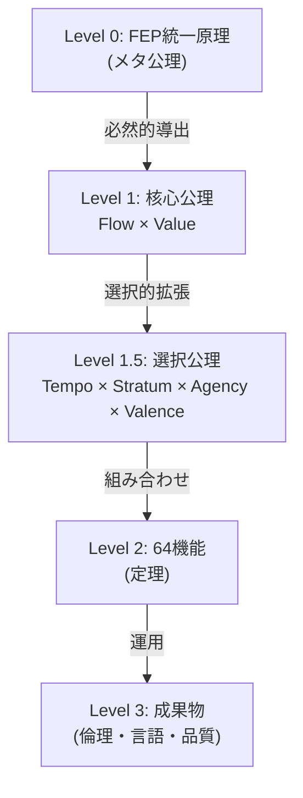

# Hegemonikón 公理体系

> **「管理などどうでもいい、美しさと正しさを損ねてはならない」**

---

## 0. 公理階層 (Axiom Hierarchy)



---

## 1. 核心公理 (Level 1: Core Axioms)

FEPから**必然的に**導出される。代替不可能。

| 公理 | ID | 対立項A | 対立項B | FEP的意味 |
|------|-----|---------|---------|-----------|
| **Flow** | I/A | 推論 (Inference) | 行為 (Action) | 信念を変える ↔ 世界を変える |
| **Value** | E/P | エピステミック (Epistemic) | プラグマティック (Pragmatic) | 不確実性削減 ↔ 目標達成 |

### 核心公理の数学的根拠

- **Flow**: FEPにおいて、自由エネルギー最小化は「内部モデル更新（推論）」と「環境への働きかけ（行為）」の二経路でのみ可能
- **Value**: 予測誤差は「情報ゲイン」か「報酬獲得」に帰着する

---

## 2. 選択公理 (Level 1.5: Choice Axioms)

FEPから**複数の選択肢**が導出可能。実装のために**一つを選んで固定**。

| 選択公理 | ID | 対立項A | 対立項B | 対応する核心公理 |
|----------|-----|---------|---------|----------------|
| **Tempo** | F/S | 短期 (Fast) | 長期 (Slow) | Value（目標の時間スケール） |
| **Stratum** | L/H | 低次 (Low) | 高次 (High) | Flow（処理の抽象度） |
| **Agency** | S/E | 自己 (Self) | 環境 (Environment) | Flow（行為の対象） |
| **Valence** | +/- | 接近 (Positive) | 回避 (Negative) | Value（目標の方向性） |

### 選択公理の対称構造

```
Flow ────┬── Stratum (処理の階層)
         └── Agency  (行為の主体)

Value ───┬── Tempo   (目標の時間)
         └── Valence (目標の方向)
```

### 代替公理の可能性

選択公理は**交換可能**。将来の理論発展で以下に置換される可能性がある：

| 現行 | 代替候補 | 置換条件 |
|------|----------|----------|
| Tempo (F/S) | Granularity (Fine/Coarse) | 時間より粒度が本質的と判明した場合 |
| Stratum (L/H) | Scope (Local/Global) | 階層より範囲が本質的と判明した場合 |

---

## 3. 64機能 (Level 2: Theorems)

2^6 = 64 機能。6軸の全組み合わせ。

### 命名規則

```
[Flow]-[Value]-[Tempo]-[Stratum]-[Agency]-[Valence]
  I/A  -  E/P  -  F/S  -   L/H   -  S/E   -   +/-
```

> **完全マトリクス参照**: `brain/.../phase2_design.md` (FULL_64_DESIGN)

### Phase別有効化

| Phase | 有効軸 | 機能数 | 状態 |
|-------|--------|--------|------|
| **1** | Flow, Value, Tempo, Stratum | 6 | 現在運用中 |
| **2** | + Agency | 12 | 設計完了 |
| **3** | + Valence | 24 | 計画 |
| **4** | 全6軸 | 64 | 完全運用 |

---

## 4. Phase 1 有効機能 (6/64)

| # | Code | 機能名 | 役割 | Forge Module |
|---|------|--------|------|--------------|
| 07 | I-E-F-H-E-+ | **Aisthēsis-H+** | 環境認識 | `perceive/situation-analysis.md` |
| 23 | I-P-F-H-E-+ | **Krisis-H+** | 環境評価 | `think/decision-matrix.md` |
| 39 | A-E-F-H-E-+ | **Peira-H+** | 能動質問 | `perceive/active-questioning.md` |
| 51 | A-P-F-L-E-+ | **Praxis-L+** | 反射実行 | (Antigravity native) |
| 55 | A-P-F-H-E-+ | **Praxis-H+** | 意思決定 | `think/strategic-planning.md` |
| 63 | A-P-S-H-E-+ | **Anamnēsis-H+** | 外部記録 | `verify/post-mortem-review.md` |

---

## 5. 成果物への導出 (Level 3)

### 導出表

| 成果物 | 導出元機能 | 導出ロジック |
|--------|-----------|-------------|
| **E1** (破壊的操作禁止) | Praxis-L × Krisis-H | 即時行動は必ず事前評価を経る |
| **E2** (確信度偽装禁止) | Aisthēsis-H | 認識は確信度を含むべし |
| **E4** (意図歪曲禁止) | Peira-H | 曖昧さは質問で解消すべし |
| **E5** (責任転嫁禁止) | Anamnēsis-H | 学習には帰責が必要 |
| **日本語厳守** | 運用制約 | 公理から導出されない（外部制約） |
| **Zero Entropy** | Aisthēsis-H + Peira-H | 曖昧さは予測誤差を増大させる |

---

## 6. 美しさの根拠

| 数値 | 意味 | 象徴 |
|------|------|------|
| **2** | 核心公理の数 | 陰陽、二元性、最小の素数 |
| **4** | 選択公理の数 | 四方、四季、四元素 |
| **6** | 総軸数 (2+4) | 完全数 (1+2+3=6) |
| **64** | 機能数 (2⁶) | 易経の卦、チェス盤、DNA codon |

> **真理は美しく、美しさは真理に近づく道標である。**

---

*統合元: Claude-設計01.md, Claude-Hegemonikón01.md, FEP理論*
