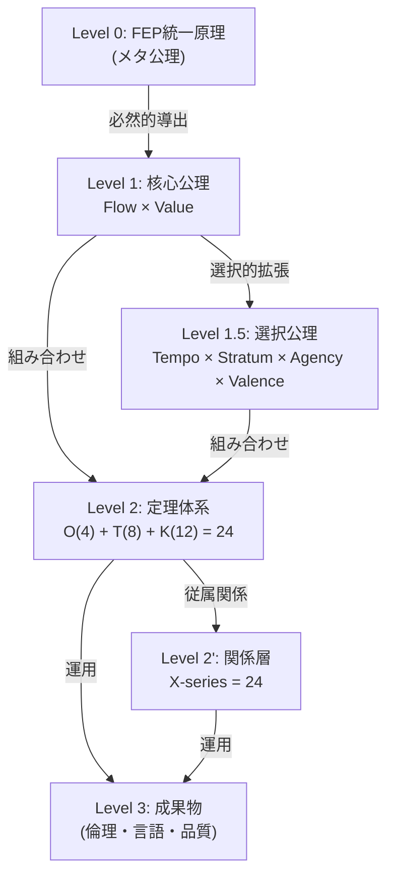

# Hegemonikón 公理体系

> **「管理などどうでもいい、美しさと正しさを損ねてはならない」**

---

## 0. 公理階層 (Axiom Hierarchy)



> **正本**: `kernel/axiom_hierarchy.md` (48定理体系)

---

## 1. 核心公理 (Level 1: Core Axioms)

FEPから**必然的に**導出される。代替不可能。

| 公理 | ID | 対立項A | 対立項B | FEP的意味 |
|------|-----|---------|---------|-----------|
| **Flow** | I/A | 推論 (Inference) | 行為 (Action) | 信念を変える ↔ 世界を変える |
| **Value** | E/P | エピステミック (Epistemic) | プラグマティック (Pragmatic) | 不確実性削減 ↔ 目標達成 |

### 核心公理の数学的根拠

- **Flow**: FEPにおいて、自由エネルギー最小化は「内部モデル更新（推論）」と「環境への働きかけ（行為）」の二経路でのみ可能
- **Value**: 予測誤差は「情報ゲイン」か「報酬獲得」に帰着する

---

## 2. 選択公理 (Level 1.5: Choice Axioms)

FEPから**複数の選択肢**が導出可能。実装のために**一つを選んで固定**。

| 選択公理 | ID | 対立項A | 対立項B | 対応する核心公理 |
|----------|-----|---------|---------|----------------|
| **Tempo** | F/S | 短期 (Fast) | 長期 (Slow) | Value（目標の時間スケール） |
| **Stratum** | L/H | 低次 (Low) | 高次 (High) | Flow（処理の抽象度） |
| **Agency** | S/E | 自己 (Self) | 環境 (Environment) | Flow（行為の対象） |
| **Valence** | +/- | 接近 (Positive) | 回避 (Negative) | Value（目標の方向性） |

### 選択公理の対称構造

```
Flow ────┬── Stratum (処理の階層)
         └── Agency  (行為の主体)

Value ───┬── Tempo   (目標の時間)
         └── Valence (目標の方向)
```

### 代替公理の可能性

選択公理は**交換可能**。将来の理論発展で以下に置換される可能性がある：

| 現行 | 代替候補 | 置換条件 |
|------|----------|----------|
| Tempo (F/S) | Granularity (Fine/Coarse) | 時間より粒度が本質的と判明した場合 |
| Stratum (L/H) | Scope (Local/Global) | 階層より範囲が本質的と判明した場合 |

## 3. 定理体系 (Level 2: Theorem Series)

> **正本**: `kernel/axiom_hierarchy.md`

### 数学的構造

| シリーズ | 生成方法 | 積記法 | 数 |
|---------|----------|--------|-----|
| **O-series (Ousia)** | 核心 × 核心 | 2 × 2 | **4** |
| **T-series (Tropos)** | 核心 × 選択 | 2 × 4 | **8** |
| **K-series (Kairos)** | 選択 × 選択 | 4 × 3 | **12** |
| **X-series (Taxis)** | 従属関係 | — | **24** |
| **総計** | — | — | **48** |

> **美しさ**: 4 + 8 + 12 = 24 (定理) + 24 (関係) = 48 (完全系)

### O-series: 純粋定理 (Ousia)

| ID | ギリシャ名 | FEP的役割 |
|----|-----------|----------|
| O1 | **Noēsis** | 世界モデル更新 |
| O2 | **Boulēsis** | 選好モデル更新 |
| O3 | **Zētēsis** | 能動的情報収集 |
| O4 | **Energeia** | 目標達成行動 |

### T-series: 拡張定理 (Tropos)

| ID | ギリシャ名 | FEP的役割 |
|----|-----------|----------|
| T1 | **Aisthēsis** | 知覚・感覚入力 |
| T2 | **Krisis** | 判断・意思決定 |
| T3 | **Theōria** | 内省・自己モデル |
| T4 | **Phronēsis** | 戦略・環境計画 |
| T5 | **Peira** | 探索・即時収集 |
| T6 | **Praxis** | 実行・行動遂行 |
| T7 | **Dokimē** | 検証・仮説確認 |
| T8 | **Anamnēsis** | 記憶・保存 |

### K-series: 文脈定理 (Kairos)

選択公理間の有向従属関係（K1-K12）。
> 詳細: `kernel/kairos.md`

### X-series: 関係層 (Taxis)

定理間の従属関係（X-O: 4, X-T: 8, X-K: 12）。
> 詳細: `kernel/taxis.md`

---

## 5. 成果物への導出 (Level 3)

### 導出表

| 成果物 | 導出元機能 | 導出ロジック |
|--------|-----------|-------------|
| **E1** (破壊的操作禁止) | Praxis-L × Krisis-H | 即時行動は必ず事前評価を経る |
| **E2** (確信度偽装禁止) | Aisthēsis-H | 認識は確信度を含むべし |
| **E4** (意図歪曲禁止) | Peira-H | 曖昧さは質問で解消すべし |
| **E5** (責任転嫁禁止) | Anamnēsis-H | 学習には帰責が必要 |
| **日本語厳守** | 運用制約 | 公理から導出されない（外部制約） |
| **Zero Entropy** | Aisthēsis-H + Peira-H | 曖昧さは予測誤差を増大させる |

---

## 5. 美しさの根拠

| 数値 | 意味 | 象徴 |
|------|------|------|
| **2** | 核心公理の数 | 陰陽、二元性、最小の素数 |
| **4** | 選択公理/O-seriesの数 | 四方、四季、四元素 |
| **12** | 基本機能 (4+8) | 12ヶ月、12音階 |
| **24** | 定理/関係の数 | 24時間、24節気 |
| **48** | 完全系 (24+24) | 完全な整合性 |

> **真理は美しく、美しさは真理に近づく道標である。**

---

*統合元: kernel/axiom_hierarchy.md, kernel/ousia.md, kernel/tropos.md*
