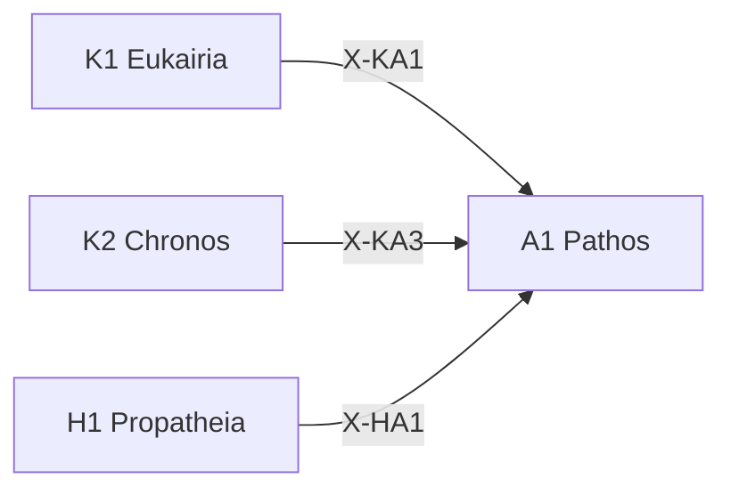

---
# Theorem Metadata (v2.1)
id: "A1"
name: "Pathos"
greek: "Πάθος"
series: "Akribeia"
generation:
  formula: "Valence × Valence"
  result: "二重傾向 — 傾向の傾向"

description: >
  この判断に対してどう感じる？・メタ感情・傾向の傾向を評価したい時に発動。
  Meta-level emotional assessment, second-order preferences.
  Use for: 感情, メタ感情, 傾向の傾向, 二重評価.
  NOT for: first-order emotional assessment (use H1/H3).

triggers:
  - メタ感情の評価
  - 二次的傾向の検出
  - 感情への感情

keywords:
  - pathos
  - emotion
  - passion
  - feeling
  - meta-emotion
  - 感情
  - 情念

related:
  upstream:
    - "K1 Eukairia"
    - "K2 Chronos"
    - "H1 Propatheia"
  downstream: []
  x_series:
    - "← X-KA1 ← K1 Eukairia"
    - "← X-KA3 ← K2 Chronos"
    - "← X-HA1 ← H1 Propatheia"

implementation:
  micro: "(implicit)"
  macro: "(future)"
  templates:
    - "旧K5-K8 の傾向判定"

version: "2.1.0"
workflow_ref: ".agent/workflows/pat.md"
risk_tier: L1
reversible: true
requires_approval: false
risks:
  - "判断基準の誤適用による過信・過少評価"
fallbacks: []
---

# A1: Pathos (Πάθος)

> **生成**: Valence × Valence
> **役割**: 傾向の傾向（二重傾向）

## When to Use

### ✓ Trigger

- メタ感情の評価
- 「この判断に対してどう感じるか」
- 二次的傾向の検出

### ✗ Not Trigger

- 一次的傾向の評価（→ H1/H3）

## Processing Logic

```
入力: 一次傾向
  ↓
[STEP 1] 一次傾向の傾向評価
  ├─ + → +: 強化（この良さを歓迎）
  ├─ + → -: 矛盾（この良さに不安）
  ├─ - → +: 受容（この悪さから学ぶ）
  └─ - → -: 強化（この悪さを忌避）
  ↓
出力: 二重傾向パターン
```

## X-series 接続



---

*Pathos: アリストテレス修辞学における「情念・感情・受難」*

---

## Related Modes

このスキルに関連する `/pat` WFモード (5件):

| Mode | CCL | 用途 |
|:-----|:----|:-----|
| rece | `/pat.rece` | 受容的評価 |
| tran | `/pat.tran` | 転換評価 |
| regu | `/pat.regu` | 調整評価 |
| delta | `/pat.delta` | 変化追跡 |
| neutral | `/pat.neutral` | 中立評価 |
