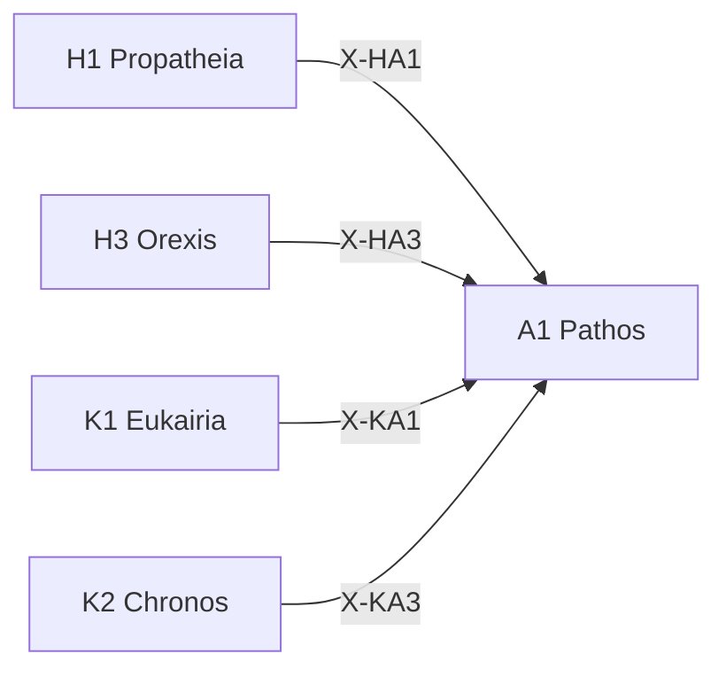

---
# Theorem Metadata (v3.0)
id: "A1"
name: "Pathos"
greek: "Πάθος"
series: "Akribeia"
generation:
  formula: "Valence × Precision"
  result: "傾向精密 — 感情の精緻な認識"

description: >
  何を感じている？・感情の正体を知りたい・メタ感情を把握したい時に発動。
  Precise emotional awareness, meta-emotion recognition, affect labeling.
  Use for: 感情, emotion, 何を感じている, affect.
  NOT for: simple sentiment (positive/negative判定のみ).

triggers:
  - メタ感情の検出
  - 感情の精緻な言語化
  - 二重傾向の認識
  - /pat コマンド

keywords:
  - pathos
  - emotion
  - affect
  - feeling
  - meta-emotion
  - 感情
  - 情念

related:
  upstream:
    - "H1 Propatheia (X-HA1: 直感→感情の精緻化)"
    - "H3 Orexis (X-HA3: 欲求→欲求の正体)"
    - "K1 Eukairia (X-KA1: 好機→感情的反応)"
    - "K2 Chronos (X-KA3: 時間圧→時間制約下の感情)"
  downstream: []

implementation:
  micro: ".agent/workflows/pat.md"
  macro: "(future)"

version: "3.0.0"
workflow_ref: ".agent/workflows/pat.md"
risk_tier: L1
reversible: true
requires_approval: false
risks: ["none identified"]
fallbacks: ["manual execution"]
---

# A1: Pathos (Πάθος)

> **生成**: Valence × Precision
> **役割**: 感情の精緻な認識
> **認知的意味**: 「自分は何を感じているのか」を正確に言語化する

## When to Use

### ✓ Trigger

- 漠然とした感情の正体を知りたいとき
- 「なんとなくモヤモヤ」を精緻化したいとき
- 二重傾向の検出 (A に対して B を感じることへの感情)
- Creator の感情的反応が行動に影響しているとき

### ✗ Not Trigger

- 単なる positive/negative 判定 → `/pro` で十分
- 感情が行動に無関係なとき

## Processing Logic

```
入力: 感情的反応 / 状況
  ↓
[STEP 1] 一次感情の同定
  ├─ 接近系: 興味, 期待, 喜び, 愛着
  └─ 回避系: 不安, 怒り, 悲しみ, 嫌悪
  ↓
[STEP 2] メタ感情の検出
  ├─ 一次感情への感情 (例: 不安を感じることへの恥)
  └─ 二重傾向パターンの識別
  ↓
[STEP 3] 感情の精緻な言語化
  ├─ 強度 (0-1)
  ├─ 対象 (何に対して)
  └─ 時間的変化 (増大/安定/減衰)
  ↓
出力: [感情ラベル, 強度, メタ感情, 行動への影響]
```

## X-series 接続

> **自然度**: 体感（無意識に起きる遷移）

### 入力射 (→ A1 に流れ込む)

| X | Source | 意味 | CCL |
|:--|:-------|:-----|:----|
| X-HA1 | H1 Propatheia | 直感→感情の精緻な認識 | `/pro >> /pat` |
| X-HA3 | H3 Orexis | 欲求→欲求の正体を感じ取る | `/ore >> /pat` |
| X-KA1 | K1 Eukairia | 好機→機会への感情的反応 | `/euk >> /pat` |
| X-KA3 | K2 Chronos | 時間圧→制約下の感情 | `/chr >> /pat` |

### 出力射

A1 は Akribeia (精密層) の感情軸であり、**体系の感情的終端**。
出力射は少ないが、感情認識はメタ認知アウトプットとして全体に影響する。



## CCL 使用例

```ccl
# 直感を精緻な感情認識に深化
/pro{first_reaction: "モヤモヤ"} >> /pat{identify: true}

# 時間圧下の感情を言語化
/chr{deadline: "tonight"} >> /pat{check: "焦りか恐怖か"}

# メタ感情チェーン
/pat{emotion: "不安"} >> /pat{meta: "不安への恥ずかしさ"}
```

## アンチパターン

| ❌ やってはいけない | 理由 |
|:-------------------|:-----|
| 感情を判断材料にする | Pathos は認識のみ。判断は Krisis (A2) |
| 感情を「解決」しようとする | Pathos は観測。感情を消すツールではない |
| positive/negative の二値化 | 精緻な言語化が目的。二値なら `/pro` で十分 |

## 派生モード

| Mode | CCL | 用途 |
|:-----|:----|:-----:|
| label | `/pat.label` | 感情ラベリング |
| meta | `/pat.meta` | メタ感情分析 |
| dual | `/pat.dual` | 二重傾向パターン |


## 🧠 WM (Working Memory) — 必須出力

> **SE原則**: 全 WF 出力に WM セクションを含めること（省略不可）

```markdown
## 🧠 WM (Working Memory)

$goal = {この WF 実行の目的}
$constraints = {制約・前提条件}
$decision = {主要な判断とその根拠}
$next = {次のアクション}
```
---

*Pathos: 古代ギリシャにおける「受動的経験・情念・苦しみ」*
*v3.0: X-series全接続 + 認知的意味 + アンチパターン追加 (2026-02-07)*
