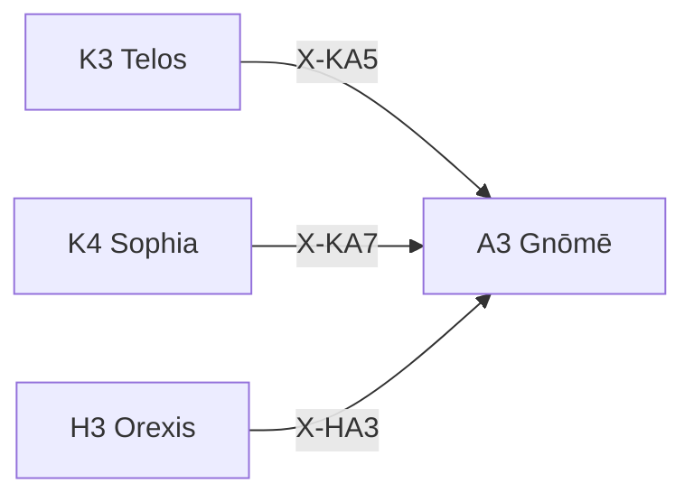

---
# Theorem Metadata (v2.1)
id: "A3"
name: "Gnōmē"
greek: "Γνώμη"
series: "Akribeia"
generation:
  formula: "Precision × Valence"
  result: "確信傾向 — 確信に基づく傾向"

description: >
  教訓は？・格言として残したい・原則を作りたい時に発動。
  Principle-based judgments, maxim extraction, wisdom-based recommendations.
  Use for: 格言, 原則, 教訓, principle, maxim.
  NOT for: special case processing.

triggers:
  - 原則に基づく判断
  - 格言・教訓の抽出
  - 知恵に基づく見解

keywords:
  - gnome
  - maxim
  - principle
  - opinion
  - insight
  - 格言
  - 見解

related:
  upstream:
    - "K3 Telos"
    - "K4 Sophia"
    - "H3 Orexis"
  downstream: []
  x_series:
    - "← X-KA5 ← K3 Telos"
    - "← X-KA7 ← K4 Sophia"
    - "← X-HA3 ← H3 Orexis"

implementation:
  micro: "(implicit)"
  macro: "(future)"
  templates:
    - "旧K9-K12 の確信判定"

version: "2.1.0"
workflow_ref: ".agent/workflows/gno.md"
---

# A3: Gnōmē (Γνώμη)

> **生成**: Precision × Valence
> **役割**: 確信に基づく傾向

## When to Use

### ✓ Trigger

- 原則・格言の適用
- 経験に基づく見解の形成
- 一般化可能な教訓の抽出

### ✗ Not Trigger

- 特殊事例の処理

## Processing Logic

```
入力: 状況 + 知識ベース
  ↓
[STEP 1] 確信度評価
  ├─ C: 確立された知識
  └─ U: 暫定的知識
  ↓
[STEP 2] 傾向抽出
  ├─ +: 推奨される行動
  └─ -: 避けるべき行動
  ↓
出力: 格言・原則 + 適用指針
```

## X-series 接続



---

*Gnōmē: アリストテレス修辞学における「格言・箴言・判断力」*

---

## Related Modes

このスキルに関連する `/gno` WFモード (23件):

| Mode | CCL | 用途 |
|:-----|:----|:-----|
| disc | `/gno.disc` | 原則発見 |
| extr | `/gno.extr` | 原則抽出 |
| appl | `/gno.appl` | 原則適用 |
| analogy | `/gno.analogy` | アナロジー推論 |
| analogy_structure | `/gno.analogy_structure` | 構造的類推 |
| analogy_surface | `/gno.analogy_surface` | 表面的類推 |
| analogy_negative | `/gno.analogy_negative` | 否定的類推 |
| analogy_cross | `/gno.analogy_cross` | 領域横断類推 |
| analogy_history | `/gno.analogy_history` | 歴史類推 |
| analogy_cs | `/gno.analogy_cs` | CS類推 |
| analogy_physics | `/gno.analogy_physics` | 物理類推 |
| analogy_ecology | `/gno.analogy_ecology` | 生態類推 |
| metaphor | `/gno.metaphor` | メタファー |
| personify | `/gno.personify` | 擬人化 |
| assumption | `/gno.assumption` | 前提抽出 |
| invariant | `/gno.invariant` | 不変量発見 |
| symmetry | `/gno.symmetry` | 対称性 |
| rule | `/gno.rule` | ルール抽出 |
| principle | `/gno.principle` | 原則抽出 |
| story | `/gno.story` | 物語化 |
| check | `/gno.check` | 前提確認 |
| lit | `/gno.lit` | Prompt Literacy |
