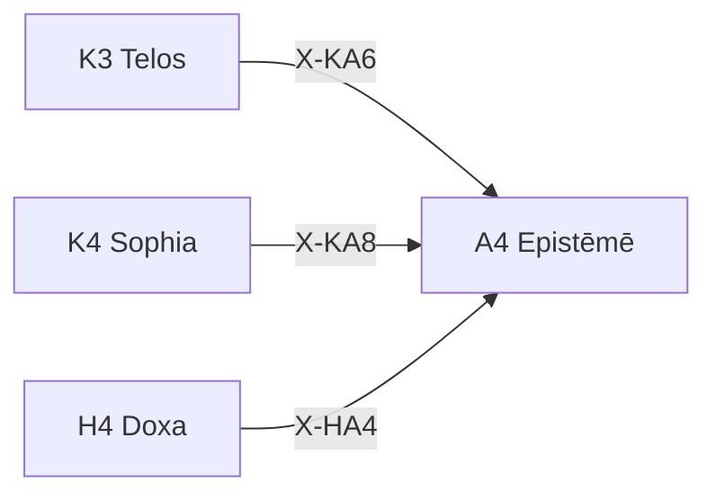

---
# Theorem Metadata (v2.1)
id: "A4"
name: "Epistēmē"
greek: "Ἐπιστήμη"
series: "Akribeia"
generation:
  formula: "Precision × Precision"
  result: "二重確信 — 知識の確実性"

description: >
  これは確実な知識？・信念を知識に昇格させたい時に発動。
  Knowledge establishment, certainty verification, doxa to episteme transition.
  Use for: 知識, 確実, 真理, knowledge, certain.
  NOT for: tentative judgments (use O3 Zētēsis).

triggers:
  - 知識の確立
  - 確実性の最大化
  - ドクサからエピステーメーへ

keywords:
  - episteme
  - knowledge
  - science
  - certain
  - truth
  - 知識
  - 真理

related:
  upstream:
    - "K3 Telos"
    - "K4 Sophia"
    - "H4 Doxa"
  downstream: []
  x_series:
    - "← X-KA6 ← K3 Telos"
    - "← X-KA8 ← K4 Sophia"
    - "← X-HA4 ← H4 Doxa"

implementation:
  micro: "(implicit)"
  macro: "mekhane/gnosis/"
  templates: []

version: "2.1.0"
workflow_ref: ".agent/workflows/epi.md"
---

# A4: Epistēmē (Ἐπιστήμη)

> **生成**: Precision × Precision
> **役割**: 知識の確実性（二重確信）

## When to Use

### ✓ Trigger

- 知識の確立・検証
- 確実性の最大化
- 信念（Doxa）から知識（Epistēmē）への昇格

### ✗ Not Trigger

- 暫定的判断
- 探索的思考

## Processing Logic

```
入力: 候補知識
  ↓
[STEP 1] 確信度 × 確信度 評価
  ├─ C × C: 確立された知識
  ├─ C × U: 部分的確信
  ├─ U × C: 部分的確信
  └─ U × U: 未確立
  ↓
[STEP 2] 知識ステータス決定
  ├─ Epistēmē: 確実な知識
  ├─ Doxa: 信念（要検証）
  └─ Hypothesis: 仮説（要調査）
  ↓
出力: 知識判定 + ステータス
```

## X-series 接続



---

*Epistēmē: プラトン・アリストテレス認識論における「真の知識・科学」— Doxa（信念）と対置*

---

## Related Modes

このスキルに関連する `/epi` WFモード (12件):

| Mode | CCL | 用途 |
|:-----|:----|:-----|
| prac | `/epi.prac` | 実践知 |
| theo | `/epi.theo` | 理論知 |
| tech | `/epi.tech` | 技術知 |
| case | `/epi.case` | 事例知識 |
| transfer | `/epi.transfer` | 知識転移 |
| pattern | `/epi.pattern` | パターン知識 |
| statistical | `/epi.statistical` | 統計知識 |
| base_rate | `/epi.base_rate` | ベースレート |
| reuse | `/epi.reuse` | 知識再利用 |
| triz40 | `/epi.triz40` | TRIZ40発明原理 |
| generalize | `/epi.generalize` | 一般化 |
