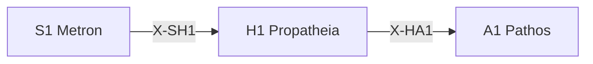

---
# Theorem Metadata (v2.1)
id: "H1"
name: "Propatheia"
greek: "Προπάθεια"
series: "Hormē"
generation:
  formula: "Flow × Valence"
  result: "流動傾向 — 推論/行為がどちらに向かうか"

description: >
  直感的にどう感じる？・第一印象・接近/回避の傾向を知りたい時に発動。
  Initial emotional tendencies, first impressions, approach/avoidance impulses.
  Use for: 直感, 第一印象, 傾向, intuition.
  NOT for: deliberate judgment (requires reflection).

triggers:
  - 初期傾向の検出
  - 直感的反応
  - 接近/回避の判断

keywords:
  - propatheia
  - pre-emotion
  - tendency
  - inclination
  - intuition
  - 傾向
  - 直感

related:
  upstream:
    - "S1 Metron"
  downstream:
    - "A1 Pathos"
  x_series:
    - "← X-SH1 ← S1 Metron"
    - "X-HA1 → A1 Pathos"

implementation:
  micro: "(implicit)"
  macro: "(future)"
  templates: []

derivatives:
  appr:
    name: "Approach (接近)"
    description: "魅力・興味・ポジティブ傾向"
  avoi:
    name: "Avoidance (回避)"
    description: "危険・不安・ネガティブ傾向"
  arre:
    name: "Arrest (保留)"
    description: "判断保留・不確実・Epochē"

version: "2.2.0"
workflow_ref: ".agent/workflows/pro.md"
---

# H1: Propatheia (Προπάθεια)

> **生成**: Flow × Valence
> **役割**: 推論/行為がどちらに向かうか

## When to Use

### ✓ Trigger

- 初期傾向の検出
- 接近 (+) vs 回避 (-) の直感的判断
- 第一印象の評価

### ✗ Not Trigger

- 熟慮された判断が必要

## Processing Logic

```
入力: 対象
  ↓
[STEP 1] 傾向検出
  ├─ + (接近): 良い・望ましい
  └─ - (回避): 悪い・避けたい
  ↓
[STEP 2] 傾向の強度評価
  ↓
出力: 傾向ベクトル (方向, 強度)
```

## X-series 接続



---

*Propatheia: ストア派における「前感情」— 理性の判断前の最初の動き*

---

## Related Modes

このスキルに関連する `/pro` WFモード (5件):

| Mode | CCL | 用途 |
|:-----|:----|:-----|
| appr | `/pro.appr` | 接近傾向 |
| avoi | `/pro.avoi` | 回避傾向 |
| arre | `/pro.arre` | 保留判断 |
| random | `/pro.random` | ランダム |
| forecast | `/pro.forecast` | 予測評価 |
