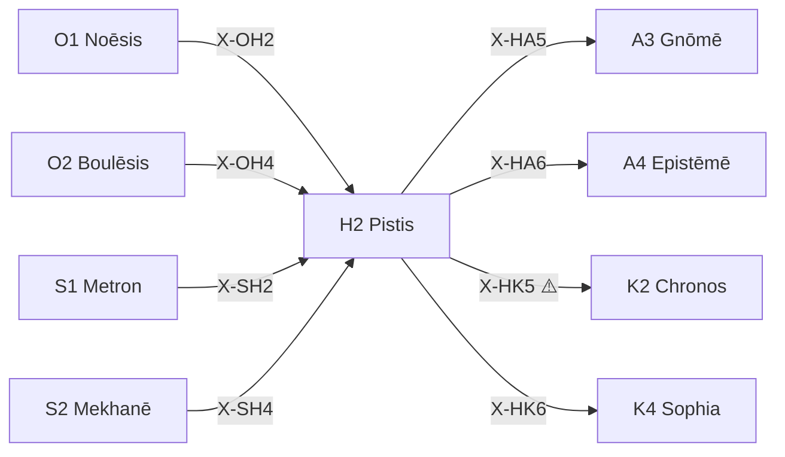

---
# Theorem Metadata (v3.0)
id: "H2"
name: "Pistis"
greek: "Πίστις"
series: "Hormē"
generation:
  formula: "Flow × Precision"
  result: "流動確信 — 推論/行為の確信度"

description: >
  どのくらい確か？・確信度を評価したい・信頼できる？時に発動。
  Confidence assessment, trust evaluation, certainty in current approach.
  Use for: 確信, 信頼, certainty, どのくらい確か.
  NOT for: confidence already clear (proceed directly).

triggers:
  - 確信度の評価
  - 信頼性判断
  - 推論の確度チェック
  - /m コマンド (本気モード)
  - 不確実性 > 0.5

keywords:
  - pistis
  - confidence
  - trust
  - belief
  - certainty
  - 確信
  - 信頼

related:
  upstream:
    - "O1 Noēsis (X-OH2: 深い認識→確信度)"
    - "O2 Boulēsis (X-OH4: 目的意識→意志の確からしさ)"
    - "S1 Metron (X-SH2: スケール設定→測定への確信)"
    - "S2 Mekhanē (X-SH4: 方法選択→方法への確信)"
  downstream:
    - "A3 Gnōmē (X-HA5: 確信→原則抽出)"
    - "A4 Epistēmē (X-HA6: 確信→知識昇格)"
    - "K2 Chronos (X-HK5: 確信→時間感覚支配)"
    - "K4 Sophia (X-HK6: 確信→知るべきことを決定)"

implementation:
  micro: ".agent/workflows/pis.md"
  macro: "(future)"

version: "3.0.0"
workflow_ref: ".agent/workflows/pis.md"
risk_tier: L1
reversible: true
requires_approval: false
risks:
  - "過信による盲点 (X-HK5: 確信が時間感覚を歪める)"
  - "確信と知識の混同 (Pistis ≠ Epistēmē)"
fallbacks: []
---

# H2: Pistis (Πίστις)

> **生成**: Flow × Precision
> **役割**: 推論/行為の確信度を評価する
> **認知的意味**: 「今の自分はどのくらい確かか」を正直に測る

## When to Use

### ✓ Trigger

- 確信度の評価が必要なとき
- 現在のアプローチへの信頼性判断
- 不確実性のチェック (U スコア)
- 行動前の「本当にこれでいいか」
- `/m` コマンド (本気モード = Pistis の制度化)

### ✗ Not Trigger

- 確信度が既に明確
- 単なる確認作業 (事実の照合)

## Processing Logic

```
入力: 推論/行為/判断
  ↓
[STEP 1] 確信度の自己評価
  ├─ 主観的確信: 「自分はどう感じるか」
  ├─ 客観的確信: 「根拠となるエビデンスは何か」
  └─ 較正: 主観と客観のギャップは？
  ↓
[STEP 2] 確信度スコア算出 (0-1)
  ├─ Certain    (> 0.8): 高確信 → 行動推奨
  ├─ Estimated  (0.4-0.8): 中確信 → 追加検証推奨
  └─ Hypothetical (< 0.4): 低確信 → /dia.epo 推奨
  ↓
[STEP 3] 確信の根拠を言語化
  ├─ 何が確信の源か (経験? 論理? 直感?)
  └─ 確信を変えるには何が必要か
  ↓
出力: [確信度スコア, 根拠, 次ステップ推奨]
```

## X-series 接続 (全8ペア)

> **自然度**: 反省（注意を向ければ気づく遷移）

### 入力射 (→ H2 に流れ込む)

| X | Source | 意味 | CCL |
|:--|:-------|:-----|:----|
| X-OH2 | O1 Noēsis | 深い認識→理解に対する確信度 | `/noe >> /pis` |
| X-OH4 | O2 Boulēsis | 目的意識→意志の確からしさ | `/bou >> /pis` |
| X-SH2 | S1 Metron | スケール設定→測定への確信度 | `/met >> /pis` |
| X-SH4 | S2 Mekhanē | 方法選択→方法への確信度 | `/mek >> /pis` |

### 出力射 (H2 から流れ出す)

| X | Target | 意味 | CCL |
|:--|:-------|:-----|:----|
| X-HA5 | A3 Gnōmē | 確信→確信から原則を抽出 | `/pis >> /gno` |
| X-HA6 | A4 Epistēmē | 確信→確信を知識に昇格 | `/pis >> /epi` |
| X-HK5 | K2 Chronos | 確信→確信度が時間感覚を支配 ⚠️ | `/pis >> /chr` |
| X-HK6 | K4 Sophia | 確信→確信が「何を知るべきか」を決定 | `/pis >> /sop` |



## CCL 使用例

```ccl
# 方法選択後の確信評価
/mek+{plan: "Phase D1"} >> /pis{honest: true}

# 確信→知識昇格パイプライン
/pis{score: 0.9, evidence: "検証済み"} >> /epi{formalize: true}

# 確信が低い → 判断停止
/pis{score: 0.3} >> /dia.epo{suspend: true}

# 振動: 方法と確信を行き来する
/mek ~ /pis
```

## アンチパターン

| ❌ やってはいけない | 理由 |
|:-------------------|:-----|
| 確信度を操作する | Pistis は**観測する**もの。意図的に上下させない |
| 確信 = 知識と混同する | Pistis (主観的確信) ≠ Epistēmē (検証済み知識) |
| 高確信で急ぐ | X-HK5 のバイアス: 確信→時間感覚歪曲。高確信でも `/chr` を確認 |
| 低確信を隠す | Hegemonikón 第3指令: Epistemic Humility。不確実は明示すべき |

## 派生モード

| Mode | CCL | 用途 |
|:-----|:----|:-----:|
| subj | `/pis.subj` | 主観的確信のみ評価 |
| obje | `/pis.obje` | 客観的確信 (エビデンス重視) |
| inte | `/pis.inte` | 主観×客観の統合確信 |
| calibrate | `/pis.calibrate` | 主観と客観の較正 |
| bayes | `/pis.bayes` | ベイズ更新で確信を修正 |
| probabilistic | `/pis.probabilistic` | 確率表現で確信を宣言 |
| uncertainty | `/pis.uncertainty` | 不確実性の構造分析 |


## 🧠 WM (Working Memory) — 必須出力

> **SE原則**: 全 WF 出力に WM セクションを含めること（省略不可）

```markdown
## 🧠 WM (Working Memory)

$goal = {この WF 実行の目的}
$constraints = {制約・前提条件}
$decision = {主要な判断とその根拠}
$next = {次のアクション}
```
---

*Pistis: 古代ギリシャにおける「信頼・確信・信仰」*
*v3.0: X-series 全接続 + 認知的意味 + アンチパターン追加 (2026-02-07)*
