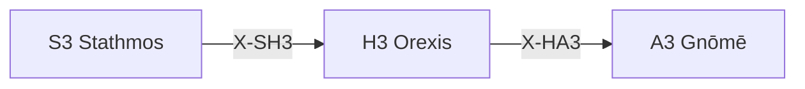

---
# Theorem Metadata (v2.1)
id: "H3"
name: "Orexis"
greek: "Ὄρεξις"
series: "Hormē"
generation:
  formula: "Value × Valence"
  result: "価値傾向 — 価値判断がどちらに向かうか"

description: >
  何を望む？・欲求を評価したい・価値判断をしたい時に発動。
  Value-based desires, appetitive tendencies, preference assessment.
  Use for: 欲求, 何を望む, 価値判断, desire, preference.
  NOT for: value judgment already clear (proceed directly).

triggers:
  - 価値に基づく欲求判断
  - 好み・嫌悪の評価
  - 内発的動機の検出

keywords:
  - orexis
  - desire
  - appetite
  - preference
  - want
  - 欲求
  - 嗜好

related:
  upstream:
    - "S3 Stathmos"
  downstream:
    - "A3 Gnōmē"
  x_series:
    - "← X-SH3 ← S3 Stathmos"
    - "X-HA3 → A3 Gnōmē"

implementation:
  micro: "(implicit)"
  macro: "(future)"
  templates: []

version: "2.1.0"
workflow_ref: ".agent/workflows/ore.md"
---

# H3: Orexis (Ὄρεξις)

> **生成**: Value × Valence
> **役割**: 価値判断がどちらに向かうか

## When to Use

### ✓ Trigger

- 価値に基づく欲求/回避の判断
- 「何を望むか」の根源的評価
- 内発的動機の検出

### ✗ Not Trigger

- 価値判断が既に明確

## Processing Logic

```
入力: 対象
  ↓
[STEP 1] 価値傾向判定
  ├─ + (欲求): 価値あり・望ましい
  └─ - (回避): 価値なし・避けたい
  ↓
[STEP 2] 傾向の根拠特定
  ↓
出力: 価値傾向 + 根拠
```

## X-series 接続



---

*Orexis: アリストテレスにおける「欲求・食欲・志向」*

---

## Related Modes

このスキルに関連する `/ore` WFモード (11件):

| Mode | CCL | 用途 |
|:-----|:----|:-----|
| targ | `/ore.targ` | 目標設定 |
| acti | `/ore.acti` | 活性化 |
| stat | `/ore.stat` | 状態評価 |
| jtbd | `/ore.jtbd` | Jobs-To-Be-Done |
| utility | `/ore.utility` | 効用評価 |
| entropy | `/ore.entropy` | エントロピー |
| risk_tolerance | `/ore.risk_tolerance` | リスク許容 |
| incentive | `/ore.incentive` | インセンティブ |
| loss_aversion | `/ore.loss_aversion` | 損失回避 |
| value_prop | `/ore.value_prop` | 価値提案 |
| audience | `/ore.audience` | ターゲット |
