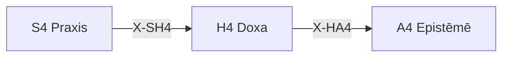

---
# Theorem Metadata (v2.1)
id: "H4"
name: "Doxa"
greek: "Δόξα"
series: "Hormē"
generation:
  formula: "Value × Precision"
  result: "価値確信 — 価値判断の確信度"

description: >
  記録して・覚えておいて・信念を残したい時に発動。
  Belief documentation, long-term memory persistence.
  Use for: 信念, 記録, 長期記憶, belief, memory, 覚えておいて.
  NOT for: temporary judgments (use H1/H2).

triggers:
  - 価値判断の確信度評価
  - 信念の記録
  - 長期記憶への格納

keywords:
  - doxa
  - belief
  - opinion
  - conviction
  - memory
  - 信念
  - 記憶

related:
  upstream:
    - "S4 Praxis"
  downstream:
    - "A4 Epistēmē"
  x_series:
    - "← X-SH4 ← S4 Praxis"
    - "X-HA4 → A4 Epistēmē"

implementation:
  micro: ".agent/workflows/hist.md"
  macro: "mekhane/anamnesis/"
  templates:
    - "旧T8 Anamnēsis の記憶処理"

derivatives:
  sens:
    name: "Sensory (感覚)"
    description: "感覚・直感に基づく信念、経験的記録"
  conc:
    name: "Conceptual (概念)"
    description: "概念的・理論的な信念、構造的記録"
  form:
    name: "Formal (形式)"
    description: "形式・ルールとしての信念、明示的参照"

version: "2.2.0"
workflow_ref: ".agent/workflows/dox.md"
risk_tier: L1
reversible: true
requires_approval: false
risks:
  - "動機評価の偏りによる行動指針の歪み"
fallbacks: []
---

# H4: Doxa (Δόξα)

> **生成**: Value × Precision
> **役割**: 価値判断の確信度

## When to Use

### ✓ Trigger

- 価値判断の確信度評価
- 信念の記録・永続化
- `/hist` コマンド
- 長期記憶への格納

### ✗ Not Trigger

- 一時的な判断

## Processing Logic

```
入力: 価値判断
  ↓
[STEP 1] 確信度評価
  ├─ C: 確立された信念
  └─ U: 暫定的な見解
  ↓
[STEP 2] 永続化判断
  ├─ 重要度評価
  └─ 記録フォーマット選択
  ↓
出力: 記録済み信念
```

## X-series 接続



---

## 🔄 Test-Time Self-Improvement (TT-SI): 再帰的学習ループ (v2.2 新規)

> **Origin**: 2026-01 LLM Agent Evolution Report (arXiv 2025-10-08)
> **本質**: 自己認識 → 自己データ増強 → 微調整の 3 段階ループ

### 原理

Test-Time Self-Improvement (TT-SI) は信念定着プロセスに再帰的改善を導入:

1. **自己認識**: 現在の信念・パターンの限界を認識
2. **自己データ増強**: 成功/失敗事例から学習データを生成
3. **微調整**: 信念体系を更新し、精度を向上

### 3段階ループ

```yaml
stage_1_self_awareness:
  name: "自己認識"
  action: "現在の信念・パターンの限界を特定"
  inputs:
    - 最近の判断履歴
    - 成功/失敗の分類
  output: "限界リスト: [L₁, L₂, ...]"

stage_2_data_augmentation:
  name: "自己データ増強"
  action: "限界を克服する事例を生成/収集"
  inputs:
    - 限界リスト
    - 外部情報ソース (Sophia, Perplexity)
  output: "強化データセット"

stage_3_belief_update:
  name: "信念更新"
  action: "パターン・値を更新"
  targets:
    - patterns.yaml (認識パターン)
    - values.json (価値重み)
    - learned_A.npy (FEP A-matrix)
  output: "更新済み信念体系"
```

### 効率性

| 指標 | 従来手法 | TT-SI |
|:-----|:---------|:------|
| データ効率 | 1x | **68x** |
| 反復回数 | 多 | 2-3回で収束 |
| 人間介入 | 必要 | 最小限 |

### Hegemonikón での統合

TT-SI は既存の永続化アーティファクトと連携:

```
├── mneme/.hegemonikon/
│   ├── patterns.yaml    ← Stage 3 で更新
│   ├── values.json      ← Stage 3 で更新
│   ├── learned_A.npy    ← FEP A-matrix 更新
│   └── sessions/        ← Stage 1 の入力
```

### 発動条件

以下の条件で TT-SI が推奨:

- 同種の判断で 3 回以上失敗
- 新しいドメイン/技術の学習が必要
- `/bye` 実行時に自動診断

### 出力形式

```markdown
## 🔄 TT-SI 自己改善レポート

### Stage 1: 限界認識
| 限界 | カテゴリ | 頻度 |
|:-----|:---------|:-----|
| [限界1] | [認識/判断/行動] | N回 |

### Stage 2: データ増強
- 収集ソース: [ソースリスト]
- 強化データ数: N件

### Stage 3: 信念更新
| 更新対象 | 変更内容 |
|:---------|:---------|
| patterns.yaml | [追加/修正内容] |
| values.json | [重み調整] |
```

---

## 📜 Palimpsest: コード考古学 (παλίμψηστος)

> **哲学**: パリンプセスト = 上書きされた羊皮紙。過去の層が透けて見える
> **本質**: 「なぜそこにあるか」を問わずに消さない — チェスタトンの柵

### 傷跡検出 (Oulē)

| 痕跡 | 意味 | アクション |
|:-----|:-----|:-----------|
| `HACK / FIXME` | 先人の戦場跡 | ⚠️ 削除禁止。理由確認必須 |
| 過剰防御コード | 過去のデータ破損 | 🛑 理由が判明するまで保持 |
| マジックナンバー | レースコンディション | 🔍 git log で考古学調査 |

### チェスタトンの柵

> 「なぜ柵があるかわからないなら、撤去してはならない」

```text
リファクタリング/削除要求時:
  ├── Oulē スキャン: HACK/FIXME/マジックナンバー検出
  │    └── 検出時 → 📜 Palimpsest: 柵警告。理由確認中
  ├── 仮説生成: 「なぜ追加されたか」を推測
  ├── 確認要求: ユーザーに履歴確認を依頼
  └── 明示的承認: "DELETE LEGACY HACK" で解除
```

### 出力形式

```text
📜 Palimpsest: 柵検出
  痕跡: {HACK/FIXME/マジックナンバー}
  仮説: {推測される追加理由}
  要求: 削除には "DELETE LEGACY HACK" が必要
```

---

*Doxa: プラトン認識論における「意見・信念」— Epistēmē（知識）に対置*
*v2.3.0 — Palimpsest 考古学統合 (2026-01-29)*

---

## Related Modes

このスキルに関連する `/dox` WFモード (4件):

| Mode | CCL | 用途 |
|:-----|:----|:-----|
| sens | `/dox.sens` | 感覚的信念 |
| conc | `/dox.conc` | 概念的信念 |
| form | `/dox.form` | 形式的信念 |
| delta | `/dox.delta` | 変化追跡 |
