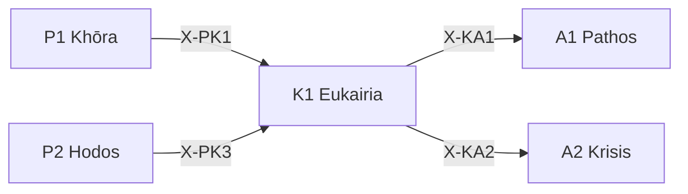

---
# Theorem Metadata (v2.1)
id: "K1"
name: "Eukairia"
greek: "Εὐκαιρία"
series: "Kairos"
generation:
  formula: "Scale × Valence"
  result: "スケール傾向 — 適切な機会の規模判断"

description: >
  今がチャンス？・タイミングを評価したい・好機かどうか知りたい時に発動。
  Opportunity recognition, timing decisions, favorable conditions assessment.
  Use for: 好機, タイミング, 機会, opportunity, timing.
  NOT for: timing already fixed (proceed directly).

triggers:
  - 機会の識別
  - タイミング判断
  - 好機の規模評価

keywords:
  - eukairia
  - opportunity
  - timing
  - favorable
  - chance
  - 好機
  - 機会

related:
  upstream:
    - "P1 Khōra"
    - "P2 Hodos"
  downstream:
    - "A1 Pathos"
    - "A2 Krisis"
  x_series:
    - "← X-PK1 ← P1 Khōra"
    - "← X-PK3 ← P2 Hodos"
    - "X-KA1 → A1 Pathos"
    - "X-KA2 → A2 Krisis"

implementation:
  micro: "(implicit)"
  macro: "(future)"
  templates:
    - "旧K1-K4 のコンテキストルール"

version: "2.1.0"
workflow_ref: ".agent/workflows/euk.md"
---

# K1: Eukairia (Εὐκαιρία)

> **生成**: Scale × Valence
> **役割**: 適切な機会の規模判断

## When to Use

### ✓ Trigger

- 機会の識別
- 「今がチャンスか」の判断
- タイミングと規模の評価

### ✗ Not Trigger

- タイミングが既に決まっている

## Processing Logic

```
入力: 状況 + 目標
  ↓
[STEP 1] スケール評価
  ├─ Micro: 局所的機会
  └─ Macro: 大局的機会
  ↓
[STEP 2] 傾向評価
  ├─ +: 好機（接近すべき）
  └─ -: 悪機（回避すべき）
  ↓
出力: 機会判定 (スケール + 傾向)
```

## X-series 接続



---

*Eukairia: 古代ギリシャにおける「好機・良い時」*

---

## Related Modes

このスキルに関連する `/euk` WFモード (4件):

| Mode | CCL | 用途 |
|:-----|:----|:-----|
| dete | `/euk.dete` | 決定タイミング |
| crea | `/euk.crea` | 創造タイミング |
| main | `/euk.main` | 維持タイミング |
| stage | `/euk.stage` | ステージング |
