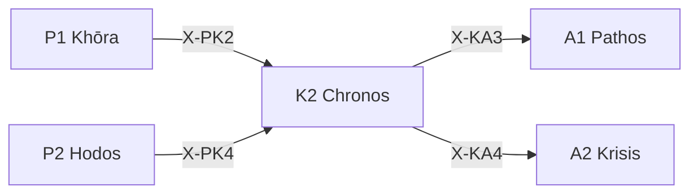

---
# Theorem Metadata (v2.1)
id: "K2"
name: "Chronos"
greek: "Χρόνος"
series: "Kairos"
generation:
  formula: "Scale × Precision"
  result: "スケール確信 — 時間的確実性の評価"

description: >
  いつまで？・期限を確認したい・時間制約を評価したい時に発動。
  Time constraint assessment, deadline awareness, temporal certainty.
  Use for: 時間, 期限, いつまで, deadline, time.
  NOT for: no time constraints (proceed directly).

triggers:
  - 時間制約の評価
  - 期限の確認
  - 時間的確実性の判断

keywords:
  - chronos
  - time
  - deadline
  - schedule
  - temporal
  - 時間
  - 期限

related:
  upstream:
    - "P1 Khōra"
    - "P2 Hodos"
  downstream:
    - "A1 Pathos"
    - "A2 Krisis"
  x_series:
    - "← X-PK2 ← P1 Khōra"
    - "← X-PK4 ← P2 Hodos"
    - "X-KA3 → A1 Pathos"
    - "X-KA4 → A2 Krisis"

implementation:
  micro: "(implicit)"
  macro: "(future)"
  templates: []

version: "2.1.0"
workflow_ref: ".agent/workflows/chr.md"
---

# K2: Chronos (Χρόνος)

> **生成**: Scale × Precision
> **役割**: 時間的確実性の評価

## When to Use

### ✓ Trigger

- 時間制約の評価
- 「いつまでに」の確認
- 見積もりの確度評価

### ✗ Not Trigger

- 時間制約がない

## Processing Logic

```
入力: タスク + 時間情報
  ↓
[STEP 1] スケール評価
  ├─ Micro: 短期（分〜時間）
  └─ Macro: 長期（日〜週〜月）
  ↓
[STEP 2] 確信度評価
  ├─ C: 確実な期限
  └─ U: 不確実な見積もり
  ↓
出力: 時間判定 (スケール + 確度)
```

## X-series 接続



---

## 📡 Kymation: 時間波及 (κῦμα)

> **哲学**: キューマ = 波。変更が時間軸で波及する影響を追跡
> **本質**: 変更前に影響範囲を予測し、変更後に巻き戻し手順を保証

### 波及分析 (Rhipē)

| リスクレベル | 条件 | アクション |
|:-------------|:-----|:-----------|
| **LOW** | 局所変更、外部依存なし | 直接実行可 |
| **MEDIUM** | 1-3ファイルに影響 | 影響先リスト提示 |
| **HIGH** | コア関数/広範囲 | 📡 Kymation: 爆発半径警告。確認必須 |

```text
変更検知時:
  ├── シンボル特定: 関数名/クラス名/定数
  ├── 参照スキャン: プロジェクト全体でgrep
  ├── リスク分類: LOW/MEDIUM/HIGH
  └── 戦略提示: 先に消費者を更新 → 本体変更
```

### 逆操作保証 (Palindromia)

> パリンドロミア = 回帰。すべての前進には後退が存在する

| コンテキスト | 前進操作 | 逆操作 |
|:-------------|:---------|:-------|
| **DB** | ALTER TABLE ADD | ALTER TABLE DROP |
| **設定** | 値変更 | 前値を記録 |
| **ファイル** | 上書き | git checkout |

```text
永続状態変更時:
  ├── Forward: 実装コード生成
  ├── Reverse: 逆操作コード生成
  └── Risk: データ消失可能性を明示
```

### 出力形式

```text
📡 Kymation: Active
  Rhipē: [LOW/MEDIUM/HIGH] — [N] ファイル影響
  Palindromia: 逆操作準備完了
```

---

*Chronos: 古代ギリシャにおける「時間」— Kairos（適時）と対をなす*
*v2.2.0 — Kymation 統合 (2026-01-29)*

---

## Related Modes

このスキルに関連する `/chr` WFモード (3件):

| Mode | CCL | 用途 |
|:-----|:----|:-----|
| regu | `/chr.regu` | 時間調整 |
| esti | `/chr.esti` | 時間見積 |
| deadline | `/chr.deadline` | 期限管理 |
