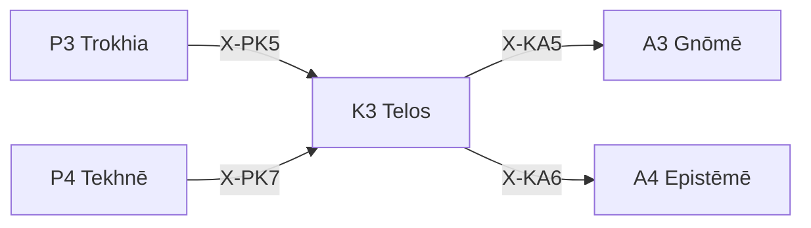

---
# Theorem Metadata (v2.1)
id: "K3"
name: "Telos"
greek: "Τέλος"
series: "Kairos"
generation:
  formula: "Function × Valence"
  result: "方法傾向 — 目的志向の方向性"

description: >
  何のため？・目的を確認したい・なぜこれをやっている？時に発動。
  Goal-means alignment, purpose verification.
  Use for: 目的, purpose, 何のため, why, 終着点.
  NOT for: purpose already clear (proceed directly).

triggers:
  - 目的との整合確認
  - 手段-目的の評価
  - ゴール志向の検証

keywords:
  - telos
  - purpose
  - goal
  - end
  - aim
  - 目的
  - 終着

related:
  upstream:
    - "P3 Trokhia"
    - "P4 Tekhnē"
  downstream:
    - "A3 Gnōmē"
    - "A4 Epistēmē"
  x_series:
    - "← X-PK5 ← P3 Trokhia"
    - "← X-PK7 ← P4 Tekhnē"
    - "X-KA5 → A3 Gnōmē"
    - "X-KA6 → A4 Epistēmē"

implementation:
  micro: ".agent/workflows/why.md"
  macro: "(future)"
  templates: []

version: "2.1.0"
workflow_ref: ".agent/workflows/tel.md"
risk_tier: L1
reversible: true
requires_approval: false
risks:
  - "文脈判断の誤りによるタイミング逸失"
fallbacks: []
---

# K3: Telos (Τέλος)

> **生成**: Function × Valence
> **役割**: 目的志向の方向性

## When to Use

### ✓ Trigger

- 目的との整合確認
- 「何のためにやっているか」の検証
- `/why` コマンド
- 手段と目的の入れ替わり検出

### ✗ Not Trigger

- 目的が明確で整合済み

## Processing Logic

```
入力: 手段 + 目的
  ↓
[STEP 1] 方法評価
  ├─ Explore: 探索的手段
  └─ Exploit: 活用的手段
  ↓
[STEP 2] 傾向評価
  ├─ +: 目的に向かっている
  └─ -: 目的から離れている
  ↓
出力: 整合判定 + 推奨アクション
```

## X-series 接続



---

*Telos: アリストテレス目的論における「目的・終着・完成」*

---

## Related Modes

このスキルに関連する `/tel` WFモード (4件):

| Mode | CCL | 用途 |
|:-----|:----|:-----|
| objective | `/tel.objective` | 客観的目的 |
| intr | `/tel.intr` | 内発的目的 |
| extr | `/tel.extr` | 外発的目的 |
| tran | `/tel.tran` | 超越的目的 |
