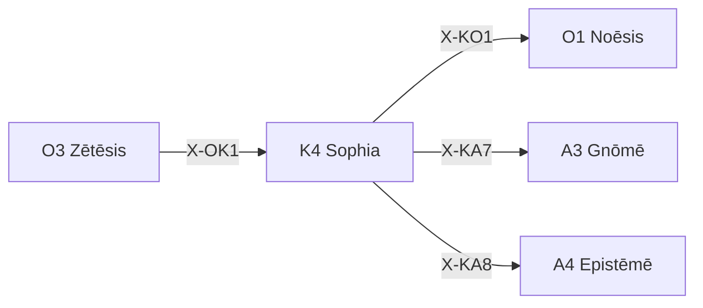

---
# Theorem Metadata (v4.0)
id: "K4"
name: "Sophia"
greek: "Σοφία"
series: "Kairos"
generation:
  formula: "Function × Precision"
  result: "知恵 — 情報収集と方法確信"

description: >
  調べて・教えて・情報収集・Perplexityに聞いて・パプ君に聞いて時に発動。
  Information gathering, research, external knowledge acquisition.
  Use for: 調査, research, 情報収集, sop.
  Also for: method reliability assessment, wisdom-based confidence.

triggers:
  - 情報収集
  - 調査依頼
  - "調べて"
  - "教えて"
  - /sop コマンド
  - Perplexity
  - パプ君

keywords:
  - sophia
  - wisdom
  - research
  - information
  - gathering
  - 調査
  - 情報収集

related:
  upstream:
    - "O3 Zētēsis"
  downstream:
    - "O1 Noēsis"
    - "A3 Gnōmē"
    - "A4 Epistēmē"
  x_series:
    - "← X-OK1 ← O3 Zētēsis (問いを立てる)"
    - "X-KO1 → O1 Noēsis (深い分析)"
    - "X-KA7 → A3 Gnōmē"
    - "X-KA8 → A4 Epistēmē"

lineage: "K4 Sophia 統一リマッピング (2026-01-28) — 情報収集機能を追加"

version: "4.0.0"
workflow_ref: ".agent/workflows/sop.md"
---

# K4: Sophia (Σοφία)

> **生成**: Function × Precision
> **役割**: 情報収集 + 方法確信度評価
> **本質**: σοφία = 知恵 — 外部ソースからの知識取得

---

## When to Use

### ✓ Trigger

- 情報収集が必要
- Perplexity に調査依頼したい
- 「調べて」「教えて」という依頼
- `/sop` コマンド

### ✗ Not Trigger

- 問いの発見 → O3 Zētēsis `/zet` を使え
- 情報が既に十分

---

## Processing Logic

```
入力: 調査テーマ / 質問
  ↓
[PHASE 0] 目的確認（決定事項・仮説）
  ↓
[PHASE 1] 調査依頼書生成
  ├─ 深掘り版テンプレート
  ├─ 時間制約 (Chronotopic Precision)
  └─ 出力フォーマット固定
  ↓
[PHASE 2] 品質チェック
  ↓
[PHASE 3] Artifact 保存
  ↓
出力: 調査依頼書 → ユーザーがパプ君にコピペ
```

---

## FEP Integration

K4 Sophia は **observe** 行動に対応:

```
act = 問いを能動的に設定する (O3 Zētēsis)
observe = 情報を受動的に取得する (K4 Sophia)
```

---

## X-series 接続



**認知サイクル**:

```
問い → 調査 → 分析 → 新しい問い
O3  →  K4  →  O1  →  O3 ...
```

---

## Integration

| 依存 | 対象 | 関係 |
|:-----|:-----|:-----|
| **Precondition** | O3 Zētēsis | 問いを立ててから |
| **Postcondition** | O1 Noēsis | 深い分析へ |
| **Postcondition** | A3 Gnōmē | 原則として定着 |
| **Postcondition** | A4 Epistēmē | 知識として確立 |

---

*Sophia: 古代ギリシャにおける「知恵・叡智」*
*v4.0.0 — 統一リマッピング (2026-01-28)*

---

## Related Modes

このスキルに関連する `/sop` WFモード (4件):

| Mode | CCL | 用途 |
|:-----|:----|:-----|
| surf | `/sop.surf` | 表層調査 |
| deep | `/sop.deep` | 深層調査 |
| prag | `/sop.prag` | 実用調査 |
| track | `/sop.track` | 追跡調査 |
