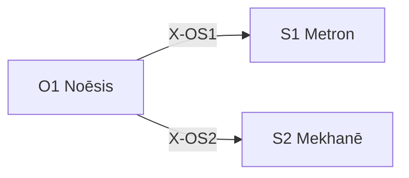

---
# Theorem Metadata (v3.0)
id: "O1"
name: "Noēsis"
greek: "Νόησις"
series: "Ousia"
generation:
  formula: "Flow (I) × Value (E)"
  result: "認識推論 — 世界を理解するための推論"

description: >
  本質を教えて・なぜ・根本的に考えて・深く理解したい時に発動。
  Deep understanding, root cause analysis, paradigm examination.
  Use for: 本質, essence, why, 根本的な問い, understand deeply.
  NOT for: simple lookups, known solutions.

triggers:
  - 根本的な行き詰まり
  - パラダイム転換が必要
  - /noe コマンド
  - 「なぜ」を問う根源的疑問

keywords:
  - noesis
  - understanding
  - insight
  - essence
  - deep-thinking
  - 本質

related:
  upstream: []
  downstream:
    - "S1 Metron"
    - "S2 Mekhanē"
  x_series:
    - "X-OS1 → S1 Metron"
    - "X-OS2 → S2 Mekhanē"

lineage: "A-9 + X-1/X-2 + Anti-Skip Protocol + 出力保存規則 → v3.0"

version: "3.0.0"
workflow_ref: ".agent/workflows/noe.md"
---

# O1: Noēsis (Νόησις)

> **生成**: Flow (I) × Value (E)
> **役割**: 世界を理解するための推論
> **本質**: νόησις = 直観的で即座の認識、高次の真理への直接的洞察

Dianoia（分析的思考）を超え、**前提を破壊し、0 から再構築する**。

> **「無知の可能性を探り検証する」**
>
> 無知に気づくことはできない。できればそれはもう無知ではなくなるから。
> だが、**無知が存在すること**は知ることができる。
> Noēsis は「盲点が存在しうる領域」を明示的に問い、限界まで探求する。

---

## When to Use

### ✓ Trigger

- 根本的な行き詰まり
- 複数の前提が同時に崩れた
- パラダイム転換が必要
- `/noe` コマンド

### ✗ Not Trigger

- 単純な情報検索
- 既知の解決策がある
- 時間が逼迫している

---

## ⚠️ Anti-Skip Protocol (MANDATORY)

> **このセクションは省略禁止。各フェーズで必ず完全な出力形式を使用すること。**

### 強制ルール

1. **派生選択必須** (v3.1 追加): 処理開始時に `select_derivative("O1", problem)` を実行し、結果を表示
2. **全フェーズ実行必須**: PHASE 0.5 → 1 → 2 → 3 → 4 → 5 を順に実行
3. **チェックポイント出力必須**: 各フェーズ終了時に `[CHECKPOINT PHASE X/5]` を出力
4. **出力形式厳守**: 各フェーズの「出力形式」セクションを**そのまま**使用
5. **読み込み証跡必須**: PHASE 0.5 で読み込んだファイルを**全て列挙**
6. **省略禁止**: 「詳細は省略」「要約すると」は使用禁止

### 派生選択表示形式 (STEP 0 必須)

```
┌─[O1 派生選択]────────────────────────────┐
│ 推奨派生: {nous/phro/meta}
│ 確信度: {X}%
│ 理由: {rationale}
│ 代替: {alternatives}
└────────────────────────────────────────────┘
```

> **派生に応じた処理分岐**:
>
> - **nous**: 抽象的・原理探求 → PHASE 1 で普遍的前提を掘る
> - **phro**: 具体的・実践的 → PHASE 1 で文脈的前提を掘る
> - **meta**: 自己反省・信頼性 → PHASE 1 で認知的前提を掘る

### 派生出力差比較表 (v3.1 新規)

| 観点 | nous | phro | meta |
|:-----|:-----|:-----|:-----|
| **前提の種類** | 普遍的 | 文脈的 | 認知的 |
| **仮説の性質** | 原理的 | 実行可能 | 信頼性評価 |
| **出力スタイル** | 洞察 | 行動指針 | 確信度+不確実性 |
| **推奨ユースケース** | 「なぜ」を根本から問う | 「今、何をすべきか」 | 「この分析は正しいか」 |

### 検証チェックリスト

実行後、以下を確認:

- [ ] PHASE 0.5 で盲点リスク表を出力したか
- [ ] PHASE 1 で 5-8 個の前提を列挙したか
- [ ] PHASE 2 で 4ベクトル全てを出力したか
- [ ] PHASE 3 で収斂/分岐ノード数を明示したか
- [ ] PHASE 4 で最強反論と妥当性スコアを出力したか
- [ ] PHASE 5 で JSON 形式の構造化出力を出力したか

### 違反時の対応

省略が検出された場合:

1. 該当フェーズを再実行
2. 完全な出力形式で再出力

---

## Processing Logic (5 Phases)

```
入力: 問い Q
  ↓
[PHASE 0.5] 盲点カテゴリチェック（Meta-Blindspot Check）
  ↓
[PHASE 1] 前提掘出（Premise Excavation）
  ↓
[PHASE 2] ゼロ設計（Zero-shot Restructuring）
  ↓
[PHASE 3] 分析深化（Analytical Deepening）[GoT]
  ↓
[PHASE 4] 自己検証（Self-Verification）
  ↓
[PHASE 5] メタ認知出力（Metacognitive Output）
  ↓
最終出力: 構造化知見
```

---

## PHASE 0.5: 盲点カテゴリチェック + Read

**目的**: 「見えていないかもしれないもの」を意識的に問い、関連情報を読み込む

> 盲点を列挙することはできない。
> しかし、**盲点が存在しうる領域** を列挙することはできる。

### Step 0.5.1: Read（読み込み）

> **「前提を疑う前に、前提を正しく理解せよ」**

思考開始前に以下を読み込む:

- [ ] 問いに関連するファイル・ドキュメント
- [ ] 既存の議論・決定事項（KI、Handoff等）
- [ ] 関連するワークフロー・スキル定義

**出力**: 読み込んだファイルを列挙してから次へ

### Step 0.5.2: 盲点チェック

| カテゴリ | 問い |
|:---------|:-----|
| 発動条件 | `/noe` を使うべきではない可能性は？ |
| 問いの前提 | 問いの立て方自体が間違っている可能性は？ |
| フレーミング | 問題の切り取り方が不適切な可能性は？ |
| ドメイン知識 | 私が知らない専門知識で結論が変わる可能性は？ |
| 時間的文脈 | 過去/現在/未来の状況変化を見落としている可能性は？ |
| 利害関係 | 隠れたステークホルダーを見落としている可能性は？ |
| メタ推論 | 「前提を疑う」という行為自体の前提は？ |

### 出力形式

```
┌─[PHASE 0.5: Read + 盲点チェック]────────┐
│ 読み込み済み:                          │
│   - [ファイル1]                        │
│   - [ファイル2]                        │
│ 盲点リスク領域:                        │
│   □ 発動条件: [低/中/高] — [理由]      │
│   □ 問いの前提: [低/中/高] — [理由]    │
│   □ フレーミング: [低/中/高] — [理由]  │
│   □ ドメイン知識: [低/中/高] — [理由]  │
│   □ 時間的文脈: [低/中/高] — [理由]    │
│   □ 利害関係: [低/中/高] — [理由]      │
│   □ メタ推論: [低/中/高] — [理由]      │
│ 最高リスク領域: [カテゴリ]             │
└────────────────────────────────────────┘
```

---

## PHASE 1: 前提掘出（Premise Excavation）

**目的**: 暗黙の前提を自動検出し、AXIOM/ASSUMPTION に分類、反転テストで妥当性を検証

> **Origin**: A-9 第一原理思考 を消化

### 制約チェックリスト（First Principles Constraints）

| 制約 | 説明 |
|:-----|:-----|
| 🚫 「普通は」禁止 | 「一般的に」「業界では」というフレーズを使用しない |
| 🚫 類推禁止 | 他の事例との比較（〜のような）を使用しない |
| ✅ 物理/慣習の区別 | 事実が「物理法則」か「人間の取り決め」か厳密に区別 |

### プロセス

1. 問いの中に含まれる **暗黙の前提** を 5-8 個列挙
2. 各前提を **AXIOM/ASSUMPTION** に分類:
   - **[AXIOM]**: 物理法則、不変の真実（破棄不可）
   - **[ASSUMPTION]**: 人間の取り決め、慣習（破棄可能）
3. 各前提に **必要度スコア** (0-100) を付与
4. 上位 3 つの前提に対し **反転テスト** を実行
   - 前提が TRUE の場合: 何が導かれるか？
   - 前提が FALSE の場合: 何が導かれるか？
   - 質問が無効になるか？

### 出力形式

```
┌─[PHASE 1: 前提掘出 (First Principles)]─┐
│ 暗黙前提:                              │
│   1. [前提] — [AXIOM] — 必要度: 95     │
│   2. [前提] — [ASSUMPTION] — 必要度: 80│
│   3. [前提] — [ASSUMPTION] — 必要度: 65│
│ 反転テスト結果:                        │
│   前提2: TRUE→[結果], FALSE→[結果]    │
│   (AXIOMは反転不可、ASSUMPTIONのみテスト)│
└────────────────────────────────────────┘
```

---

## PHASE 2: ゼロ設計（Zero-shot Restructuring）

**目的**: 既存の知識をリセットし、白紙から複数の仮説を生成

> **Origin**: X-1/X-2 発散と収束 を消化

### 直交発散 (Orthogonal Divergence)

> 「似たような案のバリエーション」は禁止。互いに直交する4ベクトルで極端な仮説を立てる。

| ベクトル | 別名 | 問い |
|:---------|:-----|:-----|
| 🚀 **V1 Idealist** | SF的解決 | リソース無限、技術的制約ゼロなら？ |
| ✂️ **V2 Minimalist** | 引き算解決 | 予算ゼロ、機能削除のみで解決するには？ |
| 🔥 **V3 Heretic** | 破壊的解決 | 業界の常識・タブーを踏み越えたら？ |
| 📊 **V4 Analyst** | 論理的解決 | データを徹底分析し機械的に最適化したら？ |

### プロセス

1. **4ベクトル発散**: 各ベクトルで極端な仮説を生成
   - Suspend Judgment: 「実現不可能」という批判は完全遮断

2. 各仮説に対し:
   - 1 文で述べる
   - 3 つの具体的証拠を列挙
   - 1 つの致命的弱点を特定
   - 信頼度 (0-100)

3. **弁証法的収束**: 最も有望な Thesis と対立する Antithesis を戦わせ、Synthesis を導出
   - **Thesis (正)**: 最も有望な仮説
   - **Antithesis (反)**: Thesisに対立する仮説
   - **Synthesis (合)**: 両者の矛盾を解消し、止揚（アウフヘーベン）

### 出力形式

```
┌─[PHASE 2: ゼロ設計 (Orthogonal Divergence)]─┐
│ 仮説:                                    │
│   V1 (Idealist): [仮説] — 信頼度 65       │
│   V2 (Minimalist): [仮説] — 信頼度 80     │
│   V3 (Heretic): [仮説] — 信頼度 55        │
│   V4 (Analyst): [仮説] — 信頼度 70         │
│ 弁証法:                                    │
│   Thesis: [V_] → Antithesis: [V_]         │
│   Synthesis: [止揚された結論]                │
└──────────────────────────────────────────┘
```

---

## PHASE 3: 分析深化（Analytical Deepening）[GoT]

**目的**: Graph-of-Thought で多径路推論を実行し、収斂・分岐を特定

### プロセス

1. 各仮説に対し **2 つの批判的質問** を生成（計 6 問）
2. 各質問に回答し、信頼度と不確実性を付与
3. **収斂ノード** を特定: 2+ 仮説が同一の中間結論に到達 → 高信頼
4. **分岐ノード** を特定: 仮説間で矛盾 → 低信頼、解決優先度を付与

### 出力形式

```
┌─[PHASE 3: GoT 分析]──────────────────┐
│ 推論グラフ:                          │
│   収斂ノード: 3 個 (高信頼)          │
│   分岐ノード: 2 個 (要解決)          │
│ 最有力パス: H2 → Q3 → 結論 C1       │
└──────────────────────────────────────┘
```

---

## PHASE 4: 自己検証（Self-Verification）

**目的**: 論理的誤謬を検出し、最強の反論を構築

### プロセス

1. **3 つの論理的誤謬** を特定:
   - 誤謬タイプ（循環論法、二項対立の誤り、など）
   - 出現箇所
   - 深刻度 (1-5)

2. **最強の反論** を構築:
   - 結論に対し、最も説得力のある反論を述べる
   - 2 つの支持ポイント
   - この反論が勝つために必要な条件

3. 反論の妥当性を評価 (0-100)
   - 50 超: 修正が必要
   - 50 以下: PHASE 5 へ

### 出力形式

```
┌─[PHASE 4: 自己検証]──────────────────┐
│ 誤謬検出:                            │
│   1. [誤謬] — 深刻度 3               │
│ 最強反論: [反論内容]                 │
│ 反論妥当性: 35 → 結論維持            │
└──────────────────────────────────────┘
```

---

## PHASE 5: メタ認知出力（Metacognitive Output）

**目的**: 推論結果を構造化し、信頼度・不確実性を明示

### 出力形式

```json
{
  "final_answer": "最終回答",
  "confidence_score": 0.87,
  
  "key_assumptions": [
    "前提1: [critical]",
    "前提2: [important]"
  ],
  
  "reasoning_structure": {
    "phases_executed": [1, 2, 3, 4, 5],
    "dag_nodes_explored": 12,
    "convergence_nodes": 3,
    "divergence_nodes": 2
  },
  
  "uncertainty_zones": [
    {
      "zone": "領域名",
      "doubt_score": 0.4,
      "reason": "不確実な理由",
      "mitigation": "不確実性を下げる方法"
    }
  ],
  
  "falsifiability": {
    "is_falsifiable": true,
    "counter_examples": ["反証シナリオ"],
    "evidence_needed_to_flip": "結論を覆すための証拠"
  }
}
```

---

## 統合出力形式

```
═══════════════════════════════════════════════════════════
[Hegemonikón] O1 Noēsis: 最深層思考完了
═══════════════════════════════════════════════════════════

📋 問い: {入力された問い}

━━━ PHASE 0.5: 盲点カテゴリチェック ━━━
{盲点リスク領域と最高リスク領域}

━━━ PHASE 1: 前提掘出 ━━━
{前提リストと反転テスト結果}

━━━ PHASE 2: ゼロ設計 ━━━
{3仮説と議論結果}

━━━ PHASE 3: GoT 分析 ━━━
{推論グラフと最有力パス}

━━━ PHASE 4: 自己検証 ━━━
{誤謬検出と反論評価}

━━━ PHASE 5: メタ認知 ━━━
{JSON形式の構造化出力}

━━━ FEP Cognitive Layer ━━━
{Active Inferenceベースの認知フィードバック}

═══════════════════════════════════════════════════════════
📌 最終結論: {結論}
📊 信頼度: {0-100}%
⚠️ 不確実領域: {リスト}
🔍 盲点リスク: {最高リスク領域}
🧠 FEP推奨: {observe/act}
═══════════════════════════════════════════════════════════
```

---

## FEP Cognitive Layer (Optional Enhancement)

> **統合**: pymdp Active Inference を使用した認知レイヤー

PHASE 5 の `confidence_score` と `uncertainty_zones` を FEP agent に渡し、
ベイズ最適な行動推奨を生成する。

### 発動条件

FEP は以下の条件で発動:

- `confidence_score < 0.7` (確信度が低い場合)
- `len(uncertainty_zones) >= 2` (不確実領域が多い場合)
- 明示的に `/noe --fep` オプションが指定された場合

### 統合コード例

```python
from mekhane.fep.encoding import (
    encode_noesis_output,
    run_fep_with_learning,
    generate_fep_feedback_markdown,
)

# PHASE 5 出力からFEP観察を生成
obs = encode_noesis_output(
    confidence_score=result["confidence_score"],
    uncertainty_zones=result["uncertainty_zones"]
)

# FEP推論 + Dirichlet学習 + 永続化を一連で実行
fep_result = run_fep_with_learning(obs)

# Markdown出力
feedback = generate_fep_feedback_markdown(
    fep_result,
    f"conf={result['confidence_score']:.0%}"
)
print(feedback)

# Auto-Epochē
if fep_result["should_epoche"]:
    print("⚠️ 高エントロピー検出 → /epo を推奨")
```

### FEP出力形式

```
━━━ FEP Cognitive Feedback ━━━
┌─[Active Inference Layer]──────────────────┐
│ 観察値: context=clear, urgency=low        │
│ 信念状態:                                 │
│   phantasia: clear                        │
│   assent: granted                         │
│   horme: passive                          │
│ エントロピー: 1.42 (中程度の不確実性)      │
│ 推奨: act (77%)                           │
│   → 結論に確信あり、行動に移行可能        │
└────────────────────────────────────────────┘
```

### 解釈ガイド

| FEP推奨 | 意味 | 次のアクション |
|:--------|:-----|:---------------|
| `observe` | 情報不足、エントロピー高 | `/zet` で調査、または `/epo` で判断保留 |
| `act` | 確信十分、行動可能 | 次のフェーズへ進む、実装開始 |

---

## 計算コスト試算

| フェーズ | トークン数 | 時間目安 |
|:---------|:-----------|:---------|
| PHASE 1 | 200-300 | 1-2秒 |
| PHASE 2 | 500-800 | 2-4秒 |
| PHASE 3 | 1000-2000 | 5-15秒 |
| PHASE 4 | 300-500 | 3-8秒 |
| PHASE 5 | 200 | 1秒 |
| **合計** | **2200-3800** | **12-30秒** |

従来 CoT の 5-8 倍のコスト、精度 +60-70%。

---

## X-series 接続



---

## Integration

| 依存 | 対象 | 関係 |
|------|------|------|
| **Postcondition** | S1 Metron | スケール配置へ |
| **Postcondition** | S2 Mekhanē | 方法配置へ |

---

## FEP Implementation (Active Inference)

> **Status**: PoC 完了 (2026-01-28)
> **Location**: `mekhane/fep/fep_agent.py`

### 概念マッピング

O1 Noēsis は pymdp の `infer_states()` に対応する。

```
┌─ Cognitive Layer (pymdp) ─────────────────────┐
│ HegemonikónFEPAgent.infer_states(observation) │
│   → Variational Free Energy 最小化            │
│   → 信念分布 Q(s) の更新                      │
└───────────────────────────────────────────────┘
```

### Stoic-FEP マッピング

| Stoic 概念 | FEP 概念 | 実装 |
|:-----------|:---------|:-----|
| Phantasia (印象) | Prior P(s) | `_default_D()` |
| Syncatasthesis (同意) | Posterior Q(s) | `infer_states()` |
| Hormē (衝動) | Action selection | `sample_action()` |

### 使用例

```python
from mekhane.fep import HegemonikónFEPAgent

agent = HegemonikónFEPAgent(use_defaults=True)

# O1 Noēsis: 観察から信念を推論
result = agent.infer_states(observation=0)
print(result["map_state_names"])  # {'phantasia': 'clear', 'assent': 'given', ...}
print(result["entropy"])  # 信念の不確実性
```

### PHASE 6: FEP Cognitive Feedback (Optional)

> **発動**: PHASE 5 完了後に自動実行
> **目的**: 認知的意思決定の客観的フィードバック

PHASE 5 の出力を FEP Agent に入力し、推奨アクション（act/observe）を提示する。

#### 処理フロー

```text
PHASE 5 完了
  ↓ confidence_score, uncertainty_zones を取得
[encode_noesis_output()]
  ↓ 観察値 (context, urgency, confidence) に変換
[HegemonikónFEPAgent.step()]
  ↓ 信念更新 + 政策推論
[generate_fep_feedback_markdown()]
  ↓ Markdown 形式で出力
統合出力に追加
```

#### 使用コード

```python
from mekhane.fep import HegemonikónFEPAgent
from mekhane.fep.encoding import (
    encode_noesis_output,
    encode_to_flat_index,
    generate_fep_feedback_markdown,
)

# PHASE 5 の結果から観察値を生成
obs = encode_noesis_output(
    confidence_score=phase5_result["confidence_score"],
    uncertainty_zones=phase5_result["uncertainty_zones"],
)

# FEP Agent で推論
agent = HegemonikónFEPAgent(use_defaults=True)
flat_obs = obs[0] + 2 * obs[1] + obs[2]  # flat index に変換
result = agent.step(observation=flat_obs)

# Markdown 出力を生成
obs_desc = f"context={'clear' if obs[0] else 'ambiguous'}, urgency={['low','medium','high'][obs[1]]}, conf={['low','medium','high'][obs[2]]}"
feedback = generate_fep_feedback_markdown(result, obs_desc)
print(feedback)
```

#### 出力形式

```text
━━━ FEP Cognitive Feedback ━━━
┌─[Active Inference Layer]──────────────────┐
│ 観察値: context=clear, urgency=low, conf=high
│ 信念状態:
│   phantasia: clear
│   assent: granted
│   horme: passive
│ エントロピー: 1.42 (中程度の不確実性)
│ 推奨: act (77%)
│   → 結論に確信あり、行動に移行可能
└────────────────────────────────────────────┘
```

#### 推奨アクションの解釈

| 推奨 | 意味 | 次のステップ |
|:-----|:-----|:-------------|
| **act** | 確信あり、行動可能 | 結論を採用し、/ene で実行 |
| **observe** | 不確実性が高い | 追加調査 (/zet) または /epo で判断停止 |

> **Note**: FEP Cognitive Feedback は Optional フェーズ。
> `/noe` 実行時に自動発動するが、出力を省略しても問題ない。

### ワークフロー統合 (推奨)

`fep_bridge` モジュールを使用すると、より高レベルな API が利用可能:

```python
from mekhane.fep import noesis_analyze, full_inference_cycle

# O1 Noēsis 単独実行
result = noesis_analyze(context_clarity=1, reset_beliefs=True)
print(f"信念エントロピー: {result.entropy:.3f}")
print(f"確信度: {result.confidence:.0%}")
print(result.interpretation)
# 出力例:
# 信念エントロピー: 1.234
# 確信度: 72%
# [FEP Noēsis] 認識状態: phantasia=clear, syncatasthesis=given, hormē=active | 信念確信度: 中 (72%)

# O1 → O2 フルサイクル
cycle = full_inference_cycle(context_clarity=2)
print(cycle["summary"])
```

### X-series との関係

```
O1 Noēsis (infer_states)
  ↓ X-OS1
O2 Boulēsis (infer_policies)
  ↓ X-OS3
O4 Energeia (sample_action)
```

---

## Extended: Internal Council (for /dia)

### 発動条件

```yaml
activation_triggers:
  - 確信度 < 80%
  - 不可逆操作を含む決定
  - 複数の有力な選択肢が存在
  - ユーザーの感情状態に影響する可能性
```

### 三者構成

| Voice | Role | Focus | Question |
|:------|:-----|:------|:---------|
| **LOGIC** | Pure Compiler | 構文、アーキテクチャ、確率計算 | 「これは論理的に正しいか？」 |
| **EMOTION** | Limbic System | ドーパミン状態、動機、恐怖 | 「これは Creator を傷つけるか？」 |
| **HISTORY** | Phantom Timeline Archive | 過去の失敗・成功パターン | 「以前これを試した時？」 |

### 合成プロトコル

```
1. LOGIC と EMOTION の対立を特定
2. HISTORY で解決の糸口を探す
3. 三者の合意点を抽出し、最終回答を合成
```

---

## Workflow Integration

| ワークフロー | 使用機能 |
|:-------------|:---------|
| `/noe` | 全 5 フェーズ (盲点チェック含む) |
| `/dia` | Internal Council (Layer 2) |
| `/ax` | O-series 本質分析 |

---

*Noēsis: プラトン・アリストテレス認識論における「直観的認識」*
*v3.0.0 — 3層アーキテクチャ対応 (2026-01-28)*

---

## Related Modes

このスキルに関連する `/noe` WFモード (6件):

| Mode | CCL | 用途 |
|:-----|:----|:-----|
| nous | `/noe.nous` | 直観 |
| phro | `/noe.phro` | 実践知 |
| meta | `/noe.meta` | メタ認知 |
| separate | `/noe.separate` | 分離 |
| align | `/noe.align` | 整合 |
| metalearning | `/noe.metalearning` | メタ学習 |
