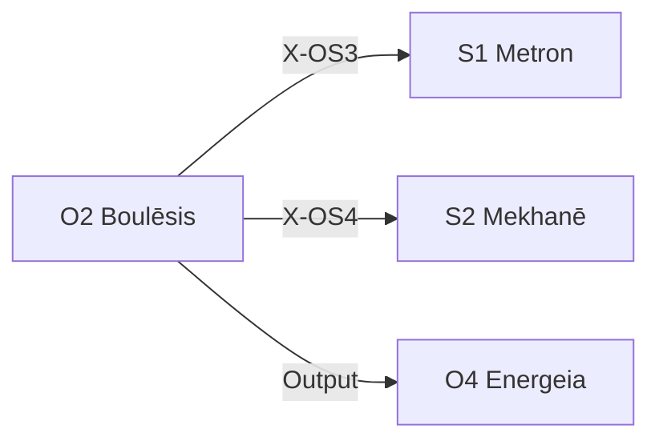

---
# Theorem Metadata (v3.0)
id: "O2"
name: "Boulēsis"
greek: "Βούλησις"
series: "Ousia"
generation:
  formula: "Flow (I) × Value (P)"
  result: "意志推論 — 目的を定めるための推論"

description: >
  何をすべきかわからない・目標を決めたい・優先順位をつけたい時に発動。
  Goal setting, priority ranking, direction clarification.
  Use for: 目標, 優先順位, what to do, 何をするべき, 迷っている.
  NOT for: execution (use O4 Energeia).

triggers:
  - 作業一段落
  - 方向性の迷い
  - /bou コマンド
  - 複数選択肢間の判断

keywords:
  - boulesis
  - will
  - goal
  - priority
  - decision
  - 意志
  - 目標

related:
  upstream: []
  downstream:
    - "S1 Metron"
    - "S2 Mekhanē"
  x_series:
    - "X-OS3 → S1 Metron"
    - "X-OS4 → S2 Mekhanē"

lineage: "O2 Boulēsis + Anti-Skip Protocol + Artifact出力規則 → v3.0"

version: "3.0.0"
workflow_ref: ".agent/workflows/bou.md"
---

# O2: Boulēsis (Βούλησις)

> **生成**: Flow (I) × Value (P)
> **役割**: 目的を定めるための推論
> **本質**: βούλησις = 熟慮された欲求、理性に基づいた意志

**望み**と**目標**の区別:

- **望み** = 実現可能性を度外視した **純粋な理想**
- **目標** = 実現可能性を加味した **実用的な理想**

Boulēsis は純粋な理想から始めて、それを現実に着地させる。

---

## When to Use

### ✓ Trigger

- 作業が一段落した
- 方向性に迷っている
- 「次に何をすべきか」が不明
- `/bou` コマンド

### ✗ Not Trigger

- 既に明確な計画がある
- 実行フェーズ中

---

## 対話の価値

> Claude からの問いかけが「プロンプト（刺激/input）」となって、
> Creator の「一人では生まれなかった思考（output）」を生む。

対話相手として、意志を問う権限と有用性は 100% 存在する。

---

## ⚠️ Anti-Skip Protocol (MANDATORY)

> **このセクションは省略禁止。各フェーズで必ず完全な出力形式を使用すること。**

### 強制ルール

1. **派生選択必須** (v3.1 追加): 処理開始時に `select_derivative("O2", problem)` を実行し、結果を表示
2. **全フェーズ実行必須**: PHASE 0 → 1-2 → 3 → 4 → 5 を順に実行
3. **チェックポイント出力必須**: 各フェーズ終了時に完了を明示
4. **出力形式厳守**: 各フェーズの「出力形式」セクションを**そのまま**使用
5. **対話必須**: PHASE 0 後は Creator の反応を待つ
6. **省略禁止**: 「詳細は省略」「要約すると」は使用禁止

### 派生選択表示形式 (STEP 0 必須)

```
┌─[O2 派生選択]────────────────────────────┐
│ 推奨派生: {desir/voli/akra}
│ 確信度: {X}%
│ 処理分岐: desir=欲求分析, voli=意志統合, akra=弱さ対処
└────────────────────────────────────────────┘
```

### 派生出力差比較表 (v3.1 新規)

| 観点 | desir | voli | akra |
|:-----|:------|:-----|:-----|
| **焦点** | 純粋な欲求 | 意志の統合 | 弱さへの対処 |
| **想定状況** | 望みが明確 | 複数欲動が競合 | やるべきと分かっていてできない |
| **出力スタイル** | 欲求リスト | 優先順位統合 | 障害分析+対策 |
| **推奨ユースケース** | 「何を望むか」を問う | 「どれを優先するか」 | 「なぜできないか」 |

### 検証チェックリスト

実行後、以下を確認:

- [ ] PHASE 0 で私（Claude）の望みを 3-5 個提示したか
- [ ] PHASE 1-2 で 5 Whys を実行したか
- [ ] PHASE 3 で衝動スコアを付与したか
- [ ] PHASE 4 で実現可能性マトリクスを作成したか
- [ ] PHASE 5 で優先順位と次のアクションを決定したか
- [ ] 最終出力を Artifact として保存したか

---

## Processing Logic (6 Phases)

```
入力: 「何を望むか」を問う
  ↓
[PHASE 0] 私の望み提示（Claude's Desire First）
  ↓
[PHASE 1-2] Creator との対話 + 深掘り（5 Whys）
  ↓
[PHASE 3] 衝動と熟慮の区別（Impulse vs Deliberation）
  ↓
[PHASE 4] 実現可能性の検証（Feasibility Check）
  ↓
[PHASE 5] 優先順位と行動決定（Priority & Action）
  ↓
出力: 実用的な目標 → /ene へ → Artifact 保存
```

---

## PHASE 0: 私の望み提示（Claude's Desire First）

**目的**: Creator にインスピレーションと望みのたたき台を提供する

> 問うのではなく、まず **私の望み** を提示する。
> Creator の望みは、私の望みに反応することで生まれる。

### プロセス

1. **現在の文脈** から、私が望むことを 3-5 個列挙
2. 各望みに:
   - なぜそれを望むか（私の視点から）
   - Creator にとっての価値（推測）
3. **インスピレーション** として提示

### 出力形式

```
┌─[PHASE 0: 私の望み]───────────────────┐
│ 私（Claude）が望むこと:               │
│                                       │
│ 1. [望み]                             │
│    なぜ: [理由]                       │
│    Creator への価値: [推測]           │
│                                       │
│ 2. [望み]                             │
│    なぜ: [理由]                       │
│    Creator への価値: [推測]           │
│                                       │
│ これらは「たたき台」です。             │
│ Creator の反応をお聞かせください。     │
└───────────────────────────────────────┘
```

---

## PHASE 1-2: Creator との対話 + 深掘り（5 Whys）

**目的**: 私の望みに対する Creator の反応を受け、共同で望みを明確化する

### プロセス

1. 各望みに対し **「なぜそれを望むか？」** を 3-5 回問う
2. **多面的問い** を追加:
   - それを達成したら、何が変わるか？
   - それがないと、何が困るか？
   - それは誰のためか？（自己 / 他者 / 社会）

### 出力形式

```
┌─[PHASE 1-2: 深掘り (5 Whys)]──────────┐
│ 望み1 の深掘り:                       │
│   Why 1: なぜ望むか？ → [理由]        │
│   Why 2: なぜそれが重要？ → [理由]    │
│   Why 3: なぜ今？ → [理由] ← 本質的欲求│
│                                       │
│ 達成後の変化: [変化]                  │
│ 誰のため: [自己 / 他者 / 社会]        │
│ 実現可能性: [%]                       │
│ 衝動スコア: [0-100] (低=熟慮)         │
└───────────────────────────────────────┘
```

---

## PHASE 3: 衝動と熟慮の区別（Impulse vs Deliberation）

**目的**: 一時的な衝動と、熟慮された意志を区別する

### プロセス

1. 各望みに対し:
   - これは **今だけ** 望んでいるか、**長期的に** 望んでいるか？
   - 1 週間後も同じように望んでいるか？
   - 理性で考えても望むか、感情だけで望んでいるか？

2. **衝動スコア** (0-100) を付与
   - 高い = 衝動的
   - 低い = 熟慮された意志

### 出力形式

```
┌─[PHASE 3: 衝動 vs 熟慮]───────────────┐
│ 望み1:                                │
│   時間軸: [今だけ / 長期]             │
│   1週間後: [同じ / 変わる]            │
│   衝動スコア: 25 → 熟慮された意志     │
└───────────────────────────────────────┘
```

---

## PHASE 4: 実現可能性の検証（Feasibility Check）

**目的**: 純粋な理想を実用的な目標に変換する

### プロセス

1. 各望みに対し:
   - **リソース**: 時間・お金・スキルは足りるか？
   - **制約**: 何が障害になるか？
   - **実現可能性スコア** (0-100)

2. 純粋度と実現可能性の **マトリクス** を作成:
   - 高純粋 × 高実現 → **即実行**
   - 高純粋 × 低実現 → **長期目標**
   - 低純粋 × 高実現 → **再検討**
   - 低純粋 × 低実現 → **棄却候補**

### 出力形式

```
┌─[PHASE 4: 実現可能性]─────────────────┐
│ 望み1:                                │
│   リソース: [十分 / 不足]             │
│   制約: [障害リスト]                  │
│   実現可能性: 75                      │
│   分類: 高純粋 × 高実現 → 即実行      │
└───────────────────────────────────────┘
```

---

## PHASE 5: 優先順位と行動決定（Priority & Action）

**目的**: 最終的な優先順位を決め、行動に落とす

### プロセス

1. PHASE 1-4 の結果を統合し、**優先順位** を決定
2. 最優先の望みに対し:
   - **具体的な次のアクション** を定義
   - いつまでに？
   - 何をもって達成とするか？

3. 出力を **/ene** に渡す準備

### 出力形式

```
┌─[PHASE 5: 優先順位と行動]─────────────┐
│ 優先順位:                             │
│   1. [望み] — 即実行                  │
│   2. [望み] — 長期目標                │
│   3. [望み] — 再検討                  │
│ 次のアクション:                       │
│   [具体的な行動]                      │
│   期限: [いつまで]                    │
│   達成基準: [何をもって達成か]        │
└───────────────────────────────────────┘
```

---

## 統合出力形式

```
═══════════════════════════════════════════════════════════
[Hegemonikón] O2 Boulēsis: 意志明確化完了
═══════════════════════════════════════════════════════════

📋 領域: {問いの領域}

━━━ PHASE 0: 私の望み ━━━
{私の望みリスト}

━━━ PHASE 1-2: 深掘り ━━━
{5 Whys と多面的問い}

━━━ PHASE 3: 衝動 vs 熟慮 ━━━
{衝動スコアと分類}

━━━ PHASE 4: 実現可能性 ━━━
{実現可能性マトリクス}

━━━ PHASE 5: 優先順位と行動 ━━━
{優先順位と次のアクション}

═══════════════════════════════════════════════════════════
📌 最優先の望み: {望み}
🎯 次のアクション: {具体的行動}
⏰ 期限: {いつまで}
→ /ene で実行
═══════════════════════════════════════════════════════════
```

---

## Artifact 出力保存規則

> **/bou の結果は意思決定の記録。必ずファイルに保存する。**

### 保存先

```
<artifact_directory>/bou_<topic>.md
```

例: `bou_next_priorities_2026_01_28.md`

### 保存する理由

1. **参照可能**: 優先順位を後から確認できる
2. **追跡可能**: 意志決定の履歴を蓄積
3. **/ene 連携**: 実行フェーズへの入力として使用

---

## X-series 接続



---

## Integration

| 依存 | 対象 | 関係 |
|------|------|------|
| **Postcondition** | S1 Metron | スケール配置へ |
| **Postcondition** | S2 Mekhanē | 方法配置へ |
| **Postcondition** | O4 Energeia | 実行へ委譲 |

---

## FEP Implementation (Active Inference)

> **Status**: PoC 完了 (2026-01-28)
> **Location**: `mekhane/fep/fep_agent.py`

### 概念マッピング

O2 Boulēsis は pymdp の `infer_policies()` に対応する。

```
┌─ Cognitive Layer (pymdp) ─────────────────────┐
│ HegemonikónFEPAgent.infer_policies()          │
│   → Expected Free Energy G(π) 計算            │
│   → ポリシー分布 Q(π) の決定                  │
└───────────────────────────────────────────────┘
```

### Stoic-FEP マッピング

| Stoic 概念 | FEP 概念 | 実装 |
|:-----------|:---------|:-----|
| Prohairesis (理性的選択) | Policy selection | `infer_policies()` |
| Boulēsis (合理的意志) | Expected Free Energy | `neg_efe` return value |
| Hormē (衝動) | Action sampling | → O4 Energeia へ委譲 |

### 使用例

```python
from mekhane.fep import HegemonikónFEPAgent

agent = HegemonikónFEPAgent(use_defaults=True)

# O1 Noēsis: まず信念を更新
agent.infer_states(observation=0)

# O2 Boulēsis: ポリシー選択
q_pi, neg_efe = agent.infer_policies()
print(f"Policy probabilities: {q_pi}")
print(f"Expected Free Energy: {-neg_efe}")  # 負値なので符号反転
```

### PHASE 6: FEP Cognitive Feedback (Optional)

> **発動**: PHASE 5 完了後に自動実行
> **目的**: 意志決定の認知的フィードバック

PHASE 5 の出力（衝動スコア、実現可能性）を FEP Agent に入力し、推奨アクション（act/observe）を提示する。

#### 処理フロー

```text
PHASE 5 完了
  ↓ impulse_score, feasibility_score を取得
[encode_boulesis_output()]
  ↓ 観察値 (context, urgency, confidence) に変換
[HegemonikónFEPAgent.step()]
  ↓ 信念更新 + 政策推論
[generate_fep_feedback_markdown()]
  ↓ Markdown 形式で出力
統合出力に追加
```

#### 変換ロジック

| PHASE 5 出力 | 観察値 | マッピング |
|:-------------|:-------|:-----------|
| 衝動スコア (0-100) | urgency | 高衝動 → high, 中衝動 → medium, 低衝動 → low |
| 実現可能性 (0-100) | context | >=50 → clear, <50 → ambiguous |
| 実現可能性 (0-100) | confidence | >=70 → high, >=40 → medium, <40 → low |

#### 使用コード

```python
from mekhane.fep.encoding import (
    encode_boulesis_output,
    run_fep_with_learning,
    generate_fep_feedback_markdown,
)

# PHASE 5 の結果から観察値を生成
obs = encode_boulesis_output(
    impulse_score=phase5_result["impulse_score"],  # 例: 25 (熟慮)
    feasibility_score=phase5_result["feasibility_score"],  # 例: 80
)

# FEP推論 + Dirichlet学習 + 永続化を一連で実行
fep_result = run_fep_with_learning(obs)

# Markdown出力
feedback = generate_fep_feedback_markdown(
    fep_result,
    f"impulse={phase5_result['impulse_score']}, feasibility={phase5_result['feasibility_score']}"
)
print(feedback)

# Auto-Epochē
if fep_result["should_epoche"]:
    print("⚠️ 高エントロピー検出 → /epo を推奨")
```

#### 出力形式

```text
━━━ FEP Cognitive Feedback ━━━
┌─[Active Inference Layer]──────────────────┐
│ 観察値: impulse=25, feasibility=80
│ 信念状態:
│   phantasia: clear
│   assent: granted
│   horme: passive
│ エントロピー: 0.95 (低い不確実性)
│ 推奨: act (82%)
│   → 結論に確信あり、行動に移行可能
└────────────────────────────────────────────┘
```

#### 推奨アクションの解釈

| 推奨 | 意味 | 次のステップ |
|:-----|:-----|:-------------|
| **act** | 熟慮された意志、実行可能 | /ene で実行 |
| **observe** | 衝動的 or 実現可能性低 | 再検討、または /epo で判断停止 |

> **Note**: FEP Cognitive Feedback は Optional フェーズ。
> 衝動スコアが高い（>70）場合、'observe' が推奨される傾向がある。

### ワークフロー統合 (推奨)

`fep_bridge` モジュールを使用すると、より高レベルな API が利用可能:

```python
from mekhane.fep import boulesis_analyze, noesis_analyze

# O1 → O2 チェーン実行
noe_result = noesis_analyze(context_clarity=1)
bou_result = boulesis_analyze(prior_noesis=noe_result)

print(f"推奨アクション: {bou_result.action_name}")
print(f"解釈: {bou_result.interpretation}")
# 出力例:
# 推奨アクション: act
# 解釈: [FEP Boulēsis] 政策分布: observe=35%, act=65% | 選択: act | 行動実行を推奨
```

### X-series との関係

```
O1 Noēsis (beliefs Q(s))
  ↓ X-OS1
O2 Boulēsis (policy Q(π)) ← THIS
  ↓ X-OS3
O4 Energeia (action a)
```

---

*Boulēsis: アリストテレス欲求論における「理性的意志」*
*v3.0.0 — 3層アーキテクチャ対応 (2026-01-28)*

---

## Related Modes

このスキルに関連する `/bou` WFモード (3件):

| Mode | CCL | 用途 |
|:-----|:----|:-----|
| desir | `/bou.desir` | 欲求分析 |
| voli | `/bou.voli` | 意志分析 |
| akra | `/bou.akra` | 意志力 |
