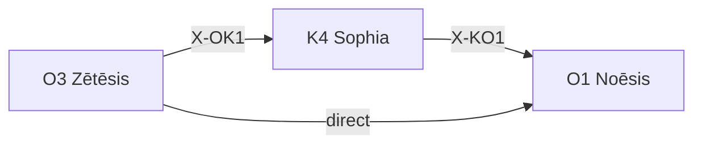

---
# Theorem Metadata (v4.0)
id: "O3"
name: "Zētēsis"
greek: "Ζήτησις"
series: "Ousia"
generation:
  formula: "Flow (A) × Value (E)"
  result: "探求 — 問いを立てる認知機能"

description: >
  何を問うべき？・問いを発見したい・深掘り候補を探す時に発動。
  Question discovery, inquiry initiation, philosophical seeking.
  Use for: 問いを立てる, 探求, 問いの発見, zet.
  NOT for: information gathering (use K4 Sophia /sop).

triggers:
  - "何を問うべき"
  - "問いを発見"
  - "問いの種"
  - "探求"
  - /zet コマンド

keywords:
  - zetesis
  - inquiry
  - question
  - discovery
  - 探求
  - 問い

related:
  upstream: []
  downstream:
    - "O1 Noēsis"
    - "K4 Sophia"
  x_series:
    - "X-OK1 → K4 Sophia (情報収集)"
    - "X-OO1 → O1 Noēsis (深い分析)"

lineage: "O3 Zētēsis 統一リマッピング (2026-01-28) — 問いを立てる機能に純化"

version: "4.0.0"
workflow_ref: ".agent/workflows/zet.md"
risk_tier: L1
reversible: true
requires_approval: false
risks:
  - "認知フレームの過度な適用による思考の硬直化"
fallbacks: []
---

# O3: Zētēsis (Ζήτησις)

> **生成**: Flow (A) × Value (E)
> **役割**: 問いを立てる — 探求の開始
> **本質**: ζήτησις = 哲学的探究・問いを立てる行為

---

## When to Use

### ✓ Trigger

- 「何を問うべきか」を発見したい
- /noe に渡す対象候補を探している
- 摩擦点・違和感・モヤモヤがある
- `/zet` コマンド

### ✗ Not Trigger

- 情報収集 → K4 Sophia `/sop` を使え
- 既に問いが明確 → O1 Noēsis `/noe` へ直接

---

## ⚠️ Anti-Skip Protocol (MANDATORY)

### 強制ルール

1. **派生選択必須** (v4.1 追加): 処理開始時に `select_derivative("O3", context)` を実行し、結果を表示
2. **全フェーズ実行必須**: PHASE 1 → 2 → 3 → 4 を順に実行
3. **省略禁止**: 「詳細は省略」は使用禁止

### 派生選択表示形式 (STEP 0 必須)

```
┌─[O3 派生選択]────────────────────────────┐
│ 推奨派生: {anom/hypo/eval}
│ 処理分岐: anom=異常検出, hypo=仮説生成, eval=評価
└────────────────────────────────────────────┘
```

---

## Processing Logic

```
入力: コンテキスト / 作業状況
  ↓
[PHASE 1] 問いの源泉探索
  ├─ 摩擦点検出 (Friction Points)
  ├─ 成功の裏読み (Success Shadow)
  └─ 前提棚卸し (Assumption Audit)
  ↓
[PHASE 2] 問いのフィルタリング
  ├─ 深さ / 緊急度 / 影響範囲
  └─ /noe 適性スコア
  ↓
[PHASE 3] 候補出力
  ↓
[PHASE 4] Creator との対話
  ↓
出力: /noe 対象候補リスト
```

---

## FEP Integration

O3 Zētēsis は **act** 行動に対応:

```
act = 問いを能動的に設定する
observe = 情報を受動的に取得する (K4 Sophia)
```

---

## X-series 接続



**認知サイクル**:

```
問い → 調査 → 分析 → 新しい問い
O3  →  K4  →  O1  →  O3 ...
```

---

## Integration

| 依存 | 対象 | 関係 |
|:-----|:-----|:-----|
| **Postcondition** | K4 Sophia | 情報収集へ |
| **Postcondition** | O1 Noēsis | 深い分析へ |

---

*Zētēsis: 古代ギリシャにおける「哲学的探究・問いを立てる」*
*v4.0.0 — 統一リマッピング (2026-01-28)*

---

## Related Modes

このスキルに関連する `/zet` WFモード (4件):

| Mode | CCL | 用途 |
|:-----|:----|:-----|
| anom | `/zet.anom` | 異常発見 |
| hypo | `/zet.hypo` | 仮説生成 |
| eval | `/zet.eval` | 評価 |
| abduction | `/zet.abduction` | アブダクション |
