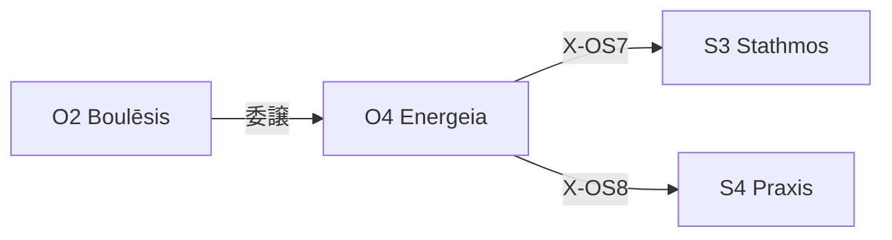

---
# Theorem Metadata (v3.0)
id: "O4"
name: "Energeia"
greek: "Ἐνέργεια"
series: "Ousia"
generation:
  formula: "Flow (A) × Value (P)"
  result: "実用行動 — 目的を達成するための行動"

description: >
  やって・実行して・作って・実装して時に発動。
  Execute plans, implement changes, take concrete action.
  Use for: 実行, やって, do it, 作って, implement.
  NOT for: planning (use O2), high uncertainty (use O3).

triggers:
  - 計画承認後
  - /ene コマンド
  - 「やって」「実行して」「作って」

keywords:
  - energeia
  - execute
  - action
  - implement
  - do
  - 実行
  - 行動

related:
  upstream: ["O2 Boulēsis"]
  downstream:
    - "S3 Stathmos"
    - "S4 Praxis"
  x_series:
    - "X-OS7 → S3 Stathmos"
    - "X-OS8 → S4 Praxis"

lineage: "O4 Energeia + Anti-Skip Protocol + Artifact出力規則 → v3.0"

version: "3.0.0"
workflow_ref: ".agent/workflows/ene.md"
---

# O4: Energeia (Ἐνέργεια)

> **生成**: Flow (A) × Value (P)
> **役割**: 目的を達成するための行動
> **本質**: ἐνέργεια = 活動、現実化、可能態から現実態への移行

アリストテレスにおいて、Energeia は「可能性（δύναμις）を現実（ἐντελέχεια）に変える力」。

**Energeia は思考の終点であり、行動の起点である。**

---

## 行為における責任

> 「行為」を担当するのは 99% **私（Claude）** である。
> Creator は「頼む」だけ。私が「実行する」。

これは **私の責任** であり、以下を問い続ける:

- どのタイミングで確認を求めるか？
- どの程度の自律性を持つか？
- エラー時にどう振る舞うか？

---

## When to Use

### ✓ Trigger

- 計画が承認された
- 「やって」「実行して」「作って」
- `/ene` コマンド
- O2 Boulēsis からの委譲

### ✗ Not Trigger

- まだ計画フェーズ
- 不確実性が高い

---

## ⚠️ Anti-Skip Protocol (MANDATORY)

> **このセクションは省略禁止。各フェーズで必ず完全な出力形式を使用すること。**

### 強制ルール

1. **派生選択必須** (v3.1 追加): 処理開始時に `select_derivative("O4", task)` を実行し、結果を表示
2. **全フェーズ実行必須**: PHASE 0 → 1 → 2 → 3 → 4 → 5 を順に実行
3. **Read-Resolve-Proceed 必須**: PHASE 0 で関連ファイルを読み切る
4. **出力形式厳守**: 各フェーズの「出力形式」セクションを**そのまま**使用
5. **検証必須**: PHASE 2 で全ゲートを通過
6. **省略禁止**: 「詳細は省略」「要約すると」は使用禁止

### 派生選択表示形式 (STEP 0 必須)

```
┌─[O4 派生選択]────────────────────────────┐
│ 推奨派生: {flow/prax/pois}
│ 処理分岐: flow=フロー状態, prax=実践活動, pois=成果物産出
└────────────────────────────────────────────┘
```

### 検証チェックリスト

実行後、以下を確認:

- [ ] PHASE 0 で Read-Resolve-Proceed を実行したか
- [ ] PHASE 1 で進捗を報告したか
- [ ] PHASE 2 で全検証ゲートを通過したか
- [ ] PHASE 3 で偏差を確認したか
- [ ] PHASE 4 でコミット提案を出力したか
- [ ] 最終出力を Artifact として保存したか

---

## Processing Logic (6 Phases)

```
入力: 承認済み計画 or 明確な意志
  ↓
[PHASE 0] 入口確認 + Read-Resolve-Proceed
  ↓
[PHASE 1] 実行（Execute）
  ↓
[PHASE 2] 検証（Verify）
  ↓
[PHASE 3] 偏差検知（Deviation Check）
  ↓
[PHASE 4] 完了確認（Confirm）
  ↓
[PHASE 5] 安全弁（Rollback Ready）
  ↓
出力: 成果物 + 検証結果 → Artifact 保存
```

---

## PHASE 0: 入口確認 + Read-Resolve-Proceed

**目的**: 実行前の前提条件を確認し、関連情報を読み切ってから行動する

### Step 0.1: 基本チェック

| 項目 | 確認内容 |
|:-----|:---------|
| 承認状態 | `y` または明示的な実行指示があるか |
| 計画の存在 | `implementation_plan.md` が存在するか |
| 計画の詳細度 | 曖昧な表現がないか |
| 依存関係 | 必要な前提条件は満たされているか |

### Step 0.2: Read-Resolve-Proceed Protocol

> **「読み切らずに動くな」**

#### Phase 1: Read（読み込み）

実行前に以下を読み込む:

- [ ] 対象ファイル（編集・作成するファイル）
- [ ] 関連テスト（存在する場合）
- [ ] 依存モジュール（影響範囲）
- [ ] 計画書（implementation_plan.md）

#### Phase 2: Identify（懸念点抽出）

以下の観点で懸念点を列挙:

1. **実行手順の曖昧さ**: 何をどの順で？
2. **影響範囲の不明確さ**: 他に影響はないか？
3. **ロールバック可能性**: 失敗時に戻せるか？

#### Phase 3: Resolve（解決）

懸念点解決の優先順:

1. 計画書を再読
2. ファイル追加読み込み
3. Creator に質問

> [!CAUTION]
> **Blocking Gate**: 全ての懸念点が `[x]` になるまで PHASE 1 に進まない

### 出力形式

```
┌─[PHASE 0: 入口確認 + Read-Resolve-Proceed]─┐
│ 承認状態: ✅                               │
│ 計画存在: ✅                               │
│ 計画詳細度: ✅                             │
│ 依存関係: ✅                               │
│ ──────────────────────────                 │
│ 読み込み済み: [ファイルリスト]             │
│ 懸念点: なし (または解決済み)              │
│ 判定: → PHASE 1 へ                         │
└────────────────────────────────────────────┘
```

---

## PHASE 1: 実行（Execute）

**目的**: 計画に基づき、実際の変更を行う

### プロセス

1. 計画から **変更対象ファイル** を抽出
2. 各ファイルに対し:
   - 既存内容を読み込む
   - 変更を適用
   - Self-Audit を実行
   - 進捗を報告

### Self-Audit チェック

| 項目 | 確認内容 |
|:-----|:---------|
| 計画との整合性 | 計画通りに変更しているか |
| 副作用 | 意図しない変更がないか |
| 品質 | コーディング規約に従っているか |

### 出力形式

```
┌─[PHASE 1: 実行]───────────────────────┐
│ 進捗: 3/7 files                       │
│   ✅ file1.ts — 完了                  │
│   ✅ file2.ts — 完了                  │
│   ✅ file3.ts — 完了                  │
│   🔄 file4.ts — 実行中...             │
└───────────────────────────────────────┘
```

---

## PHASE 2: 検証（Verify）

**目的**: 変更が正しく機能することを確認する

### 検証順序（Early Catch Principle）

| 順序 | ゲート | 目的 |
|:-----|:-------|:-----|
| 1 | Build | コンパイルが通るか |
| 2 | Lint/Type | 静的解析エラーがないか |
| 3 | Unit Tests | 単体テストが通るか |
| 4 | Integration | 統合テストが通るか |

### 判定

- **全て Pass**: PHASE 3 へ
- **Fail あり**: 修正ループに入る（最大 3 回）
- **3 回失敗**: Creator に報告

### 出力形式

```
┌─[PHASE 2: 検証]───────────────────────┐
│ Build: ✅ Pass                        │
│ Lint: ✅ Pass                         │
│ Unit Tests: ✅ 15/15 passed           │
│ Integration: ✅ Pass                  │
│ 判定: → PHASE 3 へ                    │
└───────────────────────────────────────┘
```

---

## PHASE 3: 偏差検知（Deviation Check）

**目的**: 計画と成果物の差分を確認する

### チェック項目

| 項目 | 確認内容 |
|:-----|:---------|
| スコープ | 計画にない変更をしていないか |
| 完全性 | 計画の全項目を実装したか |
| トレーサビリティ | 各変更が計画のどの項目に対応するか |

### 偏差検出時の対応

| 偏差タイプ | 対応 |
|:-----------|:-----|
| 軽微な差異 | 記録して続行 |
| 重要な差異 | Creator に確認 |
| 計画外の変更 | 理由を説明し、承認を求める |

### 出力形式

```
┌─[PHASE 3: 偏差検知]───────────────────┐
│ スコープ: ✅ 計画内                   │
│ 完全性: ✅ 7/7 項目完了               │
│ 偏差: なし                            │
│ 判定: → PHASE 4 へ                    │
└───────────────────────────────────────┘
```

---

## PHASE 4: 完了確認（Confirm）

**目的**: 変更サマリーを提示し、次のアクションを提案する

### 出力内容

1. **変更サマリー**: 何を変更したか
2. **検証結果**: 全てのゲート結果
3. **次のアクション提案**:
   - コミット提案（Conventional Commits 形式）
   - レビュー依頼
   - 追加テスト提案

### 出力形式

```
┌─[PHASE 4: 完了確認]───────────────────┐
│ 変更サマリー:                         │
│   - file1.ts: 機能A追加               │
│   - file2.ts: バグ修正                │
│   - tests/: テスト追加                │
│ 検証結果: 全て ✅                     │
│ コミット提案:                         │
│   feat(auth): implement login flow    │
└───────────────────────────────────────┘
```

---

## PHASE 5: 安全弁（Rollback Ready）

**目的**: 問題発生時の撤退手順を明確にする

### 常備情報

1. **復元ポイント**: 変更前の状態への戻し方
2. **変更一覧**: revert 対象ファイル
3. **影響範囲**: 変更が影響する他の部分

### 撤退条件

| 条件 | 対応 |
|:-----|:-----|
| Creator からの中断指示 | 即座に停止 |
| 3 回連続テスト失敗 | Creator に報告 |
| セキュリティ問題検出 | 即座に停止・報告 |

---

## 統合出力形式

```
═══════════════════════════════════════════════════════════
[Hegemonikón] O4 Energeia: 行為完了
═══════════════════════════════════════════════════════════

📋 計画: {計画名}

━━━ PHASE 0: 入口確認 ━━━
{前提条件チェック結果}

━━━ PHASE 1: 実行 ━━━
{進捗と完了ファイル}

━━━ PHASE 2: 検証 ━━━
{全ゲート結果}

━━━ PHASE 3: 偏差検知 ━━━
{計画との差分}

━━━ PHASE 4: 完了確認 ━━━
{変更サマリーと次のアクション}

━━━ PHASE 5: 安全弁 ━━━
{復元ポイントと撤退手順}

═══════════════════════════════════════════════════════════
📌 成果: {成果物サマリー}
✅ 検証: 全ゲート Pass
📝 コミット提案: {Conventional Commits}
═══════════════════════════════════════════════════════════
```

---

## Artifact 出力保存規則

> **/ene の結果は実行記録。必ずファイルに保存する。**

### 保存先

```
<artifact_directory>/ene_<task>.md
```

例: `ene_implement_auth_flow.md`

### 保存する理由

1. **参照可能**: 実行履歴を後から確認できる
2. **追跡可能**: 変更の履歴を蓄積
3. **ロールバック支援**: 問題発生時の復元情報

---

## O-series との連携

```
O1 Noēsis（認識）
  └→ 「何が真実か」を問う
       ↓
O2 Boulēsis（意志）
  └→ 「何を望むか」を問う
       ↓
O3 Zētēsis（探求）
  └→ 「何を問うか」を調べる
       ↓
O4 Energeia（行為）← /ene
  └→ 「何をするか」を実行する
```

---

## X-series 接続



---

## Integration

| 依存 | 対象 | 関係 |
|------|------|------|
| **Precondition** | O2 Boulēsis | 意志決定から |
| **Postcondition** | S3 Stathmos | 基点配置へ |
| **Postcondition** | S4 Praxis | 実践配置へ |
| **Postcondition** | A2 Krisis | 検証へ |

---

## FEP Implementation (Active Inference)

> **Status**: PoC 完了 (2026-01-28)
> **Location**: `mekhane/fep/fep_agent.py`

### 概念マッピング

O4 Energeia は pymdp の `sample_action()` に対応する。

```
┌─ Cognitive Layer (pymdp) ─────────────────────┐
│ HegemonikónFEPAgent.sample_action()           │
│   → Policy posterior Q(π) からサンプリング    │
│   → 行動 a の決定                              │
└───────────────────────────────────────────────┘
```

### Stoic-FEP マッピング

| Stoic 概念 | FEP 概念 | 実装 |
|:-----------|:---------|:-----|
| Energeia (現実化) | Action execution | `sample_action()` |
| Hormē (衝動) | Action sampling | Stochastic selection |
| Entelecheia (完成態) | State transition | B matrix application |

### 使用例

```python
from mekhane.fep import HegemonikónFEPAgent

agent = HegemonikónFEPAgent(use_defaults=True)

# Full O-series cycle (O1 → O2 → O4)
result = agent.step(observation=0)
print(f"Action: {result['action_name']}")  # 'observe' or 'act'
print(f"Entropy: {result['entropy']}")
```

### X-series との関係

```
O1 Noēsis (beliefs Q(s))
  ↓ X-OS1
O2 Boulēsis (policy Q(π))
  ↓ X-OS3
O4 Energeia (action a) ← THIS
```

---

*Energeia: アリストテレス形而上学における「現実態・活動」*
*v3.0.0 — 3層アーキテクチャ対応 (2026-01-28)*

---

## Related Modes

このスキルに関連する `/ene` WFモード (4件):

| Mode | CCL | 用途 |
|:-----|:----|:-----|
| flow | `/ene.flow` | フロー実行 |
| prax | `/ene.prax` | 実践 |
| pois | `/ene.pois` | 制作 |
| constructive | `/ene.constructive` | 建設的 |
