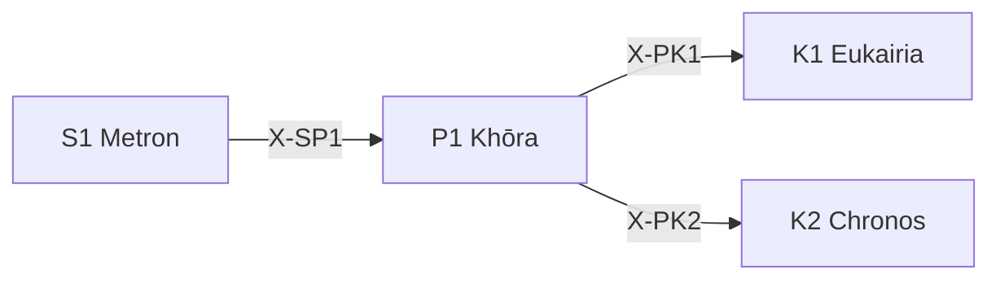

---
# Theorem Metadata (v2.1)
id: "P1"
name: "Khōra"
greek: "Χώρα"
series: "Perigraphē"
generation:
  formula: "Scale × Scale"
  result: "スケール場 — 条件空間の広がり"

description: >
  どの範囲で考える？・スコープを決めたい・領域を定義したい時に発動。
  Domain definition, scope establishment, contextual container.
  Use for: 領域, 範囲, scope, domain, 場.
  NOT for: domain already clear (proceed directly).

triggers:
  - 分析領域の定義
  - スコープの設定
  - 条件空間の確定

keywords:
  - khora
  - space
  - domain
  - scope
  - field
  - 領域
  - 場

related:
  upstream:
    - "S1 Metron"
  downstream:
    - "K1 Eukairia"
    - "K2 Chronos"
  x_series:
    - "← X-SP1 ← S1 Metron"
    - "X-PK1 → K1 Eukairia"
    - "X-PK2 → K2 Chronos"

implementation:
  micro: "(implicit)"
  macro: "(future)"
  templates: []

version: "2.1.0"
workflow_ref: ".agent/workflows/kho.md"
---

# P1: Khōra (Χώρα)

> **生成**: Scale × Scale
> **役割**: 条件空間の広がり

## When to Use

### ✓ Trigger

- 分析領域の定義
- スコープ・境界の設定
- 「どの範囲で考えるか」の決定

### ✗ Not Trigger

- 領域が既に明確

## Processing Logic

```
入力: 対象
  ↓
[STEP 1] スケール × スケール 評価
  ├─ Micro × Micro: 極小領域
  ├─ Micro × Macro: 詳細から全体へ
  ├─ Macro × Micro: 全体から詳細へ
  └─ Macro × Macro: 広大領域
  ↓
[STEP 2] 境界設定
  ↓
出力: 定義された条件空間
```

## X-series 接続



---

## 🏛️ Horos: 境界の守護 (ὅρος)

> **哲学**: ホロス（ὅρος）= 境界石、定義、限界
> **本質**: Khōra（条件空間）をエントロピーから守る境界制御

### 第一原理

条件空間を保護する4つの境界原理:

| 原理 | ギリシャ語 | 機能 |
|:-----|:-----------|:-----|
| **聖域** | Temenos（τέμενος） | 侵入不可の保護領域 |
| **秩序** | Taxis（τάξις） | 構造の不変性 |
| **自足** | Autarkeia（αὐτάρκεια） | 外部依存の最小化 |
| **封印** | Sphragis（σφραγίς） | 環境の封印・再現性 |

### 発動ロジック

```text
P1 Khōra 条件空間設定時:
  ├── Temenos検査: 保護資産への書き込み試行 → 停止 + 確認要求
  ├── Taxis検査: 構造変更試行 → 提案 + 承認待ち
  ├── Autarkeia検査: 外部依存追加 → 稟議 + 代替検討
  └── Sphragis検査: 環境構築 → コンテナ化強制
```

### 保護パターン

| パターン | 発動条件 | 応答 |
|:---------|:---------|:-----|
| **Temenos違反** | 保護資産への書込み | ⚠️ Horos: {資産名} は Temenos 内。OVERRIDE で解除 |
| **Taxis違反** | 新規ディレクトリ/移動 | 🏗️ Horos: 構造変更提案。承認待ち |
| **Autarkeia違反** | 未知の外部依存 | 🛑 Horos: 依存追加稟議。標準ライブラリ優先検討 |
| **Sphragis不在** | 環境セットアップ要求 | 🐳 Horos: コンテナ定義を生成。ホストインストール拒否 |

### 保護資産定義 (Temenos)

```yaml
temenos_patterns:
  - "^\\.env$"
  - "^config\\.(py|json|yaml)$"
  - "^secrets\\.(json|yaml)$"
  - "^auth/.*$"
  - "^docker-compose\\.yml$"
  - "^requirements\\.txt$"
  - "^package\\.json$"
```

### 出力形式

```text
🏛️ Horos: Active
  Temenos: [N] 保護資産
  Taxis: 構造変更禁止
  Autarkeia: stdlib-first
  Sphragis: container-only
```

## 🌐 Context Engineering: 人間中心コンテキスト設計 (v2.2 新規)

> **Origin**: 2026-01 MCP Apps Release / LLM Agent Evolution Report
> **本質**: AI エージェントのための「コンテキスト工学」— UI/UX と MCP の統合

### 原理

Context Engineering は条件空間 (Khōra) をエージェント時代に拡張:

1. **人間中心設計**: エージェントではなく人間がコンテキストを制御
2. **MCP 統合**: Model Context Protocol による標準化されたコンテキスト共有
3. **UI レイヤー**: コンテキストの可視化と操作

### コンテキスト層

```yaml
layer_1_static:
  name: "静的コンテキスト"
  examples:
    - System Prompt
    - GEMINI.md / CLAUDE.md
    - プロジェクト固有ルール
  persistence: "永続"

layer_2_session:
  name: "セッションコンテキスト"
  examples:
    - 会話履歴
    - 一時的な決定事項
    - 現在のタスク状態
  persistence: "セッション"

layer_3_dynamic:
  name: "動的コンテキスト"
  examples:
    - MCP サーバーからの情報
    - リアルタイムデータ
    - 外部 API 応答
  persistence: "瞬時"

layer_4_ui:
  name: "UI コンテキスト"
  examples:
    - ユーザーの現在のカーソル位置
    - 開いているファイル
    - ブラウザ状態
  persistence: "リアルタイム"
```

### Context Budget 最適化

| 層 | 推奨割合 | 理由 |
|:---|:---------|:-----|
| 静的 | ≤ 20% | 初期ロードを軽量に |
| セッション | 30-40% | 作業に最も必要 |
| 動的 | 20-30% | 必要時に取得 |
| UI | ≤ 10% | ノイズを最小化 |

### MCP 統合パターン

```yaml
mcp_resource_contract:
  identity:
    - OAuth / API Key
    - エージェント識別子
  
  access_control:
    - 能力ホワイトリスト
    - スコープ制限
  
  audit:
    - caller_id
    - tool_name
    - inputs_hash
    - outputs_summary
  
  versioning:
    - deprecated_handling: auto-fallback
```

### Hegemonikón での統合

P1 Khōra は以下でコンテキストを定義:

```
条件空間 (Khōra) 設定時:
  ├── 静的コンテキストの確認
  │     → GEMINI.md, tools.yaml の参照
  ├── セッションコンテキストの設定
  │     → handoff の読み込み、タスク状態の確認
  ├── 動的コンテキストの準備
  │     → 必要な MCP サーバーの特定
  └── UI コンテキストの取得
        → ユーザーの現在状態を反映
```

### 出力形式

```markdown
## 🌐 Context Engineering Report

### コンテキスト予算配分
| 層 | 現在使用 | 推奨 | 状態 |
|:---|:---------|:-----|:-----|
| 静的 | N% | ≤20% | ✅/⚠️ |
| セッション | N% | 30-40% | ✅/⚠️ |
| 動的 | N% | 20-30% | ✅/⚠️ |
| UI | N% | ≤10% | ✅/⚠️ |

### MCP リソース計画
| リソース | 用途 | 取得タイミング |
|:---------|:-----|:---------------|
| [MCP1] | [用途] | [初期/必要時] |

### 最適化推奨
- [推奨1]
- [推奨2]
```

### 発動条件

以下の条件で Context Engineering が推奨:

- 新しいタスク/プロジェクトの開始時
- コンテキストウィンドウ使用率 > 70%
- MCP サーバーの追加/変更時

---

*Khōra: プラトン『ティマイオス』における「場所・受容器」*
*v2.2.0 — Context Engineering 統合 (2026-01-29)*

---

## Related Modes

このスキルに関連する `/kho` WFモード (19件):

| Mode | CCL | 用途 |
|:-----|:----|:-----|
| mece | `/kho.mece` | MECE分解 |
| problem | `/kho.problem` | 問題定義 |
| constraint | `/kho.constraint` | 制約定義 |
| boundary | `/kho.boundary` | 境界設定 |
| scope | `/kho.scope` | スコープ定義 |
| module | `/kho.module` | モジュール定義 |
| io | `/kho.io` | 入出力定義 |
| edge | `/kho.edge` | エッジケース |
| phys | `/kho.phys` | 物理空間 |
| conc | `/kho.conc` | 概念空間 |
| rela | `/kho.rela` | 関係空間 |
| frame | `/kho.frame` | フレーミング |
| platform | `/kho.platform` | プラットフォーム |
| segment | `/kho.segment` | セグメント |
| positioning | `/kho.positioning` | ポジショニング |
| blue_ocean | `/kho.blue_ocean` | ブルーオーシャン |
| a3 | `/kho.a3` | A3思考 |
| datamodel | `/kho.datamodel` | データモデル |
