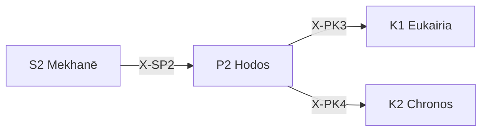

---
# Theorem Metadata (v2.1)
id: "P2"
name: "Hodos"
greek: "Ὁδός"
series: "Perigraphē"
generation:
  formula: "Scale × Function"
  result: "スケール方法 — 条件空間における経路"

description: >
  どう進める？・経路を決めたい・道筋を選びたい時に発動。
  Path definition, route planning, methodology selection.
  Use for: 経路, 道筋, path, route, 方法論.
  NOT for: path already determined (proceed directly).

triggers:
  - 経路の定義
  - 方法論の選択
  - ナビゲーション計画

keywords:
  - hodos
  - path
  - way
  - route
  - methodology
  - 経路
  - 道

related:
  upstream:
    - "S2 Mekhanē"
  downstream:
    - "K1 Eukairia"
    - "K2 Chronos"
  x_series:
    - "← X-SP2 ← S2 Mekhanē"
    - "X-PK3 → K1 Eukairia"
    - "X-PK4 → K2 Chronos"

implementation:
  micro: "(implicit)"
  macro: "(future)"
  templates: []

version: "2.1.0"
workflow_ref: ".agent/workflows/hod.md"
risk_tier: L1
reversible: true
requires_approval: false
risks:
  - "環境設計の偏りによるスコープ逸脱"
fallbacks: []
---

# P2: Hodos (Ὁδός)

> **生成**: Scale × Function
> **役割**: 条件空間における経路

## When to Use

### ✓ Trigger

- 経路・道筋の定義
- スコープ内での方法選択
- ナビゲーション計画

### ✗ Not Trigger

- 経路が既に決まっている

## Processing Logic

```
入力: 条件空間 + 目標
  ↓
[STEP 1] 経路探索
  ├─ Explore経路: 新しい道を探る
  └─ Exploit経路: 既知の道を辿る
  ↓
[STEP 2] 経路評価
  ↓
出力: 選択された経路
```

## X-series 接続



---

*Hodos: 古代ギリシャにおける「道・道筋・方法」*

---

## Related Modes

このスキルに関連する `/hod` WFモード (7件):

| Mode | CCL | 用途 |
|:-----|:----|:-----|
| line | `/hod.line` | 直線経路 |
| bran | `/hod.bran` | 分岐経路 |
| cycl | `/hod.cycl` | 循環経路 |
| bisect | `/hod.bisect` | 二分探索 |
| backcast | `/hod.backcast` | 逆算 |
| search | `/hod.search` | 探索 |
| backward | `/hod.backward` | 逆行 |
