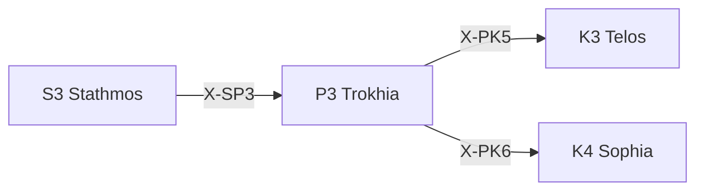

---
# Theorem Metadata (v2.1)
id: "P3"
name: "Trokhia"
greek: "Τροχιά"
series: "Perigraphē"
generation:
  formula: "Function × Scale"
  result: "方法スケール — 方法の適用範囲"

description: >
  どこまで適用する？・軌道を決めたい・サイクルを定義したい時に発動。
  Orbit/trajectory definition, application scope, iteration cycles.
  Use for: 軌道, 適用範囲, パターン, orbit, reach.
  NOT for: application scope already clear (proceed directly).

triggers:
  - 方法の適用範囲決定
  - 軌道・サイクルの定義
  - パターンの確立

keywords:
  - trokhia
  - orbit
  - trajectory
  - pattern
  - cycle
  - 軌道
  - 周期

related:
  upstream:
    - "S3 Stathmos"
  downstream:
    - "K3 Telos"
    - "K4 Sophia"
  x_series:
    - "← X-SP3 ← S3 Stathmos"
    - "X-PK5 → K3 Telos"
    - "X-PK6 → K4 Sophia"

implementation:
  micro: "(implicit)"
  macro: "(future)"
  templates: []

version: "2.1.0"
workflow_ref: ".agent/workflows/tro.md"
---

# P3: Trokhia (Τροχιά)

> **生成**: Function × Scale
> **役割**: 方法の適用範囲

## When to Use

### ✓ Trigger

- 方法の適用範囲決定
- 軌道・サイクルの定義
- 反復パターンの確立

### ✗ Not Trigger

- 適用範囲が既に明確

## Processing Logic

```
入力: 方法 + 対象空間
  ↓
[STEP 1] 軌道評価
  ├─ 短周期: 局所的適用
  └─ 長周期: 広域適用
  ↓
[STEP 2] パターン決定
  ↓
出力: 軌道パターン
```

## X-series 接続



---

*Trokhia: 古代ギリシャ天文学における「軌道・経路」*

---

## Related Modes

このスキルに関連する `/tro` WFモード (6件):

| Mode | CCL | 用途 |
|:-----|:----|:-----|
| fixe | `/tro.fixe` | 固定軌道 |
| adap | `/tro.adap` | 適応軌道 |
| emer | `/tro.emer` | 創発軌道 |
| learning | `/tro.learning` | 学習曲線 |
| state | `/tro.state` | 状態遷移 |
| scurve | `/tro.scurve` | S曲線 |
