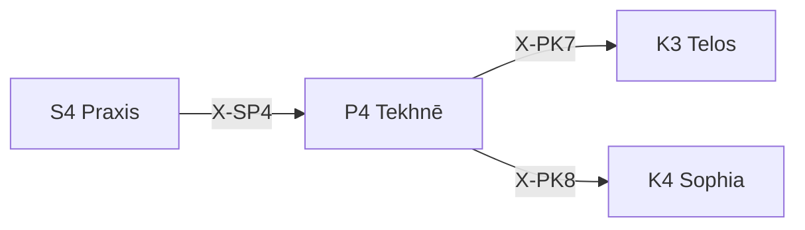

---
# Theorem Metadata (v2.1)
id: "P4"
name: "Tekhnē"
greek: "Τέχνη"
series: "Perigraphē"
generation:
  formula: "Function × Function"
  result: "方法場 — 方法論的条件空間"

description: >
  どの技法で？・技術的制約を決めたい・専門性を定義したい時に発動。
  Technique definition, craft methodology, skill domain boundaries.
  Use for: 技術, 技法, technique, craft, 専門性.
  NOT for: technique selection already clear (proceed directly).

triggers:
  - 技術的条件の定義
  - 専門領域の境界設定
  - クラフトマンシップの適用

keywords:
  - tekhne
  - technique
  - craft
  - art
  - skill
  - 技術
  - 技法

related:
  upstream:
    - "S4 Praxis"
  downstream:
    - "K3 Telos"
    - "K4 Sophia"
  x_series:
    - "← X-SP4 ← S4 Praxis"
    - "X-PK7 → K3 Telos"
    - "X-PK8 → K4 Sophia"

implementation:
  micro: "(implicit)"
  macro: "(future)"
  templates: []

version: "2.1.0"
workflow_ref: ".agent/workflows/tek.md"
risk_tier: L1
reversible: true
requires_approval: false
risks:
  - "環境設計の偏りによるスコープ逸脱"
fallbacks: []
---

# P4: Tekhnē (Τέχνη)

> **生成**: Function × Function
> **役割**: 方法論的条件空間

## When to Use

### ✓ Trigger

- 技術的条件の定義
- 専門領域の境界設定
- 「どの技法で」の決定

### ✗ Not Trigger

- 技術選択が既に明確

## Processing Logic

```
入力: 課題
  ↓
[STEP 1] 技術空間評価
  ├─ Explore × Explore: 実験的技法
  ├─ Explore × Exploit: 革新的応用
  ├─ Exploit × Explore: 応用的探索
  └─ Exploit × Exploit: 確立技法
  ↓
[STEP 2] 技法選択
  ↓
出力: 適用技法
```

## X-series 接続



---

*Tekhnē: アリストテレスにおける「技術・技法・芸術」*

---

## Related Modes

このスキルに関連する `/tek` WFモード (8件):

| Mode | CCL | 用途 |
|:-----|:----|:-----|
| manu | `/tek.manu` | 手動技法 |
| mech | `/tek.mech` | 機械技法 |
| auto | `/tek.auto` | 自動技法 |
| template | `/tek.template` | テンプレート |
| formal | `/tek.formal` | 形式手法 |
| arch | `/tek.arch` | アーキテクチャ |
| interface | `/tek.interface` | インタフェース |
| api | `/tek.api` | API設計 |
