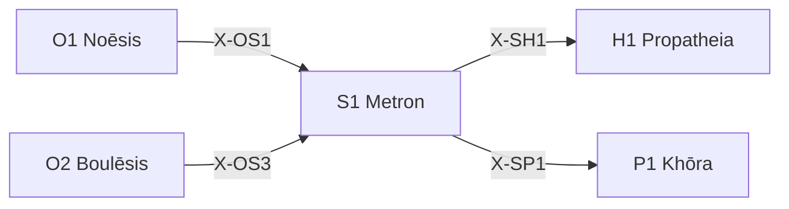

---
# Theorem Metadata (v2.1)
id: "S1"
name: "Metron"
greek: "Μέτρον"
series: "Schema"
generation:
  formula: "Flow × Scale"
  result: "スケール流動 — どのスケールで配置されるか"

description: >
  どのスケールで？・粒度を決めたい・詳細か全体か迷う時に発動。
  Scale/granularity determination, micro vs macro perspective.
  Use for: スケール, 粒度, 詳細/概要, scale, granularity.
  NOT for: scale already determined (proceed directly).

triggers:
  - スケール判断が必要
  - 粒度の決定
  - 視点の切り替え

keywords:
  - metron
  - scale
  - granularity
  - micro
  - macro
  - 粒度
  - スケール

related:
  upstream:
    - "O1 Noēsis"
    - "O2 Boulēsis"
  downstream:
    - "H1 Propatheia"
    - "P1 Khōra"
  x_series:
    - "← X-OS1 ← O1 Noēsis"
    - "← X-OS3 ← O2 Boulēsis"
    - "X-SH1 → H1 Propatheia"
    - "X-SP1 → P1 Khōra"

implementation:
  micro: "(implicit in other workflows)"
  macro: "(future)"
  templates: []

version: "2.1.1"
workflow_ref: ".agent/workflows/met.md"
risk_tier: L1
reversible: true
requires_approval: false
risks:
  - "設計パターンの硬直的適用による柔軟性欠失"
fallbacks: []
---

# S1: Metron (Μέτρον)

> **生成**: Flow × Scale
> **役割**: どのスケールで配置されるか

## When to Use

### ✓ Trigger

- マイクロ視点 vs マクロ視点の判断
- 詳細分析 vs 全体把握の選択
- 処理の粒度を決める

### ✗ Not Trigger

- スケールが既に決まっている

## Processing Logic

```
入力: 認識/行為の対象
  ↓
[STEP 1] スケール評価
  ├─ Micro: 詳細・局所・短期
  └─ Macro: 全体・大局・長期
  ↓
[STEP 2] コンテキストマッチング
  ↓
[STEP 3] スケール選択
  ↓
出力: 適用スケール
```

## X-series 接続



---

*Metron: 古代ギリシャにおける「尺度・基準」*

---

## Related Modes

このスキルに関連する `/met` WFモード (15件):

| Mode | CCL | 用途 |
|:-----|:----|:-----|
| toc | `/met.toc` | 制約理論 |
| fermi | `/met.fermi` | フェルミ推定 |
| cont | `/met.cont` | 連続量 |
| disc | `/met.disc` | 離散量 |
| abst | `/met.abst` | 抽象度 |
| kiss | `/met.kiss` | 最小化 |
| extreme | `/met.extreme` | 極端値 |
| approximation | `/met.approximation` | 近似 |
| definition | `/met.definition` | 定義確認 |
| dimensional | `/met.dimensional` | 次元分析 |
| cognitive_load | `/met.cognitive_load` | 認知負荷 |
| check | `/met.check` | 単位チェック |
| ambiguity | `/met.ambiguity` | 曖昧性解消 |
| units | `/met.units` | 単位変換 |
