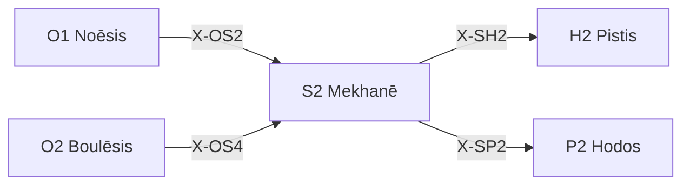

---
# Theorem Metadata (v2.1)
id: "S2"
name: "Mekhanē"
greek: "Μηχανή"
series: "Schema"
generation:
  formula: "Flow × Function"
  result: "方法流動 — どの方法で配置されるか"

description: >
  どうやって？・戦略を決めたい・方法を選びたい時に発動。
  Strategic approach selection, method determination, planning.
  Use for: 戦略, 方法, どうやって, strategy, method, /plan.
  NOT for: method already decided (proceed directly).

triggers:
  - 方法の選択が必要
  - 戦略の策定
  - /plan コマンド

keywords:
  - mekhane
  - method
  - strategy
  - approach
  - how
  - 戦略
  - 方法

related:
  upstream:
    - "O1 Noēsis"
    - "O2 Boulēsis"
  downstream:
    - "H2 Pistis"
    - "P2 Hodos"
  x_series:
    - "← X-OS2 ← O1 Noēsis"
    - "← X-OS4 ← O2 Boulēsis"
    - "X-SH2 → H2 Pistis"
    - "X-SP2 → P2 Hodos"

implementation:
  micro: ".agent/workflows/plan.md"
  macro: "(future)"
  templates:
    - "旧T4 Phronēsis の戦略設計"

derivatives:
  comp:
    name: "Compositional (組立)"
    description: "既存部品を組み合わせて構成"
  inve:
    name: "Inventive (創出)"
    description: "新規に創出・発明する"
  adap:
    name: "Adaptive (適応)"
    description: "既存を調整・適応させる"

version: "2.2.0"
workflow_ref: ".agent/workflows/mek.md"
risk_tier: L1
reversible: true
requires_approval: false
risks:
  - "設計パターンの硬直的適用による柔軟性欠失"
fallbacks: []
---

# S2: Mekhanē (Μηχανή)

> **生成**: Flow × Function
> **役割**: どの方法で配置されるか

## When to Use

### ✓ Trigger

- 戦略・方法の選択が必要
- Explore vs Exploit の判断
- `/plan` コマンド
- 設計フェーズ

### ✗ Not Trigger

- 方法が既に決まっている
- 単純な実行タスク

## Processing Logic

```
入力: 目標 / 問題
  ↓
[STEP 1] 方法空間の探索
  ├─ Explore: 新しい手法を試す
  └─ Exploit: 既知の手法を活用
  ↓
[STEP 2] トレードオフ評価
  ↓
[STEP 3] 方法選択
  ↓
出力: 選択された方法 / 計画
```

## X-series 接続



---

*Mekhanē: 古代ギリシャにおける「機械・装置・手段」*

---

## Related Modes

このスキルに関連する `/mek` WFモード (10件):

| Mode | CCL | 用途 |
|:-----|:----|:-----|
| comp | `/mek.comp` | 組成 |
| inve | `/mek.inve` | 逆転 |
| adap | `/mek.adap` | 適応 |
| model | `/mek.model` | モデル化 |
| simulation | `/mek.simulation` | シミュレーション |
| yagni | `/mek.yagni` | YAGNI |
| dry | `/mek.dry` | DRY |
| observability | `/mek.observability` | 可観測性 |
| substitute | `/mek.substitute` | 代替 |
| nudge | `/mek.nudge` | ナッジ |
