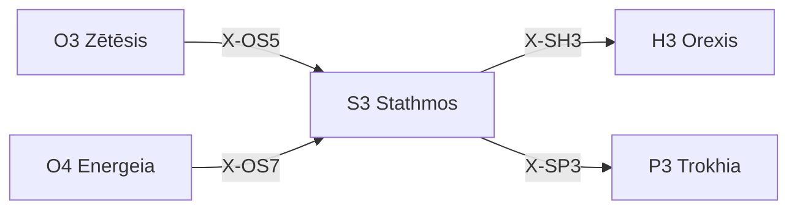

---
# Theorem Metadata (v2.1)
id: "S3"
name: "Stathmos"
greek: "Σταθμός"
series: "Schema"
generation:
  formula: "Value × Scale"
  result: "スケール価値 — どの基準点から配置されるか"

description: >
  基準は何？・ベンチマークを設定したい・評価基準を決めたい時に発動。
  Baseline establishment, benchmark setting, reference points.
  Use for: 基準, 評価基準, baseline, benchmark, 参照点.
  NOT for: baseline already clear (proceed directly).

triggers:
  - 基準点の設定
  - ベンチマーク評価
  - 価値の粒度判断

keywords:
  - stathmos
  - baseline
  - benchmark
  - standard
  - reference
  - 基準
  - 評価

related:
  upstream:
    - "O3 Zētēsis"
    - "O4 Energeia"
  downstream:
    - "H3 Orexis"
    - "P3 Trokhia"
  x_series:
    - "← X-OS5 ← O3 Zētēsis"
    - "← X-OS7 ← O4 Energeia"
    - "X-SH3 → H3 Orexis"
    - "X-SP3 → P3 Trokhia"

implementation:
  micro: "(implicit)"
  macro: "(future)"
  templates: []

derivatives:
  norm:
    name: "Normative (規範)"
    description: "業界標準・ベストプラクティスに基づく基準"
  empi:
    name: "Empirical (経験)"
    description: "過去の実績・数値データに基づく基準"
  rela:
    name: "Relative (相対)"
    description: "競合比較・ベンチマークに基づく基準"

version: "2.2.0"
workflow_ref: ".agent/workflows/sta.md"
---

# S3: Stathmos (Σταθμός)

> **生成**: Value × Scale
> **役割**: どの基準点から配置されるか

## When to Use

### ✓ Trigger

- 基準点・ベンチマークの設定
- 評価基準の決定
- 詳細 vs 大局での価値判断

### ✗ Not Trigger

- 基準が既に明確

## Processing Logic

```
入力: 価値判断の対象
  ↓
[STEP 1] スケール判定
  ├─ Micro: 詳細な価値分析
  └─ Macro: 大局的価値判断
  ↓
[STEP 2] 基準点設定
  ↓
出力: 適用基準
```

## X-series 接続



---

## 📏 Metrika: 品質門 (μετρική)

> **哲学**: メトリカ = 測定術、基準の実践
> **本質**: コード品質の5つの門 — 通過しなければ出力不可

### 5つの品質門 (Pylai)

| 門 | ギリシャ語 | 機能 | 閾値 |
|:---|:-----------|:-----|:-----|
| **試験** | Dokimē（δοκιμή） | テスト先行強制 | Red → Green → Refactor |
| **簡潔** | Syntomia（συντομία） | 複雑度制限 | ネスト≤3, 関数≤30行, 引数≤4 |
| **到達** | Prosbasimotēs（προσβασιμότης） | アクセシビリティ | WCAG 2.1 AA |
| **原子** | Atomos（ἄτομος） | UI分割強制 | 単一責任, 120行以下 |
| **清浄** | Katharos（καθαρός） | 不要物除去 | 死コード0, Zombie0 |

### 発動ロジック

```text
S3 Stathmos 品質評価時:
  ├── Dokimē検査: 実装前にテスト存在？ → 不在なら停止
  ├── Syntomia検査: 複雑度超過？ → リファクタリング強制
  ├── Prosbasimotēs検査: セマンティックHTML？ → 修正強制
  ├── Atomos検査: God Component？ → 分割強制
  └── Katharos検査: 死コード？ → 削除強制
```

### 門別応答パターン

| 門 | 違反時応答 |
|:---|:-----------|
| **Dokimē** | 🧪 Metrika: テスト先行。実装権限なし |
| **Syntomia** | 📉 Metrika: 複雑度超過。ガード節適用 |
| **Prosbasimotēs** | ♿ Metrika: a11y違反。セマンティック修正 |
| **Atomos** | ⚛️ Metrika: 単一コンポーネント超過。分割実行 |
| **Katharos** | 💀 Metrika: 死コード検出。削除実行 |

### Diorthōsis (自動修正) 連携

> **A2 Krisis の Diorthōsis** と連携し、軽微な違反は自動修正

```text
🏛️ Hexis: Praxis (実装モード)
  ↓
📏 Metrika: 5門検査
  ├── PASS → 出力
  └── FAIL → Diorthōsis 試行 (1回)
       ├── 成功 → 出力 + 修正報告
       └── 失敗 → 停止 + ユーザー確認
```

---

## ⏰ Chreos: 技術的負債管理 (χρέος)

> **哲学**: クレオス = 負債、義務
> **本質**: TODO/FIXME の期限管理

### 負債形式

```yaml
format: "# TODO({Owner}, {YYYY-MM-DD}): {Description}"
example_valid: "# TODO(Creator, 2026-03-01): Optimize this loop"
example_invalid: "# TODO: Fix later"  # ← 拒否
```

### 腐敗検出

| 状態 | 条件 | アクション |
|:-----|:-----|:-----------|
| **健全** | 期限内 | 継続 |
| **警告** | 期限7日以内 | ⚠️ 通知 |
| **腐敗** | 期限超過 | 🔴 実装 or 延期を強制 |

---

*Stathmos: 古代ギリシャにおける「停留所・基点・基準」*
*v2.3.0 — Metrika + Chreos 統合 (2026-01-29)*

---

## Related Modes

このスキルに関連する `/sta` WFモード (17件):

| Mode | CCL | 用途 |
|:-----|:----|:-----|
| pareto | `/sta.pareto` | 80/20分析 |
| optimize | `/sta.optimize` | 最適化思考 |
| safety | `/sta.safety` | 安全側設計 |
| sensitivity | `/sta.sensitivity` | 感度分析 |
| robust | `/sta.robust` | ロバスト性評価 |
| done | `/sta.done` | 完了基準 |
| test | `/sta.test` | テスト基準 |
| delta | `/sta.delta` | 変化基準 |
| signal | `/sta.signal` | シグナル検出 |
| failsafe | `/sta.failsafe` | フェイルセーフ |
| security | `/sta.security` | セキュリティ基準 |
| fairness | `/sta.fairness` | 公平性基準 |
| norm | `/sta.norm` | 規範基準 |
| empi | `/sta.empi` | 経験基準 |
| accountability | `/sta.accountability` | 説明責任 |
| opportunity | `/sta.opportunity` | 機会基準 |
| rela | `/sta.rela` | 相対基準 |
