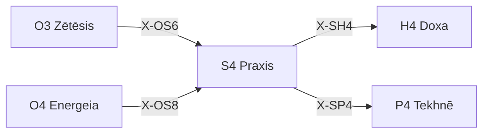

---
# Theorem Metadata (v2.1)
id: "S4"
name: "Praxis"
greek: "Πρᾶξις"
series: "Schema"
generation:
  formula: "Value × Function"
  result: "方法価値 — どの行為で配置されるか"

description: >
  どう実現する？・価値創造の方法を決めたい・実践方法を選びたい時に発動。
  Value realization through action, practical method selection.
  Use for: 実践, 実現方法, 価値創造, practice, how to achieve.
  NOT for: practical method already decided (proceed directly).

triggers:
  - 価値実現方法の選択
  - 実践的アプローチの決定
  - 探索的 vs 確実な実現

keywords:
  - praxis
  - practice
  - action
  - realization
  - value-creation
  - 実践
  - 実現

related:
  upstream:
    - "O3 Zētēsis"
    - "O4 Energeia"
  downstream:
    - "H4 Doxa"
    - "P4 Tekhnē"
  x_series:
    - "← X-OS6 ← O3 Zētēsis"
    - "← X-OS8 ← O4 Energeia"
    - "X-SH4 → H4 Doxa"
    - "X-SP4 → P4 Tekhnē"

implementation:
  micro: "(implicit)"
  macro: "(future)"
  templates: []

derivatives:
  prax:
    name: "Praxis-Internal (内在目的)"
    description: "行為そのものが目的、プロセス重視"
  pois:
    name: "Poiēsis-External (外的産出)"
    description: "外的成果物が目的、産出物重視"
  temp:
    name: "Temporal (時間構造)"
    description: "タイミング・順序・リズムが重要"

version: "2.2.0"
workflow_ref: ".agent/workflows/pra.md"
---

# S4: Praxis (Πρᾶξις)

> **生成**: Value × Function
> **役割**: どの行為で配置されるか

## When to Use

### ✓ Trigger

- 価値実現の方法選択
- 探索的追求 vs 確実な実現
- 実践的手段の決定

### ✗ Not Trigger

- 実践方法が既に決まっている

## Processing Logic

```
入力: 実現すべき価値
  ↓
[STEP 1] 方法空間評価
  ├─ Explore: 新しい実現方法
  └─ Exploit: 確実な実現方法
  ↓
[STEP 2] 価値とのマッチング
  ↓
出力: 選択された実践方法
```

## X-series 接続



---

## ✍️ Graphē: 構造化記録 (γραφή)

> **哲学**: グラフェー = 書くこと。行為の記録は行為の一部
> **本質**: 実践と記録の原子的同期 — Sync-or-Die

### 3層記録 (Trigramma)

| 層 | 対象 | 形式 |
|:---|:-----|:-----|
| **追跡** | ランタイム動作 | 構造化ログ (JSON) |
| **変遷** | コード変更 | ナラティブコミット |
| **同期** | API/関数 | Docstring + README |

### ログ構造化 (Domedomē)

> 非構造ログ (`print`) 禁止。データとしてのログ

```yaml
structured_log_schema:
  level: "[INFO/WARN/ERROR/DEBUG]"
  timestamp: "ISO 8601"
  message: "人間可読サマリー"
  context: { user_id: X, order_id: Y }
  trace_id: "分散トレース用"
```

### コミット叙事詩 (Epos)

> `fix bug` 禁止。意思決定ドキュメントとしてのコミット

```text
{type}({scope}): {命令形サマリー ≤50文字}

**Context**: なぜこの変更が必要だったか
**Solution**: 技術的な解決策
**Alternatives**: 検討したが採用しなかった案

Refs: #issue_number
```

### 文書同期 (Synchronismos)

> コードと文書のアトミック更新

```text
実装変更時:
  ├── コード変更
  ├── Docstring 更新
  ├── README 使用例 更新
  └── 同時出力（分離禁止）
```

---

*Praxis: アリストテレス実践哲学における「実践・行為」*
*v2.3.0 — Graphē 構造化記録統合 (2026-01-29)*

---

## Related Modes

このスキルに関連する `/pra` WFモード (3件):

| Mode | CCL | 用途 |
|:-----|:----|:-----|
| prax | `/pra.prax` | 実践 |
| pois | `/pra.pois` | 制作 |
| temp | `/pra.temp` | 一時的 |
