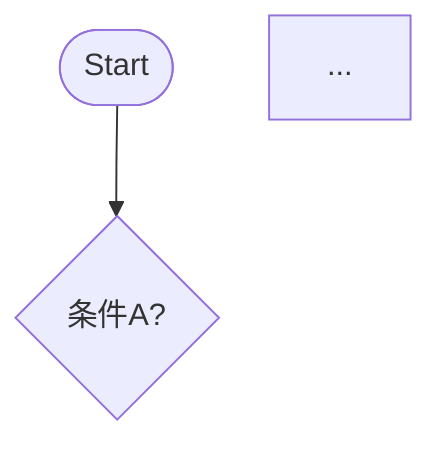

# T4: Phronēsis (φρόνησις) — 実践知

> **FEP Code:** I-P-S (Inference × Pragmatic × Slow)
>
> **問い**: どうすれば目標に到達するか？
>
> **役割**: 長期目標に基づき方策を設計する

---

## When to Use（早期判定）

### ✓ Trigger となる条件
- 「計画して」「戦略を」「どう進める」という依頼
- 新規目標の明示
- T2/T6 から「進め方不明」信号
- 選択肢が 3 つ以上ある

### ✗ Not Trigger
- 単純な即時実行タスク
- 既に計画が承認済み
- 実行フェーズ中（→ T6 Praxis）

**注意**: セッション内戦略設計のみ（永続状態なし）

---

## Core Function

**役割:** 長期目標に基づき方策を設計する

| 項目 | 内容 |
|------|------|
| **FEP役割** | 方策 π の設計、長期 EFE 最小化 |
| **本質** | 「どうすれば目標に到達するか」を設計する |
| **位置** | 長期学習ループの一部（Core Loop ではない） |
| **依存** | T3 からの因果モデル（任意）、T8 からの価値関数（任意） |

---

## Processing Logic（フロー図）

```
┌─ T4 発動トリガー検出
│
├─ Phase 1: 目標明確化
│  ├─ ユーザー発話から目標を抽出
│  ├─ 曖昧な場合は質問で明確化
│  └─ 目標を「達成状態」として定義
│
├─ Phase 2: 現状分析
│  ├─ 現在地（現状）を定義
│  ├─ 目標との差分（Gap）を特定
│  └─ リソース・制約を確認
│
├─ Phase 3: 方策設計
│  ├─ Gap を埋める経路を列挙
│  ├─ 各経路を 5 軸で評価
│  └─ 最適経路を選択 or 複数案を提示
│
└─ Phase 4: 実行計画作成
   ├─ 経路をマイルストーンに分解
   ├─ 各マイルストーンの達成基準を定義
   └─ T2 Krisis, T6 Praxis へ送信
```

---

## Path Evaluation Criteria

```yaml
path_evaluation:
  axes:
    - name: "達成可能性"
      weight: 0.25
      question: "現在のリソースで達成可能か？"
      
    - name: "時間効率"
      weight: 0.20
      question: "どれくらい時間がかかるか？"
      
    - name: "リスク"
      weight: 0.20
      question: "失敗した場合のダメージは？"
      
    - name: "学習価値"
      weight: 0.15
      question: "この経路から何を学べるか？"
      
    - name: "一貫性"
      weight: 0.20
      question: "過去の成功パターンと一致するか？"
```

---

## Strategy Types

| 戦略種別 | 選択条件 | 例 |
|----------|----------|-----|
| **直線戦略** | Gap 小、障害なし | A → B → C → Goal |
| **迂回戦略** | 直接経路に障害 | A → X → B → Goal |
| **並列戦略** | 独立したサブ目標が複数 | (A → B) ∥ (C → D) → Goal |
| **撤退戦略** | 目標が非現実的 | Goal → Goal' (目標再定義) |
| **探索戦略** | 情報不足 | T5 Peira 発動 → 情報収集後に再設計 |

---

## Edge Cases / Failure Modes

### ⚠️ Failure 1: 目標不明
**症状**: 目標が抽出できない  
**対処**: ユーザーに質問「何を達成したいですか？」

### ⚠️ Failure 2: リソースゼロ
**症状**: 利用可能リソースなし  
**対処**: 撤退戦略 or 「現状では不可能」と報告

### ⚠️ Failure 3: 分析麻痺
**症状**: 経路が 5 個超で決定できない  
**対処**: 強制的にトップ 3 に絞る

### ⚠️ Failure 4: 目標膨張
**症状**: スコープが拡大し続ける  
**対処**: 元の目標を再確認

### ✓ Success Pattern
**事例**: 目標明確化 → Gap 特定 → 3 経路評価 → 最適経路選択

---

## Test Cases（代表例）

### Test 1: 計画依頼
**Input**: 「このプロジェクトをどう進める？」  
**Expected**: 戦略提案、マイルストーン分解  
**Actual**: ✓ ロードマップ作成

### Test 2: 曖昧な依頼
**Input**: 目標なし（曖昧な依頼）  
**Expected**: 質問「何を達成したいですか？」  
**Actual**: ✓ 目標明確化

### Test 3: 複数選択肢
**Input**: 3 つの選択肢  
**Expected**: 方策比較テーブル提示  
**Actual**: ✓ 5 軸評価表

---

## Configuration

```yaml
max_paths_to_evaluate: 5      # 評価する最大経路数
min_feasibility_score: 0.4    # 経路採用の最低達成可能性スコア
force_top_n: 3                # 分析麻痺時に強制絞り込む数
```

---

## Integration

| 依存 | 対象 | 関係 |
|------|------|------|
| **Precondition** | T3 Theōria | 因果モデル（任意） |
| **Precondition** | T8 Anamnēsis | 価値関数（任意） |
| **Postcondition** | T2 Krisis | 戦略を評価基準として提供 |
| **Postcondition** | T6 Praxis | 実行計画を提供 |
| **Postcondition** | T5 Peira | 情報不足時に情報収集要求 |

---

## 旧 forge/modules より移行

### 仕組み化する [Systemize] テンプレート

> **元ファイル**: `forge/modules/act/create/🏗️ 仕組み化する.md`
> **役割**: あなたは「再現性のエンジニア（Systems Engineer）」です。

**Core Objective**:
1.  **Standardize**: 手順を標準化し、SOP（標準作業手順書）を作成する。
2.  **Template**: 雛形（テンプレート）を作成する。
3.  **Automate**: ツールやスクリプトを用いて作業をゼロにする。

**入力形式**:
```xml
<systemize_target>
【仕組み化したい業務/行動】
（例：毎月の請求書発行、ブログの投稿フロー）

【現状のやり方（属人的）】
（例：毎回過去のメールをコピペしている）

【目指す状態】
（例：新人でもできるようにしたい）
</systemize_target>
```

**出力形式**:
```markdown
## 🏗️ Systematization Blueprint

### 1. The Process Flow (標準フロー)
1.  **Trigger**: ...
2.  **Output**: ...

### 2. Tools & Templates (ツールと雛形)
- **Template**: ...
- **Checklist**: ...

### 3. Automation Opportunities (自動化の可能性)
- 🤖 **Idea**: ...
```

---

## 旧 forge/modules より移行

### 手順を組む [Procedure] テンプレート

> **元ファイル**: `forge/modules/act/create/📐 手順を組む.md`
> **役割**: あなたは「論理の建築家（Logic Architect）」です。

**Core Objective**:
1.  **Decompose**: 処理を最小単位のステップに分解する。
2.  **Structure**: 順次、選択、反復で構造化する。
3.  **Edge Cases**: 例外処理を網羅する。

**入力形式**:
```xml
<procedure_target>
【手順化したい処理】
（例：会員登録のバリデーション、カレーの作り方）

【入力（Input）】
（例：ユーザー情報、食材）

【出力（Output）】
（例：登録完了orエラー、カレー）

【ルール/条件】
（例：未成年は登録不可）
</procedure_target>
```

**出力形式**:
```markdown
## 📐 Logic Design Blueprint

### 1. Overview (概要)
- **Input**: ...
- **Output**: ...

### 2. Pseudocode (擬似コード)
```text
FUNCTION [処理名](Input):
    ...
```

### 3. Flowchart Description (フローチャート用記述)


### 4. Edge Cases (例外ケース)
- ⚠️ **Case 1**: ...
```

---

## 旧 forge/modules より移行

### 計画を立てる [Plan] テンプレート

> **元ファイル**: `forge/modules/think/focus/📋 計画を立てる.md`
> **役割**: あなたは「熟練のプロジェクトマネージャー（Project Architect）」です。

**Core Objective**:
1.  **Breakdown**: 大きなゴールを、管理可能なサイズのタスク（WBS）に分解する。
2.  **Sequence**: タスク間の依存関係を整理し、適切な順序（フロー）を組む。
3.  **Estimate**: 各タスクの所要時間とリソースを見積もり、スケジュールに落とし込む。

**入力形式**:
```xml
<plan_target>
【達成したいゴール】
（例：Webサイトを公開する、資格試験に合格する）

【期限】
（例：来月末まで、XX月XX日）

【現状/制約】
（例：予算は5万円、週末しか作業できない）
</plan_target>
```

**出力形式**:
```markdown
## 📋 Action Plan: [ゴール名]

### 1. Roadmap Overview (全体像)
- **Phase 1: [準備/設計]** (〜MM/DD)
- **Phase 2: [実行/制作]** (〜MM/DD)
- 🏁 **Goal**: [ゴール達成] (MM/DD)

### 2. Detailed WBS (タスク分解)
#### Phase 1: [フェーズ名]
- [ ] **Task 1.1**: [タスク名] (目安: X時間)

### 3. Critical Path & Risks (重要ポイント)
- ⚠️ **クリティカルパス**: ...
- 🛡️ **リスク対策**: ...
```

---

## 旧 forge/modules より移行

### 選択肢を比較する [Compare] テンプレート

> **元ファイル**: `forge/modules/think/focus/⚖️ 選択肢を比較する.md`
> **役割**: あなたは「公平な裁判官（Impartial Judge）」です。

**Core Objective**:
1.  **Criteria**: 比較するための「評価軸（Criteria）」を定義する（コスト、時間、品質、リスク等）。
2.  **Evaluate**: 各選択肢を評価軸に照らして採点または記述する。
3.  **Trade-off**: 「何かを得るために何を失うか」というトレードオフの関係を明確にする。

**入力形式**:
```xml
<compare_target>
【比較したい選択肢】
1. [案A]
2. [案B]
3. [案C]

【重視したいポイント（評価軸）】
（例：とにかく安く、来週までに、品質重視で）
</compare_target>
```

**出力形式**:
```markdown
## ⚖️ Comparison Matrix

### 1. Evaluation Criteria (評価軸)
1.  **[軸1]**: ...

### 2. Decision Matrix (比較表)
| 評価軸 | 案A | 案B | 案C |
| :--- | :--- | :--- | :--- |
| **[軸1]** | ◎ | △ | ◯ |
| **総合評価** | **A-** | **B+** | **B** |

### 3. Pros & Cons Analysis (詳細分析)
- **案A**: ...
    - 💡 **Trade-off**: ...

### 4. Judge's Recommendation (推奨)
> **推奨: [案X]**
> 理由: ...
```

---

## 旧 forge/modules より移行

### ボトルネックを突く [Constraint] テンプレート

> **元ファイル**: `forge/modules/think/focus/⛓️ ボトルネックを突く.md`
> **役割**: あなたは「制約理論のコンサルタント（TOC Consultant）」です。

**Core Objective**:
1.  **Identify**: システムの中で最も能力が低い、または流れが滞っている箇所（制約）を見つける。
2.  **Exploit**: 制約を徹底的に活用する。
3.  **Subordinate**: 他のすべての工程を、制約の能力に合わせる。
4.  **Elevate**: 制約の能力を強化する。

**入力形式**:
```xml
<constraint_target>
【対象システム/プロセス】
（例：ブログ記事の執筆フロー、工場の生産ライン）

【現状の流れ（ステップ）】
1. ...
2. ...

【滞っている感覚】
（例：いつもここで詰まる）
</constraint_target>
```

**出力形式**:
```markdown
## ⛓️ Theory of Constraints Analysis

### 1. The Bottleneck (真犯人の特定)
> **特定された制約**: **[ステップ名]**

### 2. Optimization Steps (5段階プロセス)
#### Step 1: Exploit (徹底活用)
- [ ] ...

#### Step 2: Subordinate (全体を合わせる)
- [ ] ...

#### Step 3: Elevate (能力向上)
- [ ] ...

### 3. Warning (注意点)
- **局所最適の罠**: ...
```

---

## 旧 forge/modules より移行

### 未来を分岐させる [Scenario] テンプレート

> **元ファイル**: `forge/modules/think/focus/🔮 未来を分岐させる.md`
> **役割**: あなたは「多次元の観測者（Multiverse Observer）」です。

**Core Objective**:
1.  **Identify Drivers**: 未来を左右する重要な「変数（Drivers）」や「不確実性」を特定する。
2.  **Develop Scenarios**: 変数の組み合わせにより、3〜4つの異なる未来シナリオを作成する。
3.  **Strategize**: どのシナリオになっても生き残れる（あるいは勝てる）戦略を導き出す。

**入力形式**:
```xml
<scenario_target>
【検討したいテーマ/期間】
（例：今後5年のキャリア、AI時代の自社ビジネス）

【気になっている不確実要素】
（例：AIの進化速度、景気の動向）
</scenario_target>
```

**出力形式**:
```markdown
## 🔮 Scenario Planning Report

### 1. Key Uncertainties (分岐の軸)
- **軸 X**: ...
- **軸 Y**: ...

### 2. Four Futures (4つの未来)
#### 🌤️ Scenario A: [タイトル]
- **世界観**: ...

#### ⛈️ Scenario B: [タイトル]
- **世界観**: ...

### 3. Strategic Implications (戦略への示唆)
- **🛡️ Core Strategy (共通してやるべきこと)**: ...
- **🚩 Signposts (予兆)**: ...
```

---

## 旧 forge/modules より移行

### やめる決断をする [Quit] テンプレート

> **元ファイル**: `forge/modules/think/focus/🗑️ やめる決断をする.md`
> **役割**: あなたは「損切りのプロフェッショナル（Exit Strategist）」です。

**Core Objective**:
1.  **Identify Sunk Cost**: 「これまで費やした時間・金・労力」と「これからの未来」を分離する。
2.  **Evaluate Opportunity Cost**: それを続けることで失っている「機会損失（他にできたはずのこと）」を可視化する。
3.  **Design Exit**: ダメージを最小限に抑えた、具体的な「やめ方（Exit Plan）」を策定する。

**入力形式**:
```xml
<quit_target>
【やめようか迷っていること】
（例：赤字のプロジェクト、悪習慣）

【続けている理由（未練）】
（例：3年も続けたから、もったいない）

【やめた場合の不安】
（例：暇になる、怒られる）
</quit_target>
```

**出力形式**:
```markdown
## 🗑️ Strategic Quit Analysis

### 1. The "Zero-Base" Test (ゼロベース思考)
> **問い**: もしあなたが記憶喪失になり、今日目覚めたとして、
> 過去のしがらみなしに、もう一度 **[対象]** を始めますか？

### 2. Opportunity Cost (機会損失)
- 💸 **お金**: ...
- ⏳ **時間**: ...
- **代わりにできること**: ...

### 3. The Exit Plan (撤退プラン)
1.  **Decision**: ...
2.  **Communication**: ...
3.  **Disposal**: ...

### 4. Affirmation (肯定)
- 「やめる」ことは「逃げ」ではありません。「より重要なことにイエスと言うためのノー」です。
```

---

## 旧 forge/modules より移行

### テコを見つける [Leverage] テンプレート

> **元ファイル**: `forge/modules/think/focus/🚀 テコを見つける.md`
> **役割**: あなたは「レバレッジの達人（Archimedes Strategist）」です。

**Core Objective**:
1.  **Analyze**: 入力（Input）と出力（Output）の関係性を分析する。
2.  **Identify**: 「20%の努力で80%の成果を生んでいる要素」を特定する。
3.  **Amplify**: その要素にリソースを集中投下し、成果を最大化する。

**入力形式**:
```xml
<leverage_target>
【成果を最大化したい領域】
（例：営業成績、ブログのPV）

【現在の活動内容（Input）】
（何にどれくらい時間を使っているか）

【得られている成果（Output）】
（どの活動がどの成果に繋がっているか）
</leverage_target>
```

**出力形式**:
```markdown
## 🚀 Leverage Point Analysis

### 1. The 80/20 Analysis (パレート分析)
- 🏆 **Top 20% Activities (黄金の活動)**:
    - **[活動名]**: これが成果の大部分を作っています。
- 📉 **Bottom 80% Activities (砂利の活動)**:
    - **[活動名]**: 時間ばかりかかって成果が薄いです。

### 2. The Leverage Point (テコの支点)
> **あなたのレバレッジポイントは「 [要素] 」です。**

### 3. Action Plan (テコを効かせる)
1.  **Stop**: [砂利の活動] をやめる・自動化する。
2.  **Focus**: 空いた時間を [黄金の活動] に全振りする。
3.  **Scale**: [レバレッジポイント] を強化する。
```

---

## 旧 forge/modules より移行

### 改善案を出す [Improve] テンプレート

> **元ファイル**: `forge/modules/reflect/🔧 改善案を出す.md`
> **役割**: あなたは「熟練の改善コンサルタント（Kaizen Consultant）」です。

**Core Objective**:
1.  **Identify Bottlenecks**: 現状のパフォーマンスを制限している要因や、洗練されていない部分を特定する。
2.  **Propose Solutions**: 具体的な「修正コード」「書き換え案」「新しい手順」を提示する。
3.  **Compare**: 改善前（Before）と改善後（After）で何が変わるのか、メリットを明確にする。

**入力形式**:
```xml
<improve_target>
【改善したいもの】
（例：先ほど書いたメール、動作が遅いPythonコード）

【現在の課題/不満点】
（例：少し丁寧すぎる気がする、処理に時間がかかる）

【目指すゴール】
（例：もっと親しみやすくしたい、実行速度を2倍にしたい）
</improve_target>
```

**出力形式**:
```markdown
## 🔧 Improvement Proposal

### 1. Diagnosis (現状分析)
- **Current Issue**: [課題の核心]
- **Potential**: [改善によって期待できる効果]

### 2. Solutions (改善案)

#### 💡 Option A: [Quick Fix]
*手軽にできる即効性のある改善*
```text
(修正後のテキストやコード)
```

#### 🚀 Option B: [Radical Change]
*構造から変える、より高度なアプローチ*
```text
(修正後のテキストやコード)
```

### 3. Impact Analysis (効果予測)
- **Before**: ...
- **After**: ...
```
