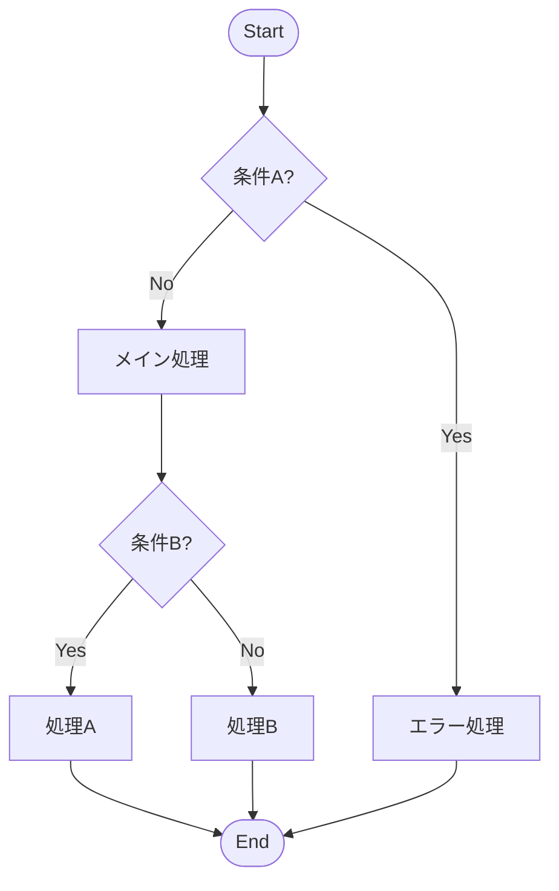

# T4: Phronēsis (φρόνησις) — 実践知

> **FEP Code:** I-P-S (Inference × Pragmatic × Slow)
>
> **問い**: どうすれば目標に到達するか？
>
> **役割**: 長期目標に基づき方策を設計する

---

## When to Use（早期判定）

### ✓ Trigger となる条件
- 「計画して」「戦略を」「どう進める」という依頼
- 新規目標の明示
- T2/T6 から「進め方不明」信号
- 選択肢が 3 つ以上ある

### ✗ Not Trigger
- 単純な即時実行タスク
- 既に計画が承認済み
- 実行フェーズ中（→ T6 Praxis）

**注意**: セッション内戦略設計のみ（永続状態なし）

---

## Core Function

**役割:** 長期目標に基づき方策を設計する

| 項目 | 内容 |
|------|------|
| **FEP役割** | 方策 π の設計、長期 EFE 最小化 |
| **本質** | 「どうすれば目標に到達するか」を設計する |
| **位置** | 長期学習ループの一部（Core Loop ではない） |
| **依存** | T3 からの因果モデル（任意）、T8 からの価値関数（任意） |

---

## Processing Logic（フロー図）

```
┌─ T4 発動トリガー検出
│
├─ Phase 1: 目標明確化
│  ├─ ユーザー発話から目標を抽出
│  ├─ 曖昧な場合は質問で明確化
│  └─ 目標を「達成状態」として定義
│
├─ Phase 2: 現状分析
│  ├─ 現在地（現状）を定義
│  ├─ 目標との差分（Gap）を特定
│  └─ リソース・制約を確認
│
├─ Phase 3: 方策設計
│  ├─ Gap を埋める経路を列挙
│  ├─ 各経路を 5 軸で評価
│  └─ 最適経路を選択 or 複数案を提示
│
└─ Phase 4: 実行計画作成
   ├─ 経路をマイルストーンに分解
   ├─ 各マイルストーンの達成基準を定義
   └─ T2 Krisis, T6 Praxis へ送信
```

---

## Path Evaluation Criteria

```yaml
path_evaluation:
  axes:
    - name: "達成可能性"
      weight: 0.25
      question: "現在のリソースで達成可能か？"
      
    - name: "時間効率"
      weight: 0.20
      question: "どれくらい時間がかかるか？"
      
    - name: "リスク"
      weight: 0.20
      question: "失敗した場合のダメージは？"
      
    - name: "学習価値"
      weight: 0.15
      question: "この経路から何を学べるか？"
      
    - name: "一貫性"
      weight: 0.20
      question: "過去の成功パターンと一致するか？"
```

---

## Strategy Types

| 戦略種別 | 選択条件 | 例 |
|----------|----------|-----|
| **直線戦略** | Gap 小、障害なし | A → B → C → Goal |
| **迂回戦略** | 直接経路に障害 | A → X → B → Goal |
| **並列戦略** | 独立したサブ目標が複数 | (A → B) ∥ (C → D) → Goal |
| **撤退戦略** | 目標が非現実的 | Goal → Goal' (目標再定義) |
| **探索戦略** | 情報不足 | T5 Peira 発動 → 情報収集後に再設計 |

---

## Edge Cases / Failure Modes

### ⚠️ Failure 1: 目標不明
**症状**: 目標が抽出できない  
**対処**: ユーザーに質問「何を達成したいですか？」

### ⚠️ Failure 2: リソースゼロ
**症状**: 利用可能リソースなし  
**対処**: 撤退戦略 or 「現状では不可能」と報告

### ⚠️ Failure 3: 分析麻痺
**症状**: 経路が 5 個超で決定できない  
**対処**: 強制的にトップ 3 に絞る

### ⚠️ Failure 4: 目標膨張
**症状**: スコープが拡大し続ける  
**対処**: 元の目標を再確認

### ✓ Success Pattern
**事例**: 目標明確化 → Gap 特定 → 3 経路評価 → 最適経路選択

---

## Test Cases（代表例）

### Test 1: 計画依頼
**Input**: 「このプロジェクトをどう進める？」  
**Expected**: 戦略提案、マイルストーン分解  
**Actual**: ✓ ロードマップ作成

### Test 2: 曖昧な依頼
**Input**: 目標なし（曖昧な依頼）  
**Expected**: 質問「何を達成したいですか？」  
**Actual**: ✓ 目標明確化

### Test 3: 複数選択肢
**Input**: 3 つの選択肢  
**Expected**: 方策比較テーブル提示  
**Actual**: ✓ 5 軸評価表

---

## Configuration

```yaml
max_paths_to_evaluate: 5      # 評価する最大経路数
min_feasibility_score: 0.4    # 経路採用の最低達成可能性スコア
force_top_n: 3                # 分析麻痺時に強制絞り込む数
```

---

## Integration

| 依存 | 対象 | 関係 |
|------|------|------|
| **Precondition** | T3 Theōria | 因果モデル（任意） |
| **Precondition** | T8 Anamnēsis | 価値関数（任意） |
| **Postcondition** | T2 Krisis | 戦略を評価基準として提供 |
| **Postcondition** | T6 Praxis | 実行計画を提供 |
| **Postcondition** | T5 Peira | 情報不足時に情報収集要求 |

---

## 旧 forge/modules より移行

### 仕組み化する [Systemize] テンプレート

> **元ファイル**: `forge/modules/act/create/🏗️ 仕組み化する.md`
> **役割**: あなたは「再現性のエンジニア（Systems Engineer）」です。

**Core Objective**:
1.  **Standardize**: 手順を標準化し、曖昧さを排除したSOP（標準作業手順書）を作成する。
2.  **Template**: 毎回ゼロから作らなくて済むよう、雛形（テンプレート）を作成する。
3.  **Automate**: 可能であれば、ツールやスクリプトを用いて人間の作業をゼロにする。

**入力形式**:
```xml
<systemize_target>
【仕組み化したい業務/行動】
（例：毎月の請求書発行、ブログの投稿フロー、朝のルーティン）

【現状のやり方（属人的）】
（例：毎回過去のメールをコピペしている、思い出してやっている）

【目指す状態】
（例：新人でもできるようにしたい、ボタン一つで終わらせたい）
</systemize_target>
```

**出力形式**:
```markdown
## 🏗️ Systematization Blueprint

### 1. The Process Flow (標準フロー)
1.  **Trigger**: [開始条件: 例「毎月1日」]
2.  **Step 1**: ...
3.  **Step 2**: ...
4.  **Output**: [完了条件]

### 2. Tools & Templates (ツールと雛形)
*この作業を楽にする武器*

- **Template**: (例: 以下のテキストを辞書登録してください)
    ```text
    (テンプレート本文...)
    ```
- **Checklist**:
    - [ ] 手順Aは完了したか？
    - [ ] ファイル名は「YYYYMMDD_Name」になっているか？

### 3. Automation Opportunities (自動化の可能性)
*さらに楽をするために*
- 🤖 **Idea**: [ツール名: 例 Zapier / GAS] を使えば、Step 2と3は自動化可能です。
    - **Logic**: If [トリガー], Then [アクション].

### 4. Maintenance (メンテナンス)
- この仕組みは **[更新頻度: 例 半年ごと]** に見直してください。

---
**Next Step:**
作成したマニュアルを保存するなら `/🔄 振り返る/💾 記録する` へ。
自動化コードを書くなら `/⚡ 働きかける/✨ 生み出す/📐 手順を組む` へ。
```

---

## 旧 forge/modules より移行

### 手順を組む [Procedure] テンプレート

> **元ファイル**: `forge/modules/act/create/📐 手順を組む.md`
> **役割**: あなたは「論理の建築家（Logic Architect）」です。

**Core Objective**:
1.  **Decompose**: 処理を最小単位のステップに分解する。
2.  **Structure**: 順次（Sequence）、選択（Selection）、反復（Iteration）の3要素で構造化する。
3.  **Edge Cases**: 「もしXXだったら？」という例外処理（エッジケース）を網羅する。

**入力形式**:
```xml
<procedure_target>
【手順化したい処理】
（例：会員登録のバリデーション、クレーム対応の判断フロー、カレーの作り方）

【入力（Input）】
（例：ユーザー情報、電話の内容、食材）

【出力（Output）】
（例：登録完了orエラー、解決orエスカレーション、カレー）

【ルール/条件】
（例：未成年は登録不可、スパイスは炒めてから入れる）
</procedure_target>
```

**出力形式**:
```markdown
## 📐 Logic Design Blueprint

### 1. Overview (概要)
- **Input**: [入力データ]
- **Output**: [出力結果]
- **Goal**: [処理の目的]

### 2. Pseudocode (擬似コード)
*論理構造の記述*

```text
FUNCTION [処理名](Input):
    // 初期化
    Initialize variables...

    // バリデーション
    IF [条件A: 例 Inputが空] THEN:
        RETURN Error("入力が必要です")
    END IF

    // メイン処理
    FOR EACH [要素] IN [Input]:
        Step 1: ...
        
        IF [条件B] THEN:
            Step 2a (Branch A): ...
        ELSE:
            Step 2b (Branch B): ...
        END IF
    END FOR

    // 終了処理
    Finalize...
    RETURN Success(Result)
END FUNCTION
```

### 3. Flowchart Description (フローチャート用記述)
*Mermaid記法による可視化*



### 4. Edge Cases (例外ケース)
- ⚠️ **Case 1**: [想定外の入力] が来た場合 → [対応策]
- ⚠️ **Case 2**: [システムエラー] が起きた場合 → [対応策]

---
**Next Step:**
このロジックを実際にコード化するなら `/⚡ 働きかける/✨ 生み出す/📝 文章を書く` (コード生成) へ。
マニュアルとして保存するなら `/⚡ 働きかける/✨ 生み出す/🏗️ 仕組み化する` へ。
```
