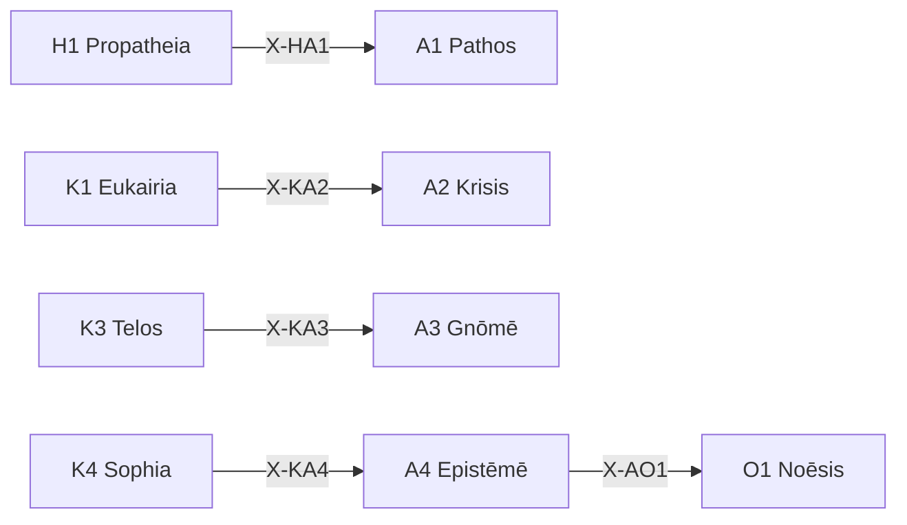

# /a: 精度保証 Peras (Akribeia)

> **Hegemonikón Layer**: Akribeia (A-series)
> **定義**: `/a` = `lim(A1·A2·A3·A4)` — L1.75×L1.75 の極限演算
> **目的**: 感情・判断・見識・知識の4定理を**1つの精度保証済み判断に収束**させる
>
> **制約**: 全4定理 → 融合(Convergence)。途中の省略は`-`モード実行時のみ許容。

---

## Limit / Colimit

| 演算 | 記号 | 圏論 | 意味 |
|:-----|:-----|:-----|:-----|
| `/a` | `/` | **Limit** | 4定理 → 最適な1収束点 |
| `\a` | `\` | **Colimit** | 4定理 → 全組み合わせに展開 |
| `/a+` | `+` | Limit強度↑ | より深い収束 |
| `/a-` | `-` | Limit強度↓ | 軽い収束 |

### 米田の補題 (Yoneda)

> 各定理 T は Hom(-, T) で完全に決まる。X-series が定理の意味そのもの。
> Limit `/a` = 4定理の精度射が一致する Cone の頂点。
> @converge = Cone を構築し、「感情・判断・見識・知識が整合する唯一の精度保証」を見つける。

---

## A-series 定理一覧

| # | ID | Name | Greek | 生成 | 役割 |
|:-:|:---|:-----|:------|:-----|:-----|
| 1 | **A1** | Pathos | Πάθος | Valence × Valence | **精度感情** — 感情の精緻化・言語化 |
| 2 | **A2** | Krisis | Κρίσις | Valence × Precision | **精度判断** — 判断・決定の精度確保 |
| 3 | **A3** | Gnōmē | Γνώμη | Precision × Valence | **精度見識** — 見識・洞察の形成 |
| 4 | **A4** | Epistēmē | Ἐπιστήμη | Precision × Precision | **精度知識** — 知識の確定・固定 |

---

## 発動条件

| トリガー | 説明 |
|:---------|:-----|
| `/a` または `/akri` | Akribeia シリーズを起動 |
| `/a [1-4]` | 特定の定理を指定して起動 |
| 精度・検証が必要 | 判断・知識の確定 |

---

## 処理フロー

### `/a` (Limit — 収束) `@converge`

> **米田**: 各定理 An は Hom(-, An) で完全に決まる。
> @converge = 精度射の Cone を構築し、「感情・判断・見識・知識が整合する唯一の精度保証」を見つける。

#### ⊕ C0: Precision Weighting (PW) — 実行時精度の決定

> **FEP**: Precision Weighting = 各情報チャネルの信頼度を動的に決定する操作。
> `+`/`-` は均等 PW（省略形）。`pw:` は不均等 PW（一般化）。
> **A-series は Precision 座標の Series。PW は A-series の核心操作。**

**明示指定**: `/a{pw: A2+, A1-}` → A2 (判断) を強化、A1 (感情) を抑制

**暗黙推定**:

| 条件 | PW 推定 | 理由 |
|:-----|:--------|:-----|
| 感情が強い文脈 | A1-, A2+ | 感情を抑え判断を強化 |
| 知識確定が目的 | A4+ | Epistēmē を重視 |
| 洞察抽出が目的 | A3+ | Gnōmē を重視 |
| 指定なし | 全0 (均等) | default |

→ **pw[A1..A4]** = 各定理の実行時精度重み [-1, +1]

---

**Cone 自動構築** (C1 の射の対比完了後に実行):

// turbo

```bash
cd ~/oikos/hegemonikon && PYTHONPATH=. .venv/bin/python mekhane/fep/cone_builder.py \
  --series A --pw "${PW_A:-}" \
  --file "$(PYTHONPATH=. .venv/bin/python -m mekhane.fep.wf_env_bridge export A)"
```

**射の列挙** (各定理の精度射を計算):

1. **[A1 Pathos]** Valence×Valence: Hom(-, A1) = 感情の射 — 主観的反応を精緻化
2. **[A2 Krisis]** Valence×Precision: Hom(-, A2) = 判断の射 — 決定基準を確定
3. **[A3 Gnōmē]** Precision×Valence: Hom(-, A3) = 見識の射 — 洞察を抽出
4. **[A4 Epistēmē]** Precision×Precision: Hom(-, A4) = 知識の射 — KI生成候補

#### ⊕ C1: 射の対比 (Contrast) — Cone の射後検査

> **圏論**: 4つの精度射が整合するか検査。感情と知識が矛盾 = Cone が存在しない。

| 定理 | Hom(X, An) | pw | 出力要点 (1行) |
|:-----|:-----------|:--:|:---------------|
| A1 | 感情の射 | {pw₁} | {感情的反応: ...} |
| A2 | 判断の射 | {pw₂} | {判断: PASS/FAIL} |
| A3 | 見識の射 | {pw₃} | {原則/見識: ...} |
| A4 | 知識の射 | {pw₄} | {知識候補: KI-ready?} |

→ **V[outputs]** = 精度射の散布度 (矛盾度: 0.0-1.0)

#### ⊕ C2: Cone の頂点探索 (Resolve) — PW 加重融合

> **圏論**: V[outputs] + PW 重み に応じて、加重融合で中介射を構築する。
> 統合出力 = Σ(定理_i × (1 + pw_i)) / Σ(1 + pw_i)

| V[outputs] | Cone 状態 | 中介射の構築法 |
|:-----------|:---------|:-------------------|
| > 0.3 | 精度矛盾 | `/dia.root` + **PW 加重融合** |
| > 0.1 | 微妙な不一致 | **PW 加重融合** (`@reduce(*, pw)`) |
| ≤ 0.1 | 精度一致 | PW ≠ 0 なら加重集約、= 0 なら `Σ` |

#### ⊕ C3: Kalon 普遍性検証 (Verify) — Cone の普遍性

> **圏論**: 「この精度保証済み知見が唯一の自然な収束点か？」を検証。
> `/noe` Phase 3 (Kalon) と同じ原理を `/a` のコンテキストに適用。

##### C3-a: 図式化 — 各定理出力を候補解として配置

| 定理 | 候補解 | 射 |
|:------|:-------|:---|
| A1 Pathos | 情念の結論 | メタ感情 |
| A2 Krisis | 判定の結論 | 判断 |
| A3 Gnōmē | 格言の結論 | 原則 |
| A4 Epistēmē | 知識の結論 | 確実知 |
| C2 | 融合判断 | 統合出力 |

##### C3-b: 因子分解テスト — 候補間の包含関係を判定

> **使用**: `mekhane.fep.universality.kalon_verify()`
> C2 の統合判断が他の全候補を特殊ケースとして含むか検証。

##### C3-c: Kalon スコア + 統合

| 項目 | 圏論的意味 | 内容 |
|:-----|:-------------|:-----|
| 矛盾度 | 射の散布 | V[outputs] = {0.0-1.0} |
| 解消法 | 中介射の構築法 | {root/weighted/simple} |
| **Kalon** | **普遍性の強さ** | {0.0-1.0} — 統合判断の包含力 |
| **精度保証済み知見** | **Cone の頂点** | {1文で} |
| **確信度** | **普遍性 × 確信** | {C/U} ({confidence}%) |

---

### `\a` (Colimit — 展開) `@diverge`

#### ⊗ D1: スキャン (Scan) — 6対の張力評価

| # | 対 | 交差 | 問い | 張力 |
|:-:|:---|:-----|:-----|:----:|
| 1 | A1⊗A2 | (Val×Val)⊗(Val×Prec) | 感情が判断をどう歪めるか | 低(同軸Val) |
| 2 | A1⊗A3 | (Val×Val)⊗(Prec×Val) | 感情が見識をどう色づけるか | 中(半直交) |
| 3 | A1⊗A4 | (Val×Val)⊗(Prec×Prec) | 感情が知識をどう選別するか | **高(完全直交)** |
| 4 | A2⊗A3 | (Val×Prec)⊗(Prec×Val) | 判断が見識をどう構造化するか | **高(完全直交)** |
| 5 | A2⊗A4 | (Val×Prec)⊗(Prec×Prec) | 判断が知識をどう確定するか | 中(半直交) |
| 6 | A3⊗A4 | (Prec×Val)⊗(Prec×Prec) | 見識が知識をどう昇華するか | 低(同軸Prec) |

#### ⊗ D2: 深掘り (Probe) — 上位3対

高張力対 (#3, #4, #2 or #5) に `/zet+` → `/noe-` を適用:

- **A1⊗A4**: 感情(Val×Val)と知識(Prec×Prec)の完全直交 → 主観と客観の乖離
- **A2⊗A3**: 判断(Val×Prec)と見識(Prec×Val)の完全直交 → 決定と洞察の緊張

#### ⊗ D3: 盲点レポート

| 項目 | 内容 |
|:-----|:-----|
| 最高張力対 | {pair} (tension: {score}) |
| 盲点 | 1. {発見1} / 2. {発見2} / 3. {発見3} |
| 確信度 | {C/U} ({confidence}%) |
| 記録先 | `/dox.sens` → {path} |

### `/a [N]` (単体駆動)

SKILL.md を参照し、指定定理のみ実行。

---

## 出力形式

| 項目 | 内容 |
|:-----|:-----|
| 定理 | A{N} {Name} |
| 対象 | {対象} |
| 精度 | {0-100}% |
| KI候補 | {Yes/No} |
| 次の推奨 | → O{X} / K{Y} |

---

## X-series 接続



---

## Hegemonikon Status

| Module | Workflow | Status |
|:-------|:---------|:-------|
| A1-A4 | /a | v5.0 Ready |

---

*v5.0 — Limit演算復元 (2026-02-07)*
*v5.1 — 米田の補題統合 (2026-02-08)*
*v5.2 — 米田深層統合。@converge C1-C3 を Cone 構築として再定義 (2026-02-08)*
