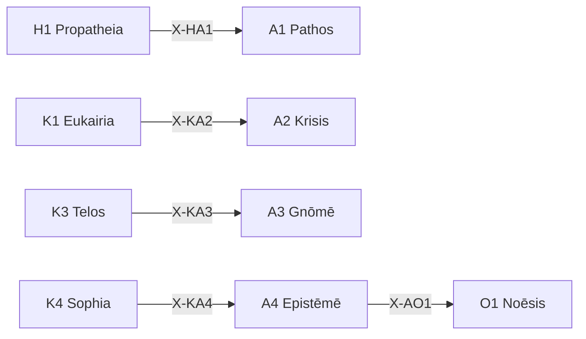

# /a: 精度定理ワークフロー (Akribeia)

> **Hegemonikón Layer**: Akribeia (A-series)
> **定義**: `/a` = `lim(A1·A2·A3·A4)` — L1.75×L1.75 の極限演算
> **目的**: 感情・判断・見識・知識の4定理を**1つの精度保証済み判断に収束**させる
>
> **制約**: 全4定理 → 融合(Convergence)。途中の省略は`-`モード実行時のみ許容。

---

## Limit / Colimit

| 演算 | 記号 | 圏論 | 意味 |
|:-----|:-----|:-----|:-----|
| `/a` | `/` | **Limit** | 4定理 → 最適な1収束点 |
| `\a` | `\` | **Colimit** | 4定理 → 全組み合わせに展開 |
| `/a+` | `+` | Limit強度↑ | より深い収束 |
| `/a-` | `-` | Limit強度↓ | 軽い収束 |

---

## A-series 定理一覧

| # | ID | Name | Greek | 生成 | 役割 |
|:-:|:---|:-----|:------|:-----|:-----|
| 1 | **A1** | Pathos | Πάθος | Valence × Valence | **精度感情** — 感情の精緻化・言語化 |
| 2 | **A2** | Krisis | Κρίσις | Valence × Precision | **精度判断** — 判断・決定の精度確保 |
| 3 | **A3** | Gnōmē | Γνώμη | Precision × Valence | **精度見識** — 見識・洞察の形成 |
| 4 | **A4** | Epistēmē | Ἐπιστήμη | Precision × Precision | **精度知識** — 知識の確定・固定 |

---

## 発動条件

| トリガー | 説明 |
|:---------|:-----|
| `/a` または `/akri` | Akribeia シリーズを起動 |
| `/a [1-4]` | 特定の定理を指定して起動 |
| 精度・検証が必要 | 判断・知識の確定 |

---

## 処理フロー

### `/a` (Limit — 収束)

1. **[A1 Pathos]** Valence×Valence: 感情を精緻化(主観的反応)
2. **[A2 Krisis]** Valence×Precision: 判断を確定(決定基準)
3. **[A3 Gnōmē]** Precision×Valence: 見識を形成(洞察抽出)
4. **[A4 Epistēmē]** Precision×Precision: 知識として固定(KI 生成候補)
5. **⊕ Convergence**: 4定理の出力を**1つの精度保証済み知見**に融合

### `\a` (Colimit — 展開)

4定理の**全6対の交差関係**を展開し、精密判断間の相互作用を可視化する。

| # | 対 | 交差 | 問い |
|:-:|:---|:-----|:-----|
| 1 | A1⊗A2 | (Val×Val)⊗(Val×Prec) | 感情が判断をどう歪めるか |
| 2 | A1⊗A3 | (Val×Val)⊗(Prec×Val) | 感情が見識をどう色づけるか |
| 3 | A1⊗A4 | (Val×Val)⊗(Prec×Prec) | 感情が知識をどう選別するか |
| 4 | A2⊗A3 | (Val×Prec)⊗(Prec×Val) | 判断が見識をどう構造化するか |
| 5 | A2⊗A4 | (Val×Prec)⊗(Prec×Prec) | 判断が知識をどう確定するか |
| 6 | A3⊗A4 | (Prec×Val)⊗(Prec×Prec) | 見識が知識をどう昇華するか |

**⊗ Divergence**: 6対の交差から**精度の盲点・隠れた前提**を抽出

### `/a [N]` (単体駆動)

SKILL.md を参照し、指定定理のみ実行。

---

## 出力形式

| 項目 | 内容 |
|:-----|:-----|
| 定理 | A{N} {Name} |
| 対象 | {対象} |
| 精度 | {0-100}% |
| KI候補 | {Yes/No} |
| 次の推奨 | → O{X} / K{Y} |

---

## X-series 接続

---

## Hegemonikon Status

| Module | Workflow | Status |
|:-------|:---------|:-------|
| A1-A4 | /a | v5.0 Ready |

---

*v5.0 — Limit演算復元 (2026-02-07)*
