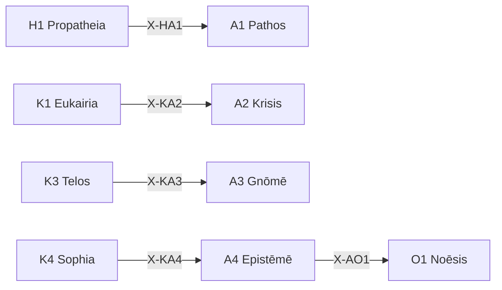

# /a: 精度定理ワークフロー (12派生対応)

> **Hegemonikón Layer**: Akribeia (A-series)
> **目的**: 感情・判断・見識・知識の4軸で精度を保証する

---

## 発動条件

| トリガー | 説明 |
| :-------- | :---- |
| `/a` または `/akri` | Akribeia シリーズを起動 |
| `/a [1-4]` | 特定の定理を指定して起動 |
| 精度・検証が必要 | 判断・知識の確定 |

---

## A-series 定理一覧

| # | ID | Name | Greek | 役割 |
| :-: | :-- | :--- | :---- | :--- |
| 1 | **A1** | Pathos | Πάθος | **精度感情** — 感情の精緻化・言語化 |
| 2 | **A2** | Krisis | Κρίσις | **精度判断** — 判断・決定の精度確保 |
| 3 | **A3** | Gnōmē | Γνώμη | **精度見識** — 見識・洞察の形成 |
| 4 | **A4** | Epistēmē | Ἐπιστήμη | **精度知識** — 知識の確定・固定 |

---

## Process

### `/a` (全体駆動)

```text
入力: 対象 X
  ↓
[A1 Pathos] 感情を精緻化（主観的反応）
  ↓
[A2 Krisis] 判断を確定（決定基準）
  ↓
[A3 Gnōmē] 見識を形成（洞察抽出）
  ↓
[A4 Epistēmē] 知識として固定（KI 生成候補）
  ↓
出力: 精度保証済み知見
```

### `/a 2` (A2 Krisis 単体)

```text
入力: 判断対象
  ↓
SKILL.md 参照: .agent/skills/akribeia/a2-krisis/SKILL.md
  ↓
[STEP 1] 判断基準の明確化
[STEP 2] 代替案の比較
[STEP 3] 決定と根拠の出力
  ↓
出力: 精度保証済み判断
```

### `/a 4` (A4 Epistēmē 単体)

```text
入力: 知見
  ↓
SKILL.md 参照: .agent/skills/akribeia/a4-episteme/SKILL.md
  ↓
[STEP 1] 知識の構造化
[STEP 2] KI 生成候補判定
[STEP 3] 固定化 or 保留
  ↓
出力: 確定知識 / KI 候補
```

---

## 出力形式

```markdown
┌─[Hegemonikón]──────────────────────┐
│ A{N} {Name}: 精度処理完了          │
│ 対象: {対象}                       │
│ 精度: {0-100}%                     │
│ KI候補: {Yes/No}                   │
│ 次の推奨: → O{X} / K{Y}            │
└────────────────────────────────────┘
```

---

## X-series 接続



---

## Hegemonikon Status

| Module | Workflow | Status |
| :----- | :------- | :----- |
| A1-A4 | /a | v2.1 Ready |
