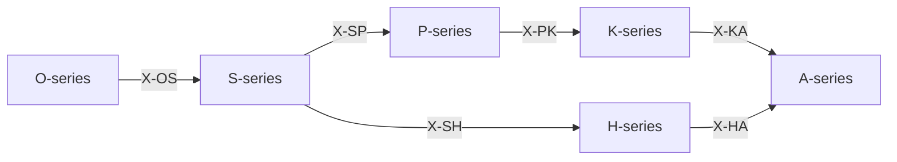

# /ax: 定理群統合ワークフロー (Axiom) v3.0

> **Hegemonikón Layer**: 全定理層統合
> **目的**: 問題を 6定理層 + 関係層 で多層的に分析
> **体系**: O → S → H → P → K → A → X

---

## Cognitive Algebra 定義

```
/ax = (/o~s~h~p~k~a) × X
    = (6 Series 振動) × (36関係マトリクス)
```

**解釈**: 6つの Series を振動させ、X-series で融合接続する。

---

## 本質

6つの定理層と関係層を順に適用することで、問題を多角的に分析する。

```
┌─────────────────────────────────────────────────────┐
│ O-series (Ousia) — 本質                             │
│   「何であるか」を問う                              │
├─────────────────────────────────────────────────────┤
│ S-series (Schema) — 様態                            │
│   「どの配置で現れるか」を問う                      │
├─────────────────────────────────────────────────────┤
│ H-series (Hormē) — 傾向                             │
│   「どちらへ向かうか」を問う                        │
├─────────────────────────────────────────────────────┤
│ P-series (Perigraphē) — 境界                        │
│   「どの範囲で」を問う                              │
├─────────────────────────────────────────────────────┤
│ K-series (Kairos) — 文脈                            │
│   「いつ・どの状況で」を問う                        │
├─────────────────────────────────────────────────────┤
│ A-series (Akribeia) — 精密                          │
│   「どの精度で」を問う                              │
├─────────────────────────────────────────────────────┤
│ X-series (Taxis) — 関係                             │
│   「どう接続するか」を問う                          │
└─────────────────────────────────────────────────────┘
```

---

## 発動条件

| トリガー | 説明 |
| :-------- | :---- |
| `/ax` | 定理群統合ワークフローを起動 |
| `/ax [問い]` | 特定の問いを全層で分析 |
| 本質的な問い | 「なぜ」「何が」を問う根源的疑問 |
| 多角的分析 | 単一視点では不十分な複雑問題 |

---

## Process

### Step 0: 問いの設定

分析対象の問いを明確化する。

### Step 1: O-series（本質分析）

**問い**: この問題の本質は何か？

| 定理 | 問い |
| :---- |------|
| O1 Noēsis | 何が真実か？ |
| O2 Boulēsis | 何を望むか？ |
| O3 Zētēsis | 何を問うか？ |
| O4 Energeia | 何をするか？ |

### Step 2: S-series（様態分析）

**問い**: どの配置でアプローチするか？

| 定理 | 問い |
| :---- |------|
| S1 Metron | どのスケールで？ |
| S2 Mekhanē | どの方法で？ |
| S3 Stathmos | どの基準で？ |
| S4 Praxis | どの実践で？ |

### Step 3: H-series（傾向分析）

**問い**: どちらへ向かうか？

| 定理 | 問い |
| :---- |------|
| H1 Propatheia | 初期傾向は？ |
| H2 Pistis | 確信度は？ |
| H3 Orexis | 価値傾向は？ |
| H4 Doxa | 信念として定着？ |

### Step 4: P-series（境界分析）

**問い**: どの範囲で？

| 定理 | 問い |
| :---- |------|
| P1 Khōra | 条件空間は？ |
| P2 Hodos | 経路は？ |
| P3 Trokhia | 軌道は？ |
| P4 Tekhnē | 技法は？ |

### Step 5: K-series（文脈分析）

**問い**: いつ・どの状況で？

| 定理 | 問い |
| :---- |------|
| K1 Eukairia | 好機か？ |
| K2 Chronos | 時間は？ |
| K3 Telos | 目的と整合？ |
| K4 Sophia | 方法は信頼できる？ |

### Step 6: A-series（精密分析）

**問い**: どの精度で？

| 定理 | 問い |
| :---- |------|
| A1 Pathos | 二重傾向は？ |
| A2 Krisis | 検証は？ |
| A3 Gnōmē | 原則は？ |
| A4 Epistēmē | 知識として確立？ |

### Step 7: X-series（関係分析）

**問い**: 定理間の接続は？



---

## 出力形式

```
══════════════════════════════════════════════════════
[Hegemonikón] /ax: 定理群統合分析 v2.1
══════════════════════════════════════════════════════

📋 問い: {分析対象の問い}

━━━ O-series (本質) ━━━
発動: O{N} {Name}
  Q: {本質的問い}
  A: {純粋な答え}

━━━ S-series (様態) ━━━
発動: S{N} {Name}
  配置: {スケール/方法}

━━━ H-series (傾向) ━━━
発動: H{N} {Name}
  傾向: {+/-}
  確信: {C/U}

━━━ P-series (境界) ━━━
発動: P{N} {Name}
  条件空間: {定義}

━━━ K-series (文脈) ━━━
発動: K{N} {Name}
  状況: {現在の文脈}
  適時: {好機/待機}

━━━ A-series (精密) ━━━
発動: A{N} {Name}
  精度: {評価}

━━━ X-series (接続マップ) ━━━
  O{N} ──X-OS{N}──→ S{N}
  S{N} ──X-SH{N}──→ H{N}
  ...

══════════════════════════════════════════════════════
📌 統合結論
══════════════════════════════════════════════════════
{6層分析の統合的結論}
```

---

## 使用例

**例1: 設計検証**

```
/ax Skill 設計は正しいか？

→ O3 Zētēsis: 「何を問うか」= 設計の妥当性
→ S2 Mekhanē: 方法として Explore を選択
→ H2 Pistis: 確信度 0.7
→ P4 Tekhnē: 技法空間の境界設定
→ K3 Telos: 目的との整合確認
→ A2 Krisis: 検証モードで評価
→ X: O3 → S2 → P4 → K3 → A2
→ 結論: 設計は妥当
```

---

## コマンド

| コマンド | 動作 |
| :-------- | :---- |
| `/ax` | 全層分析（O→S→H→P→K→A→X） |
| `/ax [問い]` | 指定の問いを全層で分析 |

---

---

## Artifact 自動保存

> **標準参照**: [workflow_artifact_standard.md](file:///home/laihuip001/oikos/.agent/standards/workflow_artifact_standard.md)

### 保存先

```
/home/laihuip001/oikos/mneme/.hegemonikon/workflows/ax_<topic>_<date>.md
```

例: `ax_多層分析_20260129.md`

### チャット出力規則

**チャットには最小限の出力のみ。詳細は全てファイルに保存。**

```text
✅ /ax 完了
📄 /mneme/.hegemonikon/workflows/ax_{topic}_{date}.md
要約: {多層分析サマリー}
→ {{推奨次ステップ}}
```

### 保存する理由

1. **コンテキスト節約**: チャット履歴を汚さない
2. **参照可能**: 多層分析を後から確認できる
3. **蓄積可能**: パターン分析に活用

## Hegemonikon Status

| Module | Workflow | Status |
| :------ | :-------- | :------ |
| O+S+H+P+K+A+X | /ax | v2.1 Ready |
