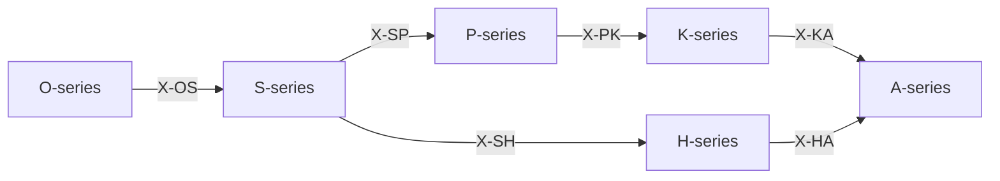

# /ax: 定理群統合ワークフロー (Axiom)

> **Hegemonikón Layer**: 全定理層統合
> **定義**: `/ax` = `(/o~s~h~p~k~a) × X` = 6 Series 振動 ⊗ 72関係マトリクス
> **目的**: 問題を 6定理層 + 関係層 で多層的に分析
>
> **制約**: 全7層を順次実行。単一視点では不十分な複雑問題に適用すること。

---

## 7層概要

| Layer | Series | Greek | 問い |
|:------|:-------|:------|:-----|
| 1 | **O** — Ousia | 本質 | 何であるか |
| 2 | **S** — Schema | 様態 | どの配置で現れるか |
| 3 | **H** — Hormē | 傾向 | どちらへ向かうか |
| 4 | **P** — Perigraphē | 境界 | どの範囲で |
| 5 | **K** — Kairos | 文脈 | いつ・どの状況で |
| 6 | **A** — Akribeia | 精密 | どの精度で |
| 7 | **X** — Taxis | 関係 | どう接続するか |

---

## 発動条件

| トリガー | 説明 |
|:---------|:-----|
| `/ax` | 定理群統合ワークフローを起動 |
| `/ax [問い]` | 特定の問いを全層で分析 |
| 本質的な問い | 「なぜ」「何が」を問う根源的疑問 |

---

## 処理フロー

### Step 0: 問いの設定

分析対象の問いを明確化する。

### Step 1-6: 各Series分析

| Step | Series | 各定理の問い |
|:-----|:-------|:-------------|
| 1 | **O** | O1: 何が真実か？ / O2: 何を望むか？ / O3: 何を問うか？ / O4: 何をするか？ |
| 2 | **S** | S1: どのスケールで？ / S2: どの方法で？ / S3: どの基準で？ / S4: どの実践で？ |
| 3 | **H** | H1: 初期傾向は？ / H2: 確信度は？ / H3: 価値傾向は？ / H4: 信念として定着？ |
| 4 | **P** | P1: 条件空間は？ / P2: 経路は？ / P3: 軌道は？ / P4: 技法は？ |
| 5 | **K** | K1: 好機か？ / K2: 時間は？ / K3: 目的と整合？ / K4: 方法は信頼できる？ |
| 6 | **A** | A1: 二重傾向は？ / A2: 検証は？ / A3: 原則は？ / A4: 知識として確立？ |

### Step 7: X-series（関係分析）

**問い**: 定理間の接続は？

---

## 出力形式

各層の分析結果 → 統合結論の構造:

| セクション | 内容 |
|:-----------|:-----|
| 問い | {分析対象の問い} |
| O-series | 発動定理 + 本質的問い + 答え |
| S-series | 配置: スケール/方法 |
| H-series | 傾向: +/- / 確信: C/U |
| P-series | 条件空間: 定義 |
| K-series | 状況/適時: 好機/待機 |
| A-series | 精度: 評価 |
| X-series | 接続マップ |
| **統合結論** | {6層分析の統合的結論} |

---

## Artifact 自動保存

> **標準参照**: [workflow_artifact_standard.md](file:///home/makaron8426/oikos/.agent/standards/workflow_artifact_standard.md)

**保存先**: `/home/makaron8426/oikos/mneme/.hegemonikon/workflows/ax_<topic>_<date>.md`

**チャット出力**: `✅ /ax 完了 → 📄 {path} → 要約: {サマリー} → {{推奨次ステップ}}`

**保存理由**: コンテキスト節約、参照可能性、パターン蓄積

---

## Hegemonikon Status

| Module | Workflow | Status |
|:-------|:---------|:-------|
| O+S+H+P+K+A+X | /ax | v3.3 Ready |

---

*v3.3 — FBR変換 (2026-02-07)*
