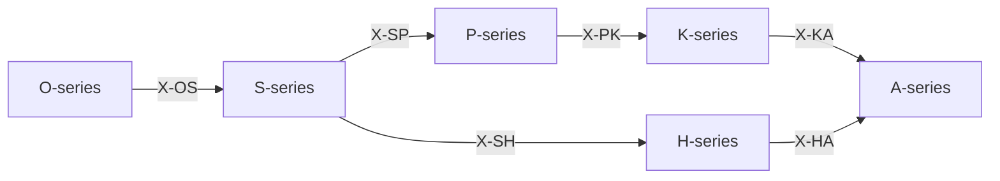

# /ax: Peras の Peras (全 Series 統合)

> **Hegemonikón Layer**: 全定理層統合
> **定義**: `/ax` = `lim(/o · /s · /h · /p · /k · /a) × X` = 6 Series Limit ⊗ 72関係マトリクス
> **目的**: 各 Series の Limit（収束判断）を多層的に統合し、X-series で接続する
>
> **制約**: 全7層 → 統合収束。単一視点では不十分な複雑問題に適用すること。

---

## 7層概要

| Layer | Series | Greek | 問い |
|:------|:-------|:------|:-----|
| 1 | **O** — Ousia | 本質 | 何であるか |
| 2 | **S** — Schema | 様態 | どの配置で現れるか |
| 3 | **H** — Hormē | 傾向 | どちらへ向かうか |
| 4 | **P** — Perigraphē | 境界 | どの範囲で |
| 5 | **K** — Kairos | 文脈 | いつ・どの状況で |
| 6 | **A** — Akribeia | 精密 | どの精度で |
| 7 | **X** — Taxis | 関係 | どう接続するか |

---

## 発動条件

| トリガー | 説明 |
|:---------|:-----|
| `/ax` | 定理群統合ワークフローを起動 |
| `/ax [問い]` | 特定の問いを全層で分析 |
| 本質的な問い | 「なぜ」「何が」を問う根源的疑問 |

---

## 処理フロー

### Step 0: 問いの設定

分析対象の問いを明確化する。

### Step 1-6: 各Series分析

| Step | Series | 各定理の問い |
|:-----|:-------|:-------------|
| 1 | **O** | O1: 何が真実か？ / O2: 何を望むか？ / O3: 何を問うか？ / O4: 何をするか？ |
| 2 | **S** | S1: どのスケールで？ / S2: どの方法で？ / S3: どの基準で？ / S4: どの実践で？ |
| 3 | **H** | H1: 初期傾向は？ / H2: 確信度は？ / H3: 価値傾向は？ / H4: 信念として定着？ |
| 4 | **P** | P1: 条件空間は？ / P2: 経路は？ / P3: 軌道は？ / P4: 技法は？ |
| 5 | **K** | K1: 好機か？ / K2: 時間は？ / K3: 目的と整合？ / K4: 方法は信頼できる？ |
| 6 | **A** | A1: 二重傾向は？ / A2: 検証は？ / A3: 原則は？ / A4: 知識として確立？ |

### Step 7: X-series（関係分析）

**問い**: 定理間の接続は？

---

## 出力形式 `@converge` (6 Series 統合)

各層の分析結果 → 統合結論の構造:

| セクション | 内容 |
|:-----------|:-----|
| 問い | {分析対象の問い} |
| O-series | 発動定理 + 本質的問い + 答え |
| S-series | 配置: スケール/方法 |
| H-series | 傾向: +/- / 確信: C/U |
| P-series | 条件空間: 定義 |
| K-series | 状況/適時: 好機/待機 |
| A-series | 精度: 評価 |
| X-series | 接続マップ |

### ⊕ C1: 対比 (Contrast) — 6 Series の Limit 出力

| Series | Limit 出力 (1行) |
|:-------|:-----------------|
| O | {純粋認知の統合判断} |
| S | {統合配置判断} |
| H | {動機的判断} |
| P | {環境配置判断} |
| K | {文脈的判断} |
| A | {精度保証済み知見} |

→ **V[6 Limits]** = 分散 (6層間の矛盾度: 0.0-1.0)

### ⊕ C2: 解消 (Resolve)

| V[6 Limits] | 状態 | 処理 |
|:-------------|:-----|:-----|
| > 0.3 | 多層矛盾 | `/dia.root` → 重み付け融合 (X-series で矛盾の射を特定) |
| > 0.1 | 微妙な不整合 | 通常融合 (`@reduce(*)`) |
| ≤ 0.1 | 全層整合 | 単純集約 (`Σ`) |

### ⊕ C3: 検証 (Verify) — 最終統合判断

| 項目 | 内容 |
|:-----|:-----|
| 矛盾度 | V[6 Limits] = {0.0-1.0} |
| 解消法 | {root/weighted/simple} |
| **統合結論** | {1文で — 6層分析の最終結論} |
| **確信度** | {C/U} ({confidence}%) |

---

### `\ax` (Colimit — 展開) `@diverge`

#### ⊗ D1: スキャン (Scan) — 15対の Series 間張力

6 Series から C(6,2) = 15対を走査:

| # | 対 | 問い | 張力 |
|:-:|:---|:-----|:----:|
| 1 | O⊗S | 認識と戦略の間 — 本質が配置をどう制約するか | 中 |
| 2 | O⊗H | 認識と動機の間 — 分析が感情をどう変えるか | 中 |
| 3 | O⊗P | 認識と環境の間 — 理解がスコープをどう定めるか | 中 |
| 4 | O⊗K | 認識と文脈の間 — 知見がタイミングをどう読むか | 中 |
| 5 | O⊗A | 認識と精度の間 — **本質と検証の完全直交** | **高** |
| 6 | S⊗H | 戦略と動機の間 — 計画が欲求をどう整合させるか | 中 |
| 7 | S⊗P | 戦略と環境の間 — 配置が境界をどう越えるか | 低 |
| 8 | S⊗K | 戦略と文脈の間 — 計画がタイミングをどう調整するか | 中 |
| 9 | S⊗A | 戦略と精度の間 — 設計が検証をどう組み込むか | 中 |
| 10 | H⊗P | 動機と環境の間 — 欲求が制約をどう超えるか | 中 |
| 11 | H⊗K | 動機と文脈の間 — 感情がタイミングをどう歪めるか | 高 |
| 12 | H⊗A | 動機と精度の間 — **欲求と客観性の完全直交** | **高** |
| 13 | P⊗K | 環境と文脈の間 — スコープとタイミングの整合 | 低 |
| 14 | P⊗A | 環境と精度の間 — 制約が精度をどう限定するか | 中 |
| 15 | K⊗A | 文脈と精度の間 — タイミングが精度をどう変えるか | 中 |

**張力レベル根拠**:

| レベル | 基準 | 該当対 |
|:-------|:-----|:-------|
| **高** | 圏論的直交: 同一 trigonon type (Pure) だが対極の座標。認知的に「正しいがぶつかる」 | O⊗A, H⊗A, H⊗K |
| 中 | 異なる次元: 関連するが座標系が違う。自然な接続はあるが翻訳が必要 | 10対 |
| 低 | 自然補完: 同一ドメイン内で役割分担。矛盾しにくい | S⊗P, P⊗K |

> ⚠️ 上記は初期値。実際の `/ax` 実行で Creator と校正すべき。

#### ⊗ D2: 深掘り (Probe) — 上位3対

高張力対 (#5, #11, #12) に `/zet+` → `/noe-` を適用:

- **O⊗A**: 本質(Ousia)と精度(Akribeia) → 理解と検証の乖離
- **H⊗A**: 動機(Hormē)と精度(Akribeia) → 欲求と客観性の葛藤
- **H⊗K**: 動機(Hormē)と文脈(Kairos) → 感情がタイミング判断を歪める

#### ⊗ D3: 盲点レポート

| 項目 | 内容 |
|:-----|:-----|
| 最高張力対 | {Series_i}⊗{Series_j} (tension: {score}) |
| 盲点 | 1. {発見1} / 2. {発見2} / 3. {発見3} |
| 確信度 | {C/U} ({confidence}%) |
| 記録先 | `/dox.sens` → {path} |

---

## Artifact 自動保存

> **標準参照**: [workflow_artifact_standard.md](file:///home/makaron8426/oikos/.agent/standards/workflow_artifact_standard.md)

**保存先**: `/home/makaron8426/oikos/mneme/.hegemonikon/workflows/ax_<topic>_<date>.md`

**チャット出力**: `✅ /ax 完了 → 📄 {path} → 要約: {サマリー} → {{推奨次ステップ}}`

**保存理由**: コンテキスト節約、参照可能性、パターン蓄積

---

## Hegemonikon Status

| Module | Workflow | Status |
|:-------|:---------|:-------|
| O+S+H+P+K+A+X | /ax | v4.0 Ready |

---

*v4.0 — Limit整合 (2026-02-07)*
