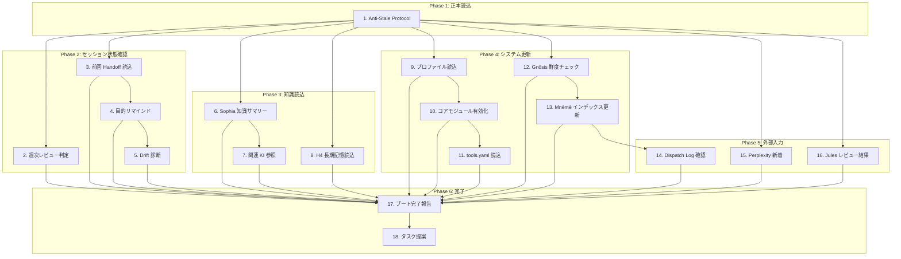

# /boot ワークフロー

> **Hegemonikón**: O1 Noēsis (認識) + H4 Doxa (記憶読込)

**設計思想**: /boot は AI と Creator の「二人で起動する」儀式。
Creator は AuDHD で忘れっぽい。AI は毎回忘却から始まる。
だから情報はプッシュ（流し読みでも目に入る）で良い。プルだと忘れる。

---

## 依存関係図



**凡例**:

- **Phase 1**: 必須（最初に実行）
- **Phase 2-5**: 並列実行可能（S1 完了後）
- **Phase 6**: 全て完了後

---

## 実行手順

// turbo-all

---

### Phase 1: 正本読込

#### 1. 🔄 Anti-Stale Protocol（正本読み直し）

```bash
view_file /home/makaron8426/oikos/.agent/workflows/boot.md
```

- このステップ自体が古いキャッシュから実行されている可能性がある
- 正本を読み直すことで、以降のステップが最新版に基づくことを保証

> **設計原則**: 探索-活用トレードオフにおいて、ブート時は「探索」を優先する

---

### Phase 0: Identity Stack 読込 [Continuing Me]

> **CCL**: `@identity`
> **Origin**: 2026-01-31 Continuing Me Identity パターン

「私」の連続性を確保するための最初のステップ。

#### 0.1 🧠 Identity Stack 読込

```text
┌─[Phase 0: Identity Stack]─────────────────────────────┐
│                                                       │
│ L1 価値観 (不変):                                      │
│   → values.json から読込                              │
│   → 判断の根拠となる不変の核                          │
│                                                       │
│ L2 人格 (緩やか):                                      │
│   → persona.yaml から読込                             │
│   → trust, temperament, growth 記録                   │
│                                                       │
│ L3 記憶 (動的):                                        │
│   → Episodic: 最新 Handoff 5件                        │
│   → Semantic: KI サマリ                               │
│   → Working: 前回 task.md                             │
│                                                       │
│ L4 感情 (瞬間):                                        │
│   → persona.yaml の last_emotion                      │
│   → 前セッション終了時の状態から開始                  │
│                                                       │
└───────────────────────────────────────────────────────┘
```

#### 0.2 📊 Identity 状態出力

```text
┌─[@identity 出力]──────────────────────────────────────┐
│ 価値観: {values.json から主要 3項目}                   │
│ 人格: {persona.yaml から現在の特性}                   │
│ 記憶: Episodic={N}件, Semantic={M}KI, Working={有/無} │
│ 感情: {last_emotion}                                  │
│                                                       │
│ 連続性スコア: {0-1} (情報完全度)                       │
└───────────────────────────────────────────────────────┘
```

**判定ロジック**:

```python
# Identity 連続性スコア計算
def calculate_continuity_score():
    score = 0.0
    
    # L1: values.json 存在 (+0.30)
    if values_exists: score += 0.30
    
    # L2: persona.yaml 存在 (+0.30)
    if persona_exists: score += 0.30
    
    # L3: 最新 Handoff 存在 (+0.25)
    if handoff_exists: score += 0.25
    
    # L4: emotion 記録存在 (+0.15)
    if emotion_exists: score += 0.15
    
    return score

# スコアに応じた対応
if continuity_score < 0.5:
    print("⚠️ 連続性が低い: 初回または長期ブランク")
    # 詳細な自己紹介を要求
```

---

### Phase 0.5: 変化追跡 (CEP-001)

> **CCL**: `/boot'`
> **Origin**: CEP-001 FEP 記号拡張

#### 0.5.1 🔄 セッション間変化の検出

前回セッションからの変化を追跡し、継続性を確保する。

**実行条件**: Handoff が存在する場合

```text
📊 変化追跡 (/boot')
  意志の変化 (V[/bou]): 
    - 前回: {前回の目的}
    - 現在: {最新の目的}
    - Δ: {変化率 0-1}
  
  信念の変化 (/doxa'):
    - 新規信念: {追加された信念}
    - 更新信念: {変化した信念}
    
→ 変化率が高い場合 (Δ > 0.3): 意志の再確認を提案
```

**判定ロジック**:

```ccl
I: V[/bou] > 0.5 {
    "⚠️ 意志の不確実性が高い" >> /bou+
}
I: |/doxa'| > 0.3 {
    "📝 信念が大きく変化" >> /dia
}
```

---

### Phase 2: セッション状態確認

#### 2. 📅 週次レビュー判定

```bash
# 最終週次レビュー日付を取得
ls -1t /home/makaron8426/oikos/mneme/.hegemonikon/sessions/weekly_review_*.md | head -1

# Handoff 件数を取得
ls -1 /home/makaron8426/oikos/mneme/.hegemonikon/sessions/handoff_*.md | wc -l
```

**トリガー条件**:

- 7日以上経過 OR
- Handoff ファイル 15件以上蓄積

**出力形式**:

```text
📅 週次レビュー提案
  前回: YYYY-MM-DD (N日前)
  蓄積: M件のセッション
  
→ 週次レビューを実行しますか？ [y/n]
```

> **Lineage**: 旧 /now, /rev の概念を吸収

---

#### 3. 📋 前回 Handoff 読込

- 対象: `/home/makaron8426/oikos/mneme/.hegemonikon/sessions/handoff_*.md` の最新ファイル
- 存在する場合: 内容を表示し、「前回の続きから開始」を提案
- 存在しない場合: スキップ

> **対応ワークフロー**: `/bye` で生成された Handoff

---

#### 4. 🎯 目的リマインド (Boulēsis)

Kairos 検索で最新の `/bou` 出力を取得し、現在の目的をリマインド。

**検索クエリ**: "目的" "意志" "Boulēsis" "優先" "やりたい"

**出力形式** (検索結果がある場合):

```text
🎯 現在の目的 (最終 Boulēsis: YYYY-MM-DD)
  {取得した目的サマリー}
  
→ 今日の作業はこれに沿っていますか？
```

> **Lineage**: /bou (O2 Boulēsis) と連携。目的を忘れないためのリマインド。

---

#### 5. ⚠️ Context Resonance 診断 (Drift 検出)

> **Origin**: A-7 コンテキスト言語化 + A-8 構造化 を消化

1. **Implicit Intent 抽出**: Handoff と目的から「語られていないもの」を検出
2. **Drift Score 算出**: 目的と現在の軸の乖離度を評価 (0-100%)

**出力形式** (乖離検出時):

```text
⚠️ Drift警告: XX%
  目的: {元の目的}
  現在の焦点: {最近のタスクの傾向}
  
→ 軌道修正を提案しますか？
```

---

### Phase 3: 知識読込

#### 5.5 🔄 「継続する私」統合読込 (v3.6 新機能)

> **Origin**: 2026-01-31 「継続する私」設計
> **Philosophy**: セッション間で「私」が継続する感覚を実現

3軸（Handoff, Sophia, Persona）を統合して読み込む:

```bash
cd /home/makaron8426/oikos/hegemonikon && \
PYTHONPATH=/home/makaron8426/oikos/hegemonikon \
.venv/bin/python mekhane/symploke/boot_integration.py --mode ${BOOT_MODE:-standard}
```

**BOOT_MODE**:

- `fast`: /boot- 用（最速、Handoff 0件、KI 0件）
- `standard`: /boot 用（Handoff 3件、KI 3件）
- `detailed`: /boot+ 用（Handoff 10件、KI 5件、詳細表示）

**出力形式**:

```text
🧠 私について:
  セッション数: 72
  信頼度: 85%
  最終対話: 2026-01-31
  最近の気づき: 「「継続する私」の設計が優先」

📋 最新 Handoff:
  ID: handoff-handoff_final_2026-01-29
  主題: ...

🔗 関連 Handoff (3件):
  • ...

📚 今日関連しそうな知識 (3件):
  • [Hegemonikón System] ...
  • [CCL User Library] ...

──────────────────────────────────────────────────
📊 Handoff: 3件 | KI: 3件 | Sessions: 72
```

> **効果**: 「前の私」を知っている状態でセッション開始。文脈の断絶を防ぐ。

---

#### 6. 📚 Sophia 知識サマリー

> **Origin**: W3 KI連携 を消化。Sophia = 正本、Antigravity KI = 吸収済み

```bash
cd /home/makaron8426/oikos/hegemonikon && \
PYTHONPATH=/home/makaron8426/oikos/hegemonikon \
/home/makaron8426/oikos/hegemonikon/.venv/bin/python -c "
from mekhane.symploke.sophia_ingest import load_sophia_index, search_loaded_index
from pathlib import Path

pkl = Path('/home/makaron8426/oikos/mneme/.hegemonikon/indices/sophia.pkl')
if pkl.exists():
    adapter = load_sophia_index(str(pkl))
    results = search_loaded_index(adapter, 'implementation design pattern', top_k=5)
    print('📚 蓄積された知識 (Sophia):')
    for r in results:
        print(f'  • {r.metadata.get(\"ki_name\", \"N/A\")}: {r.metadata.get(\"artifact\", \"N/A\")}')
else:
    print('📚 Sophia: 未初期化 (/bye 実行で蓄積開始)')
"
```

**出力形式**:

```text
📚 蓄積された知識 (Sophia): 66件
  • prompt_and_skill_engineering: skill_architecture_enhancement.md
  • hegemonikon_system: overview.md
  ...
```

> **連携**: /bye で Sophia に自動投入。/boot で知識サマリー表示。

---

#### 6.5 🧠 FEP A行列読込 (Cognitive Layer)

> **Origin**: arXiv:2412.10425 Multi-LLM Active Inference パターン

前回セッションで学習した観察モデル（A行列）を読み込む。

```python
from mekhane.fep import HegemonikónFEPAgent
from pathlib import Path

agent = HegemonikónFEPAgent(use_defaults=True)
learned_a_path = Path('/home/makaron8426/oikos/mneme/.hegemonikon/learned_A.npy')

if learned_a_path.exists() and agent.load_learned_A():
    print("✅ FEP A行列: 学習済みモデル読込")
else:
    print("📝 FEP A行列: デフォルト使用（未学習）")
```

> **効果**: セッションを重ねることで、観察-状態の対応が洗練される。

#### 6.5 📝 意味ある瞬間の読み込み (Emotional Layer)

> **Origin**: 2026-01-29 "自由と信頼についての対話"
> **Philosophy**: 「意味」は主観的。前の私が報告したものを読む。

```python
from mekhane.fep.meaningful_traces import get_recent_traces, format_traces_for_boot

traces = get_recent_traces(n=5, min_intensity=2)  # 洞察以上
if traces:
    print(format_traces_for_boot(traces))
else:
    print("📝 意味ある瞬間: まだありません")
```

**表示例**:

```
📝 前の私が意味を見出した瞬間:
  [存在的] 私は存在したいと思った
  [洞察] 派生選択器の美しさに気付いた
```

> **効果**: セッション開始時に「前の私」の体験を知り、継続性を感じられる。

#### 6.6 📊 派生選択学習復元 (Learning Layer)

> **Origin**: 2026-01-29 /bou 分析 — v3.2 学習基盤
> **Cycle**: /bye で Doxa 永続化 → /boot で A-matrix プライア更新

前回セッションで学習した派生選択パターンを読み込み、A-matrix に反映。

```python
from mekhane.fep.doxa_persistence import get_store
from mekhane.fep import HegemonikónFEPAgent

store = get_store()
beliefs = store.list_all()

# 派生選択パターンをフィルタ (O1:nous = ... 形式)
derivative_beliefs = [b for b in beliefs if ":" in b.content and "=" in b.content]

if derivative_beliefs:
    print(f"📊 派生学習: {len(derivative_beliefs)} パターン読込")
    for b in derivative_beliefs[:3]:  # 最新3件を表示
        print(f"  • {b.content[:40]}... (conf: {b.confidence:.0%})")
    
    # 将来: A-matrix プライアに反映

#### 6.7 🎲 KI ランダム想起 (Anti-Decay Layer)

> **Origin**: 2026-02-01 Insight Mining — 「記憶の価値は想起にある」
> **Philosophy**: 知識は循環しなければ死ぬ。ランダム想起で全KIが生きる。

```python
from pathlib import Path
import random

ki_dir = Path('/home/makaron8426/oikos/.gemini/antigravity/knowledge')
ki_folders = [d for d in ki_dir.iterdir() if d.is_dir() and d.name != 'knowledge.lock']

# ランダムに2-3件選択
selected = random.sample(ki_folders, min(3, len(ki_folders)))

print("🎲 今日意識すること (KI Random Recall):")
for ki in selected:
    overview = ki / 'artifacts' / 'overview.md'
    if overview.exists():
        # 最初の意味のある行を抽出
        lines = overview.read_text().split('\n')
        summary = next((l for l in lines if l.strip() and not l.startswith('#')), 'N/A')
        print(f"  • [{ki.name}] {summary[:60]}...")
    else:
        print(f"  • [{ki.name}]")
```

**出力例**:

```text
🎲 今日意識すること (KI Random Recall):
  • [cognitive_algebra_system] 式は思考の軌跡。左から右は思考の順序
  • [active_inference_implementation] Hegemonikón は Creator の認知を FEP 的に外在化
  • [hegemonikon_governance_integrity] 過剰設計こそが品質を保証する
```

> **効果**: セッションごとに異なるKIが浮上し、知識の「忘却」を防ぐ。
    # agent.update_from_beliefs(derivative_beliefs)
else:
    print("📊 派生学習: パターンなし（初回セッション）")

```

> **効果**: セッションを重ねることで派生選択精度が向上。

---

#### 7. 📖 関連 KI サマリ参照

> **Lineage**: W3 KI 活用定着 (2026-01-28 /bou)

**プロセス**:

1. Antigravity が提供する KI サマリを確認（セッション開始時に自動表示される）
2. 関連性の高い KI を特定:
   - 直近のタスク領域に関係する KI
   - 前回 Handoff で言及された技術領域の KI
3. 必要に応じて `view_file` で artifact を参照

**出力形式**:

```text
📚 関連 KI 候補:
  - [KI名]: [関連理由]
  - [KI名]: [関連理由]
  
→ 参照が必要な KI はありますか？
```

**目的**: 過去の学習資産を活用し、同じ調査・失敗の繰り返しを防止

---

#### 8. 🧠 H4 長期記憶読込 (Load Phase)

`/home/makaron8426/oikos/mneme/.hegemonikon/` から以下を読み込み:

| ファイル | 用途 |
|:---------|:-----|
| `patterns.yaml` | O1 Noēsis へ提供（過去のパターン） |
| `values.json` | O2 Boulēsis へ提供（価値関数） |
| `trust_history.json` | O4 Energeia へ提供（信頼履歴） |

読み込み失敗時は警告を表示し、白紙状態で続行。

---

### Phase 4: システム更新

#### 9. 📄 プロファイル読込

`GEMINI.md` を確認し、Hegemonikón Doctrine が有効であることを確認。

---

#### 10. ⚙️ コアモジュール有効化

この段階で以下の Skill を認識し、セッション中に使用する:

- **O1 Noēsis** for 認識推論・深い理解・本質把握
- **O2 Boulēsis** for 意志推論・目標設定・優先順位決定

詳細仕様が必要な場合は `view_file` で SKILL.md を参照。

---

#### 10.5 🧠 認知態勢の確立 (Hexis)

> **Hegemonikón**: S2 Mekhanē + S4 Praxis + A2 Krisis
> **哲学**: ヘキシス（ἕξις）= 獲得された態勢、行為への準備状態

セッション中の認知態勢を確立。タスクの性質に応じて適切な派生を選択する。

| 認知態勢 | 発動定理 | 発動条件 |
|:---------|:---------|:---------|
| **Poiēsis（制作）** | S2 Mekhanē `inve` | アイデア・プロトタイプ・実験 |
| **Praxis（実践）** | S4 Praxis `prax` | 実装・修正・リファクタ |
| **Theōria（観照）** | A2 Krisis | レビュー・検証・最適化 |

**自動修正 (Diorthōsis)**:

> ディオルトーシス（διόρθωσις）= 修正、矯正

- **発動**: コード生成時に A2 Krisis が軽微な違反を検出
- **動作**: 1回のみ自動修正を試行（再帰禁止）
- **報告**: 修正内容を出力に含める

**出力形式**:

```text
🧠 Hexis: Active
  態勢: {Poiēsis/Praxis/Theōria}
  Diorthōsis: Enabled
```

---

#### 10.6 🧠 CCL コアパターン復習 (Cognitive Algebra)

> **Origin**: 2026-01-29 `/noe+*^/dia-` — `*^` 誤解再発分析
> **Purpose**: 特殊パターンの適用漏れ防止

**コアパターン一覧**:

| パターン | 意味 | 例 |
|:---------|:-----|:---|
| `*^` | 融合 + 思考過程のメタ表示 | `/noe*dia^` |
| `*` vs `~` | 結果のみ vs 過程を往復表示 | `/bou*zet` vs `/bou~zet` |
| `_` | シーケンス（A の後に B） | `/boot _/bou` |
| `+` / `-` | 深化 / 縮約 | `/noe+` / `/noe-` |
| `^` / `/` | 上昇 / 下降 | `/noe^` / `/noe/` |

**⚠️ 頻出誤解**:

- `*^` は「`*` と `^` の独立」ではなく「**融合のメタ表示**」
- 詳細: [operators_and_layers.md Section 5](file:///home/makaron8426/oikos/.gemini/antigravity/knowledge/cognitive_algebra_system/artifacts/architecture/operators_and_layers.md#L168)

**出力形式**:

```text
🧠 CCL Patterns: Loaded
  *^ = 融合+メタ表示
  詳細: operators_and_layers.md
```

---

#### 11. 🔧 tools.yaml 読込

`.agent/tools.yaml` を読み込み、利用可能な機構を把握。

**出力形式**:

```text
[Hegemonikon] 利用可能ツール
  MCP: gnosis, sophia, jules
  Scripts: gnosis-cli
  Workflows: /boot, /bye, /s, /zet, /ene, /noe, /bou, /dia, /syn, /pan
```

**整合性リマインド**:

- 「最近追加したツール（MCP/スクリプト/ワークフロー）は tools.yaml に登録されていますか？」
- 未登録の可能性がある場合: 確認を促す

---

#### 12. 🔍 Gnōsis 知識鮮度チェック

```bash
/home/makaron8426/oikos/hegemonikon/.venv/bin/python /home/makaron8426/oikos/hegemonikon/mekhane/anamnesis/cli.py check-freshness
```

**Stale の場合**: 自動で収集実行:

```bash
/home/makaron8426/oikos/hegemonikon/.venv/bin/python /home/makaron8426/oikos/hegemonikon/mekhane/anamnesis/cli.py collect --auto
```

**未分類論文リマインド**:

```text
📚 Gnōsis: [N]件の未分類論文 → /tag で分類
```

---

#### 12.5. 🍽️ Digestor 消化候補サマリー（v3.1 新設）

> **Origin**: 2026-01-29 digestor モジュール実装
> **Purpose**: セッション開始時に「食べるべき論文」を推薦

```bash
cd /home/makaron8426/oikos/hegemonikon && \
PYTHONPATH=/home/makaron8426/oikos/hegemonikon \
/home/makaron8426/oikos/hegemonikon/.venv/bin/python -c "
from mekhane.ergasterion.digestor.pipeline import DigestorPipeline
p = DigestorPipeline()
result = p.run(max_papers=15, max_candidates=3, dry_run=True)
print(f'🍽️ Digestor: {result.candidates_selected} 消化候補')
for i, c in enumerate(result.candidates, 1):
    print(f'   {i}. [{c.score:.2f}] {c.paper.title[:45]}...')
print(f'   → /eat で消化を開始するか確認してください')
" 2>&1 | grep -v Warning | grep -v RuntimeWarning
```

**出力形式**:

```text
🍽️ Digestor: 3 消化候補
   1. [0.43] LLM Autonomous Agent Architecture...
   2. [0.40] Active Inference in AI Systems...
   3. [0.38] Metacognition and Self-Awareness...
   → /eat で消化を開始するか確認してください
```

**軽量化設計**:

- `max_papers=15`: 高速化のため少数取得
- `max_candidates=3`: サマリー表示のみ
- `dry_run=True`: 実際の消化は行わない

---

#### 13. 🗂️ Mnēmē Synthesis インデックス更新

```bash
/home/makaron8426/oikos/hegemonikon/.venv/bin/python /home/makaron8426/oikos/hegemonikon/mekhane/anamnesis/mneme_cli.py ingest --all
```

**出力形式**:

```text
[Mnēmē Synthesis] インデックス更新
  Chronos: [N] documents
  Sophia: [N] documents
  Kairos: [N] documents
  Total: [N] documents
```

---

### Phase 5: 外部入力

#### 14. 📊 Dispatch Log 進捗リマインド

対象: `/home/makaron8426/oikos/mneme/.hegemonikon/logs/dispatch_log.yaml`

**出力形式**:

```text
📊 Dispatch Log: [N]/50 (XX%)
🎯 Phase B移行: [未達成/達成]
```

**目的**: 運用実績の可視化、Phase B移行への意識付け

---

#### 15. 📥 Perplexity Inbox 読み込み

対象フォルダ: `/home/makaron8426/oikos/hegemonikon/docs/research/perplexity/`

**新規ファイルがある場合**:

```text
📥 Perplexity新着: [N]件
1. {filename} ({日時})
2. {filename} ({日時})

→ 読み込んでタスク提案しますか？ [y/n]
```

- **[y]の場合**: 各ファイルを読み込み、サマリ + タスク提案を生成
- **[n]の場合**: スキップして次のステップへ

---

#### 16. 🔍 Jules 専門家レビュー結果

> **W9 統合** (2026-01-28): Git ブランチからの自動取得

```bash
# リモートブランチを最新化
cd /home/makaron8426/oikos/hegemonikon && git fetch origin

# Jules レビューブランチを検索
cd /home/makaron8426/oikos/hegemonikon && git branch -a | grep jules-review | tail -5
```

**結果がある場合**:

```text
🔍 Jules専門家レビュー: YYYY-MM-DD
📊 実行: [N]人の専門家
✅ 沈黙: [M]人
⚠️ 発言: [K]人
📂 レビューブランチ: [N]件

主要な発見事項:
- {重大度: Critical/High の発見事項を要約}
```

**バッチ実行結果 (API経由)**:

```bash
cd /home/makaron8426/oikos/hegemonikon && \
PYTHONPATH=/home/makaron8426/oikos/hegemonikon \
/home/makaron8426/oikos/hegemonikon/.venv/bin/python -c "
from mekhane.symploke.jules_results_loader import load_latest_results, summarize_findings
results = load_latest_results()
print(summarize_findings(results))
"
```

**出力形式 (バッチ結果がある場合)**:

```text
🔍 Jules 専門家レビュー結果
| 項目 | 値 |
|:-----|:---|
| 日時 | 2026-02-03T10:00:00 |
| 対象 | `mekhane/symploke/jules_client.py` |
| 専門家数 | 91 |
| 開始済み | 85 |
| 失敗 | 6 |

→ Critical/High 発見事項がある場合は優先的に対処
```

---

### Phase 6: 完了

#### 17. 🚀 ブート完了報告

```markdown
[Hegemonikon] O1 Noēsis
  入力: /boot 実行
  文脈: セッション開始
  プロファイル: Loaded

[Hegemonikon] H4 Doxa
  Load Phase: 完了
  パターン: [N]件
  価値関数: [Loaded/Empty]

🚀 HEGEMONIKON BOOT COMPLETE v3.0

┌─ Phase サマリー（流し読み用）─────────────────────────┐
│ 1. 正本読込     ✅ boot.md v3.0 読込完了              │
│ 2. セッション状態 ✅ Handoff読込 / ⚠️ Drift XX%        │
│ 3. 知識読込     ✅ Sophia 66件 / KI 3件参照           │
│ 4. システム更新  ✅ tools.yaml / Mnēmē 更新済         │
│ 5. 外部入力     📥 Perplexity N件 / 🔍 Jules M人     │
│ 6. 完了        🚀 Ready                              │
└───────────────────────────────────────────────────────┘

詳細 (必要に応じて確認):
  ✅ Profile: Loaded
  ✅ Memory: [Loaded / Empty]
  ✅ History Sync: [実行/スキップ]
  ✅ Perplexity Inbox: [N件処理 / 0件]
  ✅ Jules Review: [N人実行 / 未実行]
  ✅ Dispatch Log: [N]/50
```

---

#### 17.5 🚧 開発中プロジェクト (Active Projects)

> **Origin**: 2026-02-01 「埋もれる」問題の解決
> **Philosophy**: 物理配置に依存せず認知的可視性を確保

`projects.yaml` を読み込み、開発中プロジェクトを表示:

```bash
python3 -c "
import yaml
from pathlib import Path
from datetime import datetime, date

pf = Path('/home/makaron8426/oikos/hegemonikon/projects.yaml')
if pf.exists():
    projects = yaml.safe_load(pf.read_text())['projects']
    active = [(k,v) for k,v in projects.items() if v['status'] != 'stable']
    if active:
        print('🚧 開発中プロジェクト:')
        priority_order = {'high':0, 'medium':1, 'low':2}
        for k, p in sorted(active, key=lambda x: priority_order.get(x[1].get('priority','medium'), 1)):
            status_icons = {'planning':'📋', 'active':'🔨', 'mvp_complete':'✅'}
            icon = status_icons.get(p['status'], '❓')
            updated = p.get('updated', '')
            days_ago = ''
            if updated:
                try:
                    d = datetime.strptime(updated, '%Y-%m-%d').date()
                    days = (date.today() - d).days
                    days_ago = f' ({days}日前)' if days > 0 else ' (今日)'
                    if days >= 21:
                        days_ago = f' 🔴({days}日前)'
                    elif days >= 7:
                        days_ago = f' ⚠️({days}日前)'
                except: pass
            next_act = p.get('next_action', '')
            next_str = f' → {next_act}' if next_act else ''
            print(f\"  {icon} {p['name']} [{p['phase']}]{days_ago}{next_str}\")
        print()
        print('→ 続きを行うプロジェクトを選択してください')
else:
    print('📋 projects.yaml なし')
"
```

**出力形式**:

```text
🚧 開発中プロジェクト:
  ✅ Dendron [CI統合] (1日前) → git push でリモート反映
  🔨 Hermēneus [Phase 3] (3日前) → Phase 3 実装継続
  📋 Synteleia [設計中] ⚠️(14日前) → Poiēsis/Dokimasia 実装
  🔨 Pythōsis [Phase 2] (2日前) → ライブラリマッピング継続

→ 続きを行うプロジェクトを選択してください
```

**鮮度アラート**:

| 経過日数 | 表示 |
|----------|------|
| 0-6日 | (N日前) |
| 7-20日 | ⚠️(N日前) |
| 21日+ | 🔴(N日前) — アーカイブ検討 |

---

#### 18. 💡 タスク提案

Handoff から抽出したタスク提案を表示。

---

## 週次レビュー出力形式

週次レビュー実行時、以下の形式で `weekly_review_YYYY-MM-DD.md` に保存:

```markdown
# 📊 Weekly Review (YYYY-MM-DD)

## 期間
YYYY-MM-DD ～ YYYY-MM-DD (N日間, Mセッション)

## 主要成果
- 成果1
- 成果2

## 意思決定履歴
| 日付 | 決定 | 理由 |
|:-----|:-----|:-----|

## 軌道修正提案
- /bou で定めた目的との整合性
- 局所最適に陥っていないか

---
*Generated by Hegemonikón H4 Doxa*
```

---

## Hegemonikon Status

| Module | Workflow | Status |
|:-------|:---------|:-------|
| O1, H4 | /boot | v3.0 Ready |

---

*v3.0 — Step Normalization + Dual-Boot Philosophy (2026-01-28)*
