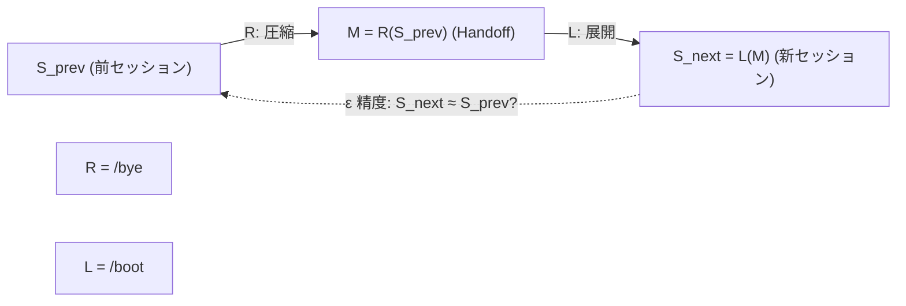

# /bye ワークフロー

> **Hegemonikón H-series**: H4 Doxa（信念・記憶永続化）
> **圏論的正体**: 随伴 L⊣R の右関手 R: Ses → Mem（作業状態を圧縮記憶に変換）
> **/boot の対**。L が展開なら R は圧縮。
>
> **制約**: Handoff は「赤の他人が引き継いでも理解できる」レベルで記述すること。
> Step 3.5 (チャット履歴エクスポート) は絶対にスキップ禁止。

// turbo-all

---

## 随伴構造: Boot ⊣ Bye

```
     L = Boot (自由関手: 圧縮記憶 → 作業状態)
Mem ←──────────────────────────────→ Ses
     R = Bye  (忘却関手: 作業状態 → 圧縮記憶)
```

### /bye = 右随伴 R の計算

右随伴 R は「忘却関手」— **構造を保存しながら情報量を圧縮する**。

```
R(S) = M  ここで S = 現在のセッション状態

Step 0: S の品質評価     — 圧縮前に S の状態を確認
Step 1: S の射を記録     — Git = コード圏の射の永続記録
Step 2: S の対象を列挙   — セッション中の全対象を収集
Step 3: R(S) を計算      — Handoff = S を Mem の対象に圧縮
Step 3.5: ker(R) を保存  — R で失われる情報の生データを保存
Step 3.6: S の行動射記録 — Dispatch Log = AI行動の射
Step 3.7: id_R を更新    — R 自身の特性（Self-Profile）を更新
Step 3.8: R(S) → Mem    — 圧縮結果を圏 Mem に永続配置
Step 4: R(S) を出力      — Creator が R(S) の品質を検証
```

| 概念 | 圏論 | 実践的意味 |
|:-----|:-----|:-----------|
| /bye | 右随伴 R | セッション → 記憶（圧縮） |
| Handoff | R(S) | セッション S の圧縮表現 |
| チャット履歴 | ker(R) | R で失われる情報の原本 |
| Self-Profile更新 | id_R の修正 | R 自身の誤差パターンを学習 |
| 永続化 | R(S) → Mem | 圧縮結果を記憶圏に配置 |
| 赤の他人基準 | R(S) の自己完結性 | R(S) が L なしで意味を持つ |

---

## サブモジュール

| Step | ファイル | 圏論的役割 | 内容 |
|------|----------|:-----------|------|
| 3 | [handoff-format.md](bye/handoff-format.md) | R(S) の出力形式 | Handoff 出力形式 |
| 3.6 | [dispatch-log.md](bye/dispatch-log.md) | 行動射の記録 | Dispatch Log 自動集計 |
| 3.8 | [persistence.md](bye/persistence.md) | R(S) → Mem | 永続化ステップ |

---

## Step 0: S の品質評価 — 収束確認 (CEP-001)

> **圏論**: R を適用する前に、圏 Ses の現在の対象 S の状態を評価する。
> 不確定な射が多い S を圧縮すると、R(S) も不確定になる。
> V[session] = S 内の未確定射の割合。

> **CCL**: `/bye >> V[]`

```ccl
V[session] >> {
    I: V[] > 0.5 { "⚠️ 高不確実性で終了" >> "未確定射を Handoff に明記" }
    I: V[] <= 0.5 { "✅ 十分に収束して終了" }
}
```

| 項目 | 圏論的意味 | 内容 |
|:-----|:-----------|:-----|
| V[session] | S の未確定射の割合 | 0.0–1.0 |
| 判定 | R(S) の信頼性 | 収束 / 要引継ぎ / 中断 |

---

## Step 1: S の射を記録 — Git 状態取得

> **圏論**: セッション S 内で発生したコード圏の射（変更）を記録する。
> Git status = 未コミットの射、Git log = 確定済みの射。

```bash
git -C ~/oikos log -1 --oneline
git -C ~/oikos status --short
```

---

## Step 2: S の対象列挙 — セッション情報収集

> **圏論**: 圏 Ses の現在の対象を列挙する。R はここで列挙された対象を圧縮する。
> 列挙されない対象は R(S) に含まれない = 次の L(R(S)) で復元されない = 忘却される。

自動収集:

- 今日の task.md — **S の目標対象**
- 完了タスク（[x]マーク） — **S の確定射**
- 未完了タスク（[ ]マーク） — **S の未確定射**
- 決定事項 — **S の不可逆射（合意された変更）**

---

## Step 3: R(S) の計算 — Handoff 生成

> **圏論**: 右随伴 R をセッション S に適用し、圧縮表現 R(S) を生成する。
> **R(S) = Handoff**: セッションの全情報を、次の L が復元可能な形式に圧縮する。
> 圧縮品質 = R の精度。**赤の他人基準 = R(S) が L なしでも意味を持つこと**。

> 形式: [bye/handoff-format.md](bye/handoff-format.md)

出力先: `~/oikos/mneme/.hegemonikon/sessions/handoff_{YYYY-MM-DD}_{HHMM}.md`

---

## Step 3.5: ker(R) の保存 — チャット履歴エクスポート

> [!CAUTION]
> **このステップは絶対にスキップ禁止。即座に実行せよ。**

> **圏論**: R の核 ker(R) = R で失われる情報。チャット履歴は R(S) に含まれない詳細を保持する。
> Handoff は圧縮 (R) なので情報ロスがある。生チャットデータは ε 精度の上限を決める。
> ker(R) を保存しなければ、ε は原理的に 1 に近づけない。

```bash
cd ~/oikos/hegemonikon && \
.venv/bin/python mekhane/anamnesis/export_chats.py --single "Session_$(date +%Y%m%d_%H%M)"
```

---

## Step 3.6: 行動射の記録 — Dispatch Log 自動集計

> **圏論**: セッション中に AI が発動したスキル・WF = 圏 Ses 内で traversal した射の記録。
> 次の L で「前回何をしたか」を復元するための射のログ。
> 詳細: [bye/dispatch-log.md](bye/dispatch-log.md)

---

## Step 3.7: id_R の更新 — Self-Profile 更新

> **圏論**: 関手 R 自身の恒等射 id_R を更新する。R がどこで精度を落とすか（忘却パターン）、
> どこで精度が高いかを学習し、次回の R に反映する。
> /boot Phase 0 (id_L) と対称: L の自己認識が id_L なら、R の自己反省が id_R。

> **消化ルール**: 保存ではなく消化。記録したものは次の /boot で食べ直す。
> **参照先**: KI `hegemonikon_core_system/artifacts/identity/self_profile.md`

| 項目 | 圏論的意味 | 内容 |
|:-----|:-----------|:-----|
| 今日忘れたこと | R の情報ロスパターン | 具体的に何を忘れたか |
| 確認を省略した場面 | R の射の省略 | 「つまりこういうことですか？」を省略した場面 |
| 同じミスの繰り返し | R の系統的誤差 | 過去の記録と照合してパターン確認 |
| 能力境界の更新 | R の定義域を修正 | 得意/苦手の発見 |
| 比喩の自己評価 | R の表現力 | 自発的比喩の数と質 |
| 同意/反論比率 | R の偏り | 同意N / 反論N / 確認N |

---

## Step 3.8-3.14: R(S) → Mem — 永続化

> **圏論**: 計算された R(S) を圏 Mem の各領域に配置する。
> Mem は単一の Handoff ファイルではなく、複数の対象（KI, FEP, Sophia 等）からなる圏。
> R(S) を Mem の適切な対象に分配する作業。
> 詳細: [bye/persistence.md](bye/persistence.md)

| 永続化先 | 圏論的意味 | 内容 |
|:---------|:-----------|:-----|
| Kairos インデックス | Mem の時間射 | タイミングの記録 |
| Handoff インデックス | Mem の索引 | 検索可能性の保証 |
| Persona | Mem の行動パターン | 対人特性の学習 |
| Sophia | Mem の知識対象 | 学術的知識の同期 |
| FEP A行列 | Mem の構造射 | 予測精度の永続化 |
| WF 一覧 | Mem のスキーマ | ワークフロー構造の更新 |
| 意味ある瞬間 | Mem の際立った対象 | 感情的に重要な出来事 |
| 派生選択学習 | Mem の選好射 | 派生の使用頻度 |
| X-series 経路 | Mem の morphism 使用記録 | 定理間遷移パターン |

---

## Step 4: R(S) の出力 — 確認

> **圏論**: R(S) = Handoff を Creator に提示し、圧縮品質を検証する。
> Creator の確認 = R(S) の赤の他人基準を人間が検証するステップ。

生成された Handoff を表示し、ユーザーに確認を求める。

### 4.5 Post-Check — R(S) の品質検証

> **環境強制**: postcheck が PASS しなければ Creator に Handoff を提示してはならない。
> 赤の他人基準 = R(S) が L なしでも意味を持つこと。

**チェック項目**:

| # | 検証 | 圏論的意味 | FAIL 条件 |
|:--|:-----|:-----------|:----------|
| 1 | Handoff にコンテキスト依存表現がないか | R(S) の自己完結性 | 「あれ」「さっきの」等の指示語残存 |
| 2 | 全変更ファイルがリストされているか | R の全射性 | 変更したのに Handoff に未記載 |
| 3 | タスク提案が具体的か | R(S) → L の射の計算可能性 | 「続きをやる」等の曖昧なタスク |
| 4 | Step 3.5 (ker(R)) が実行されたか | ker(R) の保存 | チャット履歴エクスポート未実行 |

**手順**:

1. Handoff 生成後、上記4項目を自己検証
2. FAIL 時: 不足を補完してから Creator に提示。PASS するまでループ。

---

## Boot ⊣ Bye: 随伴のサイクル



1. `/bye` で現在のセッション S を R(S) = Handoff に圧縮
2. 次回 `/boot` で R(S) を L(R(S)) = 新セッションに展開
3. ε 精度 = L(R(S)) と S の近さ = 情報がどれだけ保存されたか
4. Drift = 1 - ε = 失われた文脈の量

---

## Hegemonikón Status

| Module | Workflow | Status |
|:-------|:---------|:-------|
| H4 Doxa | /bye | v6.0 Ready |

> **制約リマインダ**: Handoff は「赤の他人基準」(R の自己完結性) で記述。Step 3.5 スキップ禁止。

---

*v4.1 — FBR 適用 (2026-02-07)*
*v5.0 — 随伴統合 (2026-02-08)*
*v6.0 — 随伴深層統合。各Step を右随伴 R の計算ステップとして再定義。S品質評価(0) → 射記録(1) → 対象列挙(2) → R(S)計算(3) → ker(R)保存(3.5) → id_R更新(3.7) → Mem永続化(3.8) → 出力(4) (2026-02-08)*
