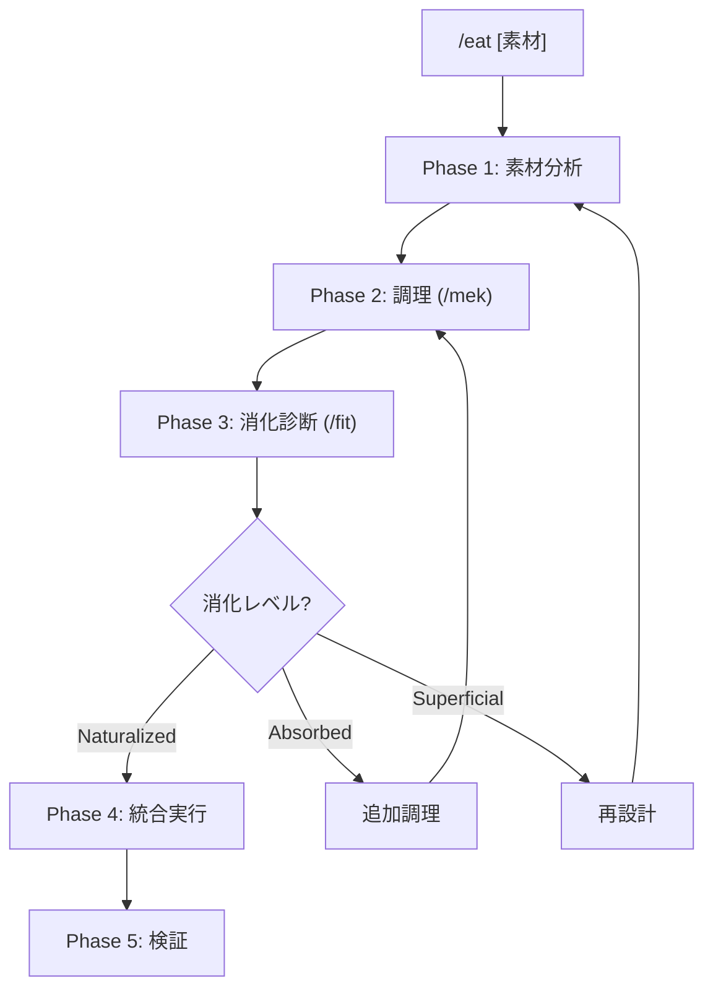

# /eat: 外部コンテンツ消化ワークフロー

> **Hegemonikón**: S2 Mekhanē (調理) + A2 Krisis (消化)
> **目的**: 外部の知識・フレームワーク・技法を Hegemonikón に馴染む形で吸収する
>
> **制約**: 外部コンテンツをそのまま取り込むと「付着」になる。必ず /mek で調理し /fit で消化診断すること。

---

## 設計思想

| 課題 | 解決 |
|:-----|:-----|
| そのまま取り込むと「付着」になる | /mek で「調理」= Native形式に変換 |
| 形式・哲学が合わず「境界」が残る | /fit で「消化診断」= 境界消失を検証 |
| 新規コマンドの乱立を招く | 既存ワークフローの「拡張」として吸収 |

> **比喩**: 生肉(外部コンテンツ) → 調理(/mek) → 消化(/fit) → 栄養(既存WF強化)

---

## 発動条件

| トリガー | 説明 |
|:---------|:-----|
| `/eat [素材]` | 指定した素材を消化 |
| 「〇〇を Hegemonikón に取り込んで」 | 自然言語トリガー |
| 「〇〇を食べて」 | 消化メタファートリガー |

---

## マクロフロー



---

## 処理フロー

// turbo-all

### Phase 1: 素材分析

**目的**: 外部素材の構造と価値を把握する

1. 素材の構成要素を列挙
2. 概念・技法・フレームワークを抽出
3. Hegemonikón の既存定理との対応を初期マッピング

**出力形式**:

| 項目 | 内容 |
|:-----|:-----|
| 素材 | {素材名} |
| 構成要素 | 1. {概念} — {説明} / 2. {概念} — {説明} |
| 初期マッピング | {概念} → {既存WF} (既存カバー) / {概念} → /??? (新規候補) |

---

### Phase 2: 調理 (/mek)

**目的**: 素材を Hegemonikón Native 形式に変換する

> **/mek (tekhne-maker) を発動** — Hegemonikón Mode で調理を実行

1. 各概念を消化先の定理に対応させる
2. Hegemonikón フォーマットに変換: frontmatter追加、出力形式統一、哲学的接続の明示
3. 既存ワークフローへの「拡張パッチ」を生成

**出力形式**:

| 項目 | 内容 |
|:-----|:-----|
| 調理品 | {概念} → {消化先WF} |
| 追加内容 | {パッチ内容サマリー} |
| 哲学的接続 | {定理との関係} |
| 生成パッチ | {WF}.md への拡張リスト |

---

### Phase 3: 消化診断 (/fit)

**目的**: 調理結果が「馴染む」か検証する

> **/fit を発動** — Level 0-3 の階層的消化プロトコルを実行

1. 境界残存チェック — 素材名が残っていないか
2. 機能重複検出 — 新コマンドを作っていないか
3. 強化度評価 — 既存WFが「より強く」なるか
4. 消化レベル判定

**消化レベル判定**:

| レベル | 意味 | 次ステップ |
|:-------|:-----|:-----------|
| Naturalized | 境界消失 | Phase 4: 統合実行へ |
| Absorbed | 境界あり | 追加調理（Phase 2 へ戻る） |
| Superficial | 構造問題 | 再設計（Phase 1 へ戻る） |

**出力形式**:

| 項目 | 内容 |
|:-----|:-----|
| 消化レベル | {Naturalized/Absorbed/Superficial} |
| 境界残存 | {なし/あり} |
| 機能重複 | {なし/あり} |
| 強化スコア | {N}/5 |
| 判定理由 | {具体的な判断根拠} |

---

### Phase 4: 統合実行

**目的**: 調理済みパッチを既存ワークフローに統合する

> **消化レベル Naturalized の場合のみ実行**

1. 生成したパッチを既存WFに適用
2. lineage を更新
3. version をインクリメント
4. Git commit

**検証項目**: ワークフロー構文チェック / 参照解決チェック / Anti-Skip Protocol 維持確認

**出力形式**:

| 項目 | 内容 |
|:-----|:-----|
| 変更ファイル | {WF}.md (vX.Y → vX.Z) |
| 追加参照 | tekhne/references/{素材}/ |
| Git | {commit hash} |

---

### Phase 5: 検証

**目的**: 統合後の動作を確認する

1. 変更したWFを単体実行
2. 追加機能が自然に発動するか確認
3. 認知負荷が増えていないか評価

**成功基準**: 新機能が既存フローに溶け込んでいる / ユーザーが「元からあった」と感じる / 覚えるコマンドが増えていない

---

## 統合出力形式

消化完了時の出力:

| 項目 | 内容 |
|:-----|:-----|
| 素材 | {素材名} |
| Phase 1 | {構成要素と初期マッピング} |
| Phase 2 | {調理品リストとパッチサマリー} |
| Phase 3 | {消化レベルと判定理由} |
| Phase 4 | {変更ファイルと Git commit} |
| Phase 5 | {動作確認結果} |
| 結論 | {素材} は Hegemonikón に消化されました |
| 栄養 | {強化されたWFリスト} |

---

## Artifact 自動保存

> **標準参照**: [workflow_artifact_standard.md](file:///home/makaron8426/oikos/.agent/standards/workflow_artifact_standard.md)

**保存先**: `/home/makaron8426/oikos/mneme/.hegemonikon/workflows/eat_<素材名>_<date>.md`

例: `eat_ai_zen_techniques_20260129.md`

**チャット出力**: チャットには最小限の出力のみ。詳細は全てファイルに保存。

```
✅ /eat 完了
📄 /mneme/.hegemonikon/workflows/eat_{素材名}_{date}.md
要約: {消化レベル} — {強化されたWFリスト}
→ {推奨次ステップ}
```

**保存する理由**: コンテキスト節約 / 消化履歴の追跡 / 監査可能な外部ソース出典記録

---

## X-series 連携

| 入力 | 出力 | 経路 |
|:-----|:-----|:-----|
| 外部素材 | S2 Mekhanē | X-SA (S→A) |
| 調理品 | A2 Krisis | /fit 消化診断 |
| 消化完了 | H4 Doxa | 長期記憶に保存 |

---

## Hegemonikon Status

| Module | Workflow | Status |
|:-------|:---------|:-------|
| S2, A2 | /eat | v1.4 Ready |

> **制約リマインダ**: そのまま取り込みは「付着」。必ず /mek で調理し /fit で消化診断すること。

---

*v1.3 — SEL統合 (2026-02-07)*
*v1.4 — FBR変換 (2026-02-07)*
