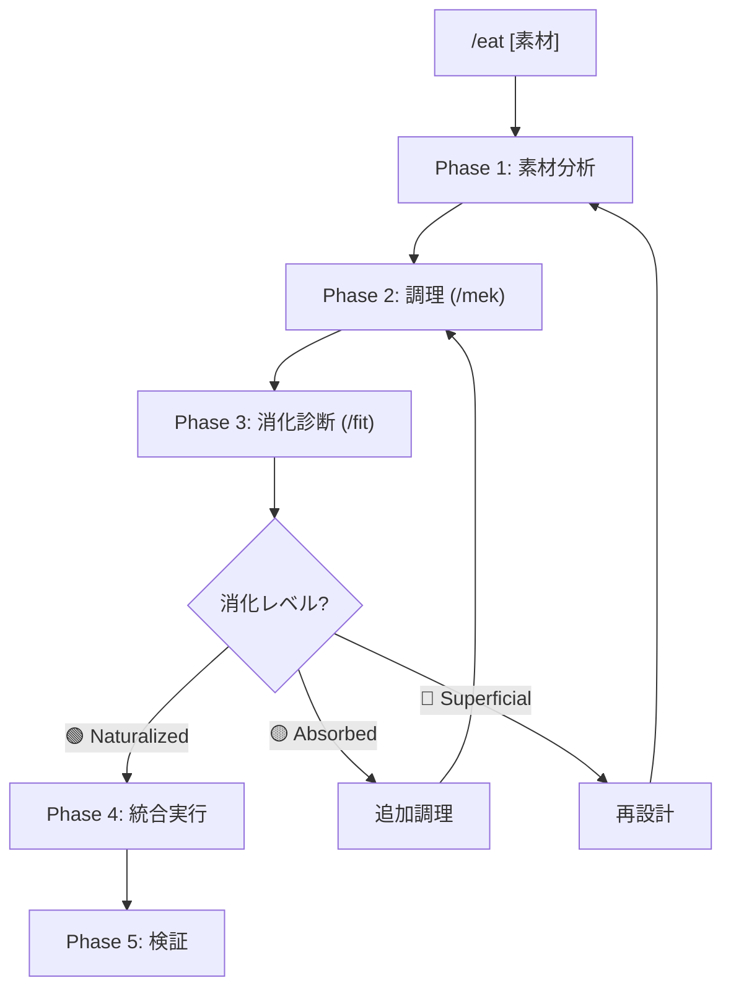

# /eat: 外部コンテンツ消化ワークフロー

> **Hegemonikón**: S2 Mekhanē (調理) + A2 Krisis (消化)
> **目的**: 外部の知識・フレームワーク・技法を Hegemonikón に馴染む形で吸収する

---

## 設計思想

```yaml
問題:
  - 外部コンテンツをそのまま取り込むと「付着」になる
  - 形式・哲学が合わず「境界」が残る
  - 新規コマンドの乱立を招く

解決:
  - /mek で「調理」= Hegemonikón Native 形式に変換
  - /fit で「消化診断」= 境界が消えているか検証
  - 既存ワークフローの「拡張」として吸収

比喩:
  生肉(外部コンテンツ) → 調理(/mek) → 消化(/fit) → 栄養(既存WF強化)
```

---

## 発動条件

| トリガー | 説明 |
|:---------|:-----|
| `/eat [素材]` | 指定した素材を消化 |
| 「〇〇を Hegemonikón に取り込んで」 | 自然言語トリガー |
| 「〇〇を食べて」 | 消化メタファートリガー |

---

## マクロフロー



---

## 実行手順

// turbo-all

---

### Phase 1: 素材分析

**目的**: 外部素材の構造と価値を把握する

```yaml
action:
  1. 素材の構成要素を列挙
  2. 概念・技法・フレームワークを抽出
  3. Hegemonikón の既存定理との対応を初期マッピング

output:
  素材: [名前]
  構成:
    - 概念A: [説明]
    - 概念B: [説明]
    - 概念C: [説明]
  初期マッピング:
    概念A → [既存定理/WF]
    概念B → [既存定理/WF]
    概念C → [既存定理/WF または 新規候補]
```

### 出力形式

```text
┌─[Phase 1: 素材分析]───────────────────────┐
│ 素材: [素材名]                            │
│                                           │
│ 構成要素:                                 │
│   1. [概念] — [説明]                      │
│   2. [概念] — [説明]                      │
│                                           │
│ 初期マッピング:                           │
│   [概念] → [既存WF] (既存カバー)          │
│   [概念] → /??? (新規候補)                │
└───────────────────────────────────────────┘
```

---

### Phase 2: 調理 (/mek)

**目的**: 素材を Hegemonikón Native 形式に変換する

> **/mek (tekhne-maker) を発動**
> Hegemonikón Mode で調理を実行

```yaml
action:
  1. 各概念を消化先の定理に対応させる
  2. Hegemonikón フォーマットに変換:
     - frontmatter 追加 (derived_from, lineage, x_series)
     - 出力形式の統一
     - 哲学的接続の明示
  3. 既存ワークフローへの「拡張パッチ」を生成

process:
  input: 素材の概念リスト
  output: 
    - 拡張パッチ (既存WFに追加する内容)
    - 参照資料 (tekhne-maker/references/ に保存)
```

### 出力形式

```text
┌─[Phase 2: 調理 (/mek)]────────────────────┐
│ 調理品:                                   │
│                                           │
│ 1. [概念A] → [消化先WF]                   │
│    追加内容: [パッチ内容サマリー]          │
│    哲学的接続: [定理との関係]              │
│                                           │
│ 2. [概念B] → [消化先WF]                   │
│    追加内容: [パッチ内容サマリー]          │
│    哲学的接続: [定理との関係]              │
│                                           │
│ 生成パッチ:                               │
│   - [WF1].md への拡張                     │
│   - [WF2].md への拡張                     │
└───────────────────────────────────────────┘
```

---

### Phase 3: 消化診断 (/fit)

**目的**: 調理結果が「馴染む」か検証する

> **/fit を発動**
> Level 0-3 の階層的消化プロトコルを実行

```yaml
action:
  1. 境界残存チェック — 素材名が残っていないか
  2. 機能重複検出 — 新コマンドを作っていないか
  3. 強化度評価 — 既存WFが「より強く」なるか
  4. 消化レベル判定

judgment:
  🟢 Naturalized: 境界消失、統合実行へ
  🟡 Absorbed: 境界あり、追加調理へ
  🔴 Superficial: 構造問題、再設計へ
```

### 出力形式

```text
┌─[Phase 3: 消化診断 (/fit)]────────────────┐
│ 消化レベル: [🟢/🟡/🔴]                    │
│                                           │
│ 境界残存: [なし/あり]                     │
│ 機能重複: [なし/あり]                     │
│ 強化スコア: [N]/5                         │
│                                           │
│ 判定: [Naturalized/Absorbed/Superficial]  │
│ 理由: [具体的な判断根拠]                  │
└───────────────────────────────────────────┘
```

---

### Phase 4: 統合実行

**目的**: 調理済みパッチを既存ワークフローに統合する

> **消化レベル 🟢 Naturalized の場合のみ実行**

```yaml
action:
  1. 生成したパッチを既存WFに適用
  2. lineage を更新（AI Zen v1.0 消化 等）
  3. version をインクリメント
  4. Git commit

verification:
  - ワークフロー構文チェック
  - 参照解決チェック
  - Anti-Skip Protocol 維持確認
```

### 出力形式

```text
┌─[Phase 4: 統合実行]───────────────────────┐
│ 統合完了:                                 │
│                                           │
│ 変更ファイル:                             │
│   - [WF1].md (v3.0 → v3.1)               │
│   - [WF2].md (v4.0 → v4.1)               │
│                                           │
│ 追加参照:                                 │
│   - tekhne/references/[素材]/             │
│                                           │
│ Git: [commit hash]                        │
└───────────────────────────────────────────┘
```

---

### Phase 5: 検証

**目的**: 統合後の動作を確認する

```yaml
action:
  1. 変更したWFを単体実行
  2. 追加機能が自然に発動するか確認
  3. 認知負荷が増えていないか評価

success_criteria:
  - 新機能が既存フローに溶け込んでいる
  - ユーザーが「元からあった」と感じる
  - 覚えるコマンドが増えていない
```

---

## 統合出力形式

```text
═══════════════════════════════════════════════════════════
[Hegemonikón] /eat: 外部コンテンツ消化完了
═══════════════════════════════════════════════════════════

📋 素材: [素材名]

━━━ Phase 1: 素材分析 ━━━
{構成要素と初期マッピング}

━━━ Phase 2: 調理 (/mek) ━━━
{調理品リストとパッチサマリー}

━━━ Phase 3: 消化診断 (/fit) ━━━
{消化レベルと判定理由}

━━━ Phase 4: 統合実行 ━━━
{変更ファイルと Git commit}

━━━ Phase 5: 検証 ━━━
{動作確認結果}

═══════════════════════════════════════════════════════════
📌 結論: [素材] は Hegemonikón に消化されました
🍽️ 栄養: [強化されたWFリスト]
═══════════════════════════════════════════════════════════
```

---

## Artifact 自動保存

> **標準参照**: [workflow_artifact_standard.md](file:///home/laihuip001/oikos/.agent/standards/workflow_artifact_standard.md)

### 保存先

```
/home/laihuip001/oikos/mneme/.hegemonikon/workflows/eat_<素材名>_<date>.md
```

例: `eat_ai_zen_techniques_20260129.md`

### チャット出力規則

**チャットには最小限の出力のみ。詳細は全てファイルに保存。**

```text
✅ /eat 完了
📄 /mneme/.hegemonikon/workflows/eat_{素材名}_{date}.md
要約: {消化レベル} — {強化されたWFリスト}
→ {推奨次ステップ}
```

### 保存する理由

1. **コンテキスト節約**: チャット履歴を汚さない
2. **消化履歴** — 何をいつ取り込んだか追跡
3. **監査可能** — 外部ソースの出典を記録

---

## X-series 連携

| 入力 | 出力 | 経路 |
|:-----|:-----|:-----|
| 外部素材 | S2 Mekhanē | X-SA (S→A) |
| 調理品 | A2 Krisis | /fit 消化診断 |
| 消化完了 | H4 Doxa | 長期記憶に保存 |

---

## Hegemonikon Status

| Module | Workflow | Status |
|:-------|:---------|:-------|
| S2, A2 | /eat | v1.0 Ready |

---

*v1.0 — 調理+消化の統合ワークフロー (2026-01-29)*
