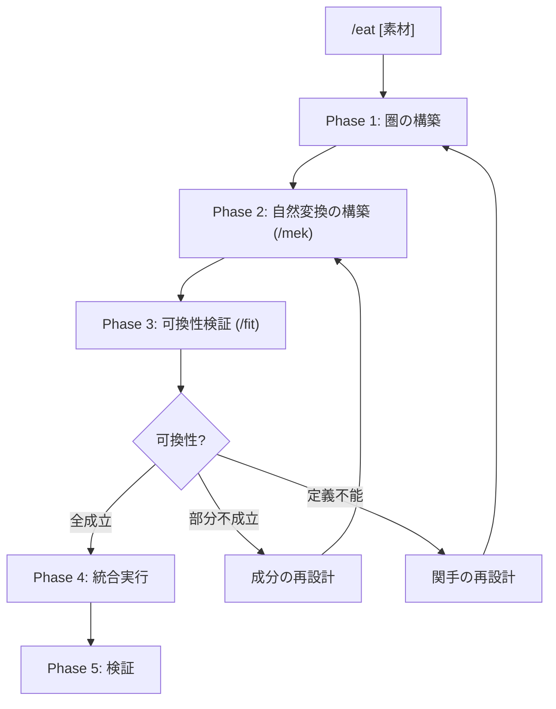

# /eat: 外部コンテンツ消化ワークフロー

> **Hegemonikón**: S2 Mekhanē (調理) + A2 Krisis (消化)
> **圏論的正体**: 自然変換 α: F ⟹ G の構築プロセス
> **目的**: 外部の知識・フレームワーク・技法を Hegemonikón に馴染む形で吸収する
>
> **制約**: 外部コンテンツをそのまま取り込むと「付着」になる。必ず /mek で調理し /fit で消化診断すること。

---

## 圏論的設計思想

```
          F(f)
  F(A) --------→ F(B)        F = 外部関手 (素材の概念空間)
   |                |        G = 内部関手 (既存WFの概念空間)
   | αA              | αB     α = 消化 (自然変換)
   ↓                ↓
  G(A) --------→ G(B)        可換 = Naturalized
          G(f)
```

| 問い | 答え |
|:-----|:-----|
| なぜ「付着」が起きるか？ | αX が定義されていない（成分が未定義）か、可換図式が崩れているから |
| なぜ「調理」が必要か？ | 各概念 X に対して成分 αX: F(X) → G(X) を構築する作業だから |
| なぜ「消化診断」が必要か？ | 全ての概念間関係 f で αB∘F(f) = G(f)∘αA が成り立つか検証するため |
| 「Naturalized」とは何か？ | 自然変換の可換条件が**全ての**図式で成立している状態 |

> **比喩**: 生肉(外部コンテンツ) → 調理(α の成分構築) → 消化検証(可換性テスト) → 栄養(既存WF強化)

---

## サブモジュール

| ファイル | 内容 |
|----------|------|
| [batch.md](eat/batch.md) | 大量ファイル一括変換パイプライン (10+ファイル用) |

---

## 発動条件

| トリガー | 説明 |
|:---------|:-----|
| `/eat [素材]` | 指定した素材を消化 |
| 「〇〇を Hegemonikón に取り込んで」 | 自然言語トリガー |
| 「〇〇を食べて」 | 消化メタファートリガー |

---

## マクロフロー



---

## 処理フロー

// turbo-all

### Phase 1: 圏の構築 (Categorical Setup)

**目的**: 外部素材の概念空間（圏 **Ext**）と2つの関手 F, G を定義する

1. **対象の列挙**: 素材の構成概念 A, B, C, ... を列挙（圏 Ext の対象）
2. **射の列挙**: 概念間の関係 f: A→B, g: B→C, ... を列挙（圏 Ext の射）
3. **外部関手 F の構築**: 各概念を Hegemonikón の対象に「素朴に」マッピング
4. **内部関手 G の構築**: 各概念の「理想的な消化先」を既存 WF/Skill から特定

**出力形式**:

| 項目 | 内容 |
|:-----|:-----|
| 素材 | {素材名} |
| 圏 Ext | 対象: {A, B, C, ...} / 射: {f: A→B, g: B→C, ...} |
| 関手 F | F(A)={WF1}, F(B)={WF2}, ... (素朴マッピング) |
| 関手 G | G(A)={WF1'}, G(B)={WF2'}, ... (理想的消化先) |
| F と G の乖離 | {乖離がある成分のリスト} |

---

### Phase 2: 自然変換の構築 (/mek)

**目的**: 各概念 X に対して成分 αX: F(X) → G(X) を構築する

> **/mek (tekhne-maker) を発動** — 各成分 αX の調理を実行

1. 各概念 X に対して αX を設計:
   - F(X) と G(X) の差分を特定
   - F(X) を G(X) に変換する「パッチ」を生成
2. **可換性の事前チェック**: 概念間の射 f: A→B に対して
   - αB ∘ F(f) を追跡: F(A) → F(B) → G(B)
   - G(f) ∘ αA を追跡: F(A) → G(A) → G(B)
   - 両経路が同じ結果を導くか検証
3. Hegemonikón フォーマットに変換: frontmatter, 出力形式, 哲学的接続

**出力形式**:

| 項目 | 内容 |
|:-----|:-----|
| 成分 αX | αA: F(A)→G(A) = {パッチ内容} |
| 可換性事前チェック | f: A→B — αB∘F(f) = G(f)∘αA? {✅/⚠️} |
| 生成パッチ | {WF}.md への拡張リスト |

---

### Phase 3: 可換性検証 (/fit)

**目的**: 自然変換 α の可換条件を検証する

> **/fit を発動** — 自然性の可換図式を検証

/fit が以下を実行:

1. **成分検証**: 各 αX が well-defined か
2. **可換性検証**: 全ての射 f に対して αB∘F(f) = G(f)∘αA が成立するか
3. **消化レベル判定**

| レベル | 圏論的定義 | 次ステップ |
|:-------|:-----------|:-----------|
| 🟢 Naturalized | **全ての可換図式が成立** | Phase 4: 統合実行へ |
| 🟡 Absorbed | 一部の可換図式が不成立 | 成分の再設計（Phase 2 へ戻る） |
| 🔴 Superficial | 成分 αX が定義できない | 関手の再設計（Phase 1 へ戻る） |

> 詳細: [/fit ワークフロー](fit.md) を参照

---

### Phase 4: 統合実行

**目的**: 可換性が確認された自然変換 α を適用する

> **消化レベル Naturalized の場合のみ実行**

1. 生成したパッチ（各成分 αX）を既存WFに適用
2. lineage を更新
3. version をインクリメント
4. Git commit

**検証項目**: WF 構文チェック / 参照解決チェック / Anti-Skip Protocol 維持確認

**出力形式**:

| 項目 | 内容 |
|:-----|:-----|
| 適用した成分 | αA: {変更内容}, αB: {変更内容}, ... |
| 変更ファイル | {WF}.md (vX.Y → vX.Z) |
| Git | {commit hash} |

---

### Phase 5: 検証

**目的**: 統合後の動作を確認する（自然変換の事後検証）

1. 変更したWFを単体実行
2. 追加機能が自然に発動するか確認
3. 認知負荷が増えていないか評価
4. **自己参照検証**: この消化結果自体に `/fit` を適用（メタ可換性）

**成功基準**: 新機能が既存フローに溶け込んでいる / ユーザーが「元からあった」と感じる / 覚えるコマンドが増えていない

---

## 統合出力形式

消化完了時の出力:

| 項目 | 内容 |
|:-----|:-----|
| 素材 | {素材名} |
| Phase 1 | 圏 Ext: {N}対象, {M}射 / F, G 構築済 |
| Phase 2 | {K}成分の自然変換構築 / 可換性事前チェック |
| Phase 3 | 消化レベル: {Naturalized/Absorbed/Superficial} |
| Phase 4 | {変更ファイル} / Git: {commit} |
| Phase 5 | 動作確認: {結果} |
| 結論 | {素材} は自然変換 α として Hegemonikón に消化されました |
| 栄養 | {強化されたWFリスト} |

---

## Artifact 自動保存

> **標準参照**: [workflow_artifact_standard.md](file:///home/makaron8426/oikos/.agent/standards/workflow_artifact_standard.md)

**保存先**: `/home/makaron8426/oikos/mneme/.hegemonikon/workflows/eat_<素材名>_<date>.md`

**チャット出力**: チャットには最小限の出力のみ。詳細は全てファイルに保存。

```
✅ /eat 完了 (α: F ⟹ G)
📄 /mneme/.hegemonikon/workflows/eat_{素材名}_{date}.md
要約: {消化レベル} — {強化されたWFリスト}
→ {推奨次ステップ}
```

---

## X-series 連携

| 入力 | 出力 | 経路 |
|:-----|:-----|:-----|
| 外部素材 | S2 Mekhanē (自然変換構築) | X-SA (S→A) |
| 調理品 | A2 Krisis (可換性検証) | /fit 発動 |
| 消化完了 | H4 Doxa (長期記憶保存) | 長期記憶 |

---

## Hegemonikon Status

| Module | Workflow | Status |
|:-------|:---------|:-------|
| S2, A2 | /eat | v2.0 Ready |

> **制約リマインダ**: そのまま取り込みは「付着」（成分未定義の自然変換）。必ず /mek で調理し /fit で可換性を検証すること。

---

*v1.3 — SEL統合 (2026-02-07)*
*v1.4 — FBR変換 (2026-02-07)*
*v2.0 — 自然変換統合。消化プロセスを α: F ⟹ G の構築・検証として再設計 (2026-02-08)*
