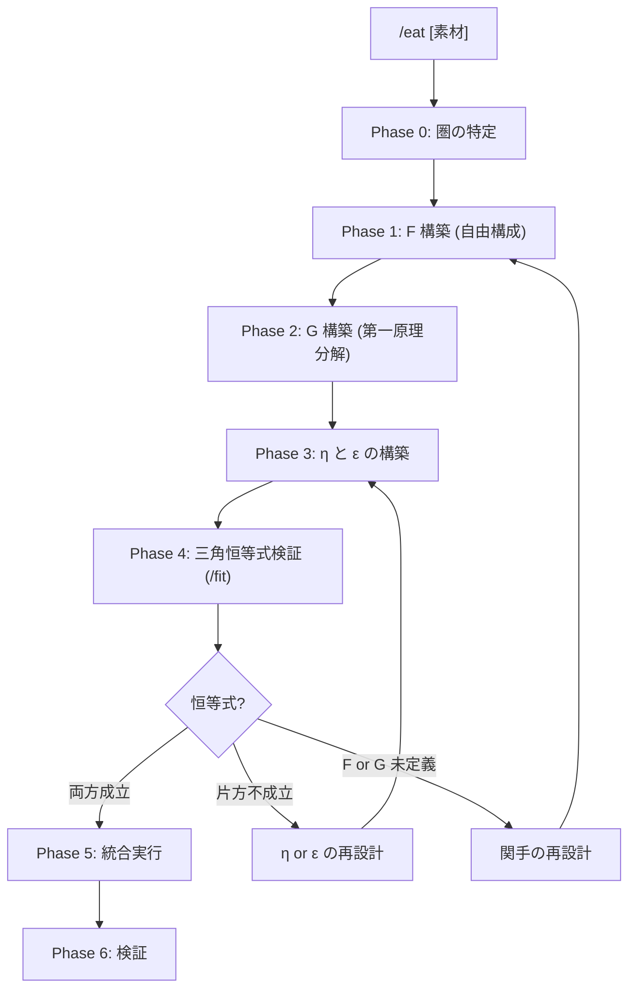

# /eat: 外部コンテンツ消化ワークフロー

> **Hegemonikón**: S2 Mekhanē (調理) + A2 Krisis (消化)
> **圏論的正体**: 随伴 F⊣G (Free-Forgetful Adjunction)
> **目的**: 外部の知識・フレームワーク・技法を Hegemonikón に馴染む形で吸収する
>
> **哲学**: 第零原則「自分を信じない」とは、既知の構造を忘却(G)して第一原理に分解し、
> そこから自由に再構成(F)すること。消化とはこの F⊣G の反復である。
>
> **制約**: 外部コンテンツをそのまま取り込むと「付着」になる。必ず G で分解し F で再構成すること。

---

## 随伴構造: Eat ⊣ Forget

```
     F = Eat    (取り込み関手 = 左随伴 = 自由構成)
Ext ←────────────────────────────────────────→ Int
     G = Forget (忘却関手    = 右随伴 = 第一原理分解)

η: Id_Ext → G∘F  — 取り込んで分解して戻す = 情報保存率
ε: F∘G → Id_Int  — 分解して再構成して戻す = 構造の非冗長性
```

### 統一随伴表

| ペア | 左随伴 (自由構成) | 右随伴 (忘却) | 圏 |
|:-----|:-----------------|:-------------|:---|
| `/boot ⊣ /bye` | L: Mem → Ses（展開） | R: Ses → Mem（圧縮） | 記憶 ↔ セッション |
| `/eat` の F⊣G | F: Ext → Int（再構成） | G: Int → Ext（第一原理分解） | 外部 ↔ 内部 |

> **Ext** = 最小チャンクの圏（構造なし、原子的概念の集合）
> **Int** = HGK 構造の圏（定理・WF・圏論的関係が載っている）

### なぜ「忘却 = 第一原理分解」か

| 概念 | 圏論 | HGK | Aristotle |
|:-----|:-----|:----|:----------|
| 忘却関手 G | 構造を忘れて台を残す | WF/定理/関係を剥いでチャンクに分解 | 第一原理に還元 |
| 自由関手 F | 台に自由に構造を載せる | チャンクに HGK 構造を自由に構成 | 第一原理から構築 |
| G(Y) | 群の演算を忘れて集合にする | `/syn` → {多視点批評, ペルソナ, 専門家, ...} | 本質を取り出す |
| F(X) | 集合から自由群を生成 | {評議, 批評} → `/syn` WF に構成 | 公理から定理を導く |

| 問い | 答え |
|:-----|:-----|
| なぜ「付着」が起きるか？ | G で分解せず F のみ実行 = 構造の不整合 |
| なぜ第一原理分解が必要か？ | 既存構造に「自由でない」形で載せると歪む |
| 第零原則との関係は？ | 「自分を信じない」= 既知を G で分解して F で再構成 |
| 「Naturalized」とは何か？ | 三角恒等式が成立 = 分解⇆再構成の往復が恒等的 |

> **比喩**: 生肉(外部コンテンツ) → 第一原理に分解(G) → HGK 構造として自由構成(F)
> → 食べて分解して組み立て直す — それが消化

---

## サブモジュール

| ファイル | 内容 |
|----------|------|
| [batch.md](../workflow-modules/eat/batch.md) | 大量ファイル一括変換パイプライン (10+ファイル用) |
| [digestion_templates.md](../pepsis/templates/digestion_templates.md) | **消化テンプレート (T1-T4)** — Phase 1 での F 構築パターン選択ガイド |

---

## 発動条件

| トリガー | 説明 |
|:---------|:-----|
| `/eat [素材]` | 指定した素材を消化 |
| 「〇〇を Hegemonikón に取り込んで」 | 自然言語トリガー |
| 「〇〇を食べて」 | 消化メタファートリガー |
| 「左随伴して」 | 圏論動詞トリガー |

---

## マクロフロー



---

## 処理フロー

// turbo-all

### Phase 0: 圏の特定 (Categorical Setup)

**目的**: 外部圏 Ext と内部圏 Int を特定する

1. **素材の最小チャンクを列挙**: 素材を原子的概念に分解（圏 Ext の対象）
2. **チャンク間の関係を列挙**: 概念間の関係 f: A→B（圏 Ext の射）
3. **内部圏 Int の確認**: マッピング先となる HGK の WF/Skill/定理を特定

**出力形式**:

| 項目 | 内容 |
|:-----|:-----|
| 素材 | {素材名} |
| 圏 Ext | 対象: {A, B, C, ...} / 射: {f: A→B, g: B→C, ...} |
| 圏 Int | 候補: {WF1, WF2, Skill1, ...} |

---

### Phase 1: F の構築 (取り込み関手 = 自由構成)

**目的**: 最小チャンクに HGK 構造を自由に載せて内部対象に再構成する

> **F: Ext → Int — 「第一原理から自由に構成する」**

1. **消化テンプレート選択**: [digestion_templates.md](../pepsis/templates/digestion_templates.md) を参照し、T1-T4 のどのパターンか判断:
   - T1 対応表: 既存対象への射を張る
   - T2 哲学抽出: 既存対象の属性を豊かにする
   - T3 機能消化: 新しい WF/マクロ/演算子を生む
   - T4 概念輸入: HGK の構造自体を拡張する
2. 各チャンク X に対して F(X) を構築:
   - X に最も自然な HGK 構造（WF/定理/関係）を付与
   - **自由構成** = 最小限の制約から最大限の構造を構築
3. 各関係 f: A→B に対して F(f): F(A)→F(B) を構築:
   - 外部の関係を HGK 内部の射に変換
4. **関手性チェック**: F(g∘f) = F(g)∘F(f) が成り立つか

**出力形式**:

| 項目 | 内容 |
|:-----|:-----|
| F(A) | {チャンク A} → {HGK 対象} (構造: {付与した WF/定理}) |
| F(f) | {関係 f} → {HGK 内部射} |
| 関手性 | F(g∘f) = F(g)∘F(f)? {✅/⚠️} |

---

### Phase 2: G の構築 (忘却関手 = 第一原理分解)

**目的**: HGK 内部対象から構造を剥いで最小チャンクに分解する

> **G: Int → Ext — 「第一原理に還元する」= 究極の要素分解**

1. 各 HGK 内部対象 Y に対して G(Y) を構築:
   - Y の WF 構造・定理・X-series 関係を**全て剥ぐ**
   - 残った「原子的概念のリスト」= G(Y)
2. 各 HGK 内部射 g: Y→Z に対して G(g): G(Y)→G(Z) を構築:
   - 内部の射から構造を落とし、チャンク間の関係に戻す
3. **関手性チェック**: G(h∘g) = G(h)∘G(g) が成り立つか

**操作手順**:

```yaml
G(Y) の計算:
  1. Y の構造を列挙する:
     - どの WF に属するか
     - どの定理を使っているか
     - どの X-series で接続されているか
  2. 全ての構造を剥ぐ:
     - WF 所属 → 忘却
     - 定理の適用 → 忘却
     - X-series 関係 → 忘却
  3. 残った原子的概念のリスト = G(Y)
```

**例**: G(/syn) = {多視点批評, ペルソナ, 専門家, 評議, 反転, 失敗分析}

**出力形式**:

| 項目 | 内容 |
|:-----|:-----|
| G(Y) | {HGK 対象 Y} → {原子チャンク: [c1, c2, c3, ...]} |
| G(g) | {HGK 射 g} → {チャンク間関係} |
| 関手性 | G(h∘g) = G(h)∘G(g)? {✅/⚠️} |

---

### Phase 3: η と ε の構築 (随伴条件)

**目的**: unit η と counit ε を構築し、F⊣G の随伴を確立する

> **/mek (tekhne-maker) を発動** — η と ε の調理を実行

#### η (unit): 情報保存率

```
η_X: X → G(F(X))

意味: チャンク X を取り込み(F)して、分解(G)して戻す
      → 元のチャンクが全て残っているか？

η ≈ id ⟺ 取り込みで情報が失われていない
```

**計算手順**:

1. X にHGK構造を載せる: F(X)
2. F(X) から構造を剥ぐ: G(F(X))
3. X と G(F(X)) を比較:
   - 全チャンクが保存 → η ≈ id ✅
   - 一部チャンクが消失 → η の乖離 ⚠️
   - 多くのチャンクが消失 → F の再設計 ❌

#### ε (counit): 構造の非冗長性

```
ε_Y: F(G(Y)) → Y

意味: HGK 対象 Y を分解(G)して、再構成(F)して戻す
      → 元の構造と同じに戻るか？

ε ≈ id ⟺ 構造が最小チャンクから完全に再構成可能（冗長でない）
```

**計算手順**:

1. Y から構造を剥ぐ: G(Y)
2. G(Y) に構造を載せ直す: F(G(Y))
3. Y と F(G(Y)) を比較:
   - 完全に復元 → ε ≈ id ✅ Naturalized
   - 部分的に復元 → ε の乖離 ⚠️ Absorbed
   - 復元不能 → G or F の再設計 ❌ Superficial

**Drift = 1 - ε** — /boot⊣/bye と同型の測定

**出力形式**:

| 項目 | 内容 |
|:-----|:-----|
| η_X | X → G(F(X)): {チャンク保存状況} — 情報保存率:  |
| Drift | 1 - ε = {%} |

#### 半自動化オプション (v3.1)

> **選択**: 手動判定 or Gemini 半自動算出

| パス | 手順 | 使用場面 |
|:-----|:-----|:---------|
| **[手動]** | 上記計算手順に従い、自分で η/ε を判定 | 精密な消化。L2+ |
| **[半自動]** | `pepsis/templates/digestion_quality.md` のプロンプトを Cortex に投入し、η/ε を算出 | 大量消化。L1 |

**[半自動]** の手順:

1. `view_file pepsis/templates/digestion_quality.md` でテンプレート読込
2. η プロンプトに原文チャンク + F(X) を埋めて `mcp_ochema_ask_cortex` に投入
3. ε プロンプトに HGK 構造 Y + G(Y) を埋めて投入
4. Gemini 出力の η/ε 値を上記テーブルに記入
5. 手動判定との差異が ±10% 以上なら手動を優先

---

### Phase 4: 三角恒等式検証 (/fit)

**目的**: 三角恒等式の成立を検証し、消化レベルを判定する

> **/fit を発動** — 三角恒等式を検証

/fit が以下を実行:

1. **左三角恒等式**: ε_F(X) ∘ F(η_X) = id_F(X)
   - X を取り込み(F) → 分解(G) → 再取込(F) → counit で戻す = 元と同じ？
2. **右三角恒等式**: G(ε_Y) ∘ η_G(Y) = id_G(Y)
   - Y を分解(G) → 取込(F) → 分解(G) → unit で戻す = 元と同じ？

| レベル | 圏論的定義 | 次ステップ |
|:-------|:-----------|:-----------|
| 🟢 Naturalized | **両方の三角恒等式が成立** | Phase 5: 統合実行へ |
| 🟡 Absorbed | η は成立するが ε が不完全、または逆 | η or ε の再設計（Phase 3 へ戻る） |
| 🔴 Superficial | F or G が well-defined でない | 関手の再設計（Phase 1 or 2 へ戻る） |

> 詳細: [/fit ワークフロー](fit.md) を参照

---

### Phase 5: 統合実行

**目的**: 三角恒等式が確認された随伴を適用する

> **消化レベル Naturalized の場合のみ実行**

1. 生成した構造（F による再構成結果）を既存 WF に適用
2. lineage を更新
3. version をインクリメント
4. Git commit

**検証項目**: WF 構文チェック / 参照解決チェック / Anti-Skip Protocol 維持確認

**出力形式**:

| 項目 | 内容 |
|:-----|:-----|
| 適用した構造 | F(A): {変更内容}, F(B): {変更内容}, ... |
| 変更ファイル | {WF}.md (vX.Y → vX.Z) |
| Git | {commit hash} |

---

### Phase 6: 検証

**目的**: 統合後の動作を確認する（随伴の事後検証）

1. 変更した WF を単体実行
2. 追加機能が自然に発動するか確認
3. 認知負荷が増えていないか評価
4. **自己参照検証**: この消化結果自体に `/fit` を適用（メタ三角恒等式）

**成功基準**: 新機能が既存フローに溶け込んでいる / ユーザーが「元からあった」と感じる / 覚えるコマンドが増えていない

---

## 統合出力形式

消化完了時の出力:

| 項目 | 内容 |
|:-----|:-----|
| 素材 | {素材名} |
| Phase 0 | 圏 Ext: {N}対象, {M}射 / Int 候補特定 |
| Phase 1 | F: {K}対象の自由構成 |
| Phase 2 | G: {L}対象の第一原理分解 |
| Phase 3 | η: 情報保存率  / Drift: {%} |
| Phase 4 | 消化レベル: {Naturalized/Absorbed/Superficial} |
| Phase 5 | {変更ファイル} / Git: {commit} |
| Phase 6 | 動作確認: {結果} |
| 結論 | {素材} は随伴 F⊣G として Hegemonikón に消化されました |
| 栄養 | {強化された WF リスト} |

---

## Artifact 自動保存

> **標準参照**: [workflow_artifact_standard.md](file:///home/makaron8426/oikos/.agent/standards/workflow_artifact_standard.md)

**保存先**: `/home/makaron8426/oikos/mneme/.hegemonikon/workflows/eat_<素材名>_<date>.md`

**チャット出力**: チャットには最小限の出力のみ。詳細は全てファイルに保存。

```
✅ /eat 完了 (F⊣G)
📄 /mneme/.hegemonikon/workflows/eat_{素材名}_{date}.md
要約: {消化レベル} — Drift: {%} — {強化されたWFリスト}
→ {推奨次ステップ}
```

---

## X-series 連携

| 入力 | 出力 | 経路 |
|:-----|:-----|:-----|
| 外部素材 | S2 Mekhanē (F 構築) | X-SA (S→A) |
| F 構築品 | A2 Krisis (三角恒等式検証) | /fit 発動 |
| 消化完了 | H4 Doxa (長期記憶保存) | 長期記憶 |

---

## Hegemonikon Status

| Module | Workflow | Status |
|:-------|:---------|:-------|
| S2, A2 | /eat | v3.0 Ready |

> **制約リマインダ**: そのまま取り込みは「付着」（G で分解せず F のみ実行した状態）。必ず G で第一原理に分解し F で自由構成すること。

---

*v1.3 — SEL統合 (2026-02-07)*
*v1.4 — FBR変換 (2026-02-07)*
*v2.0 — 自然変換統合。消化プロセスを α: F ⟹ G の構築・検証として再設計 (2026-02-08)*
*v3.0 — 随伴昇格。F⊣G (Free-Forgetful Adjunction) として再設計。G=第一原理分解、F=自由構成。自然変換は η,ε として包含 (2026-02-10)*

> **自己消化の知見 (F7, 2026-02-15)**:
> /eat v3.0 自体を /eat で消化した結果:
>
> - **η (保存)**: ワークフローの目的・抽象構造・圏論的基盤は保存される
> - **η (損失)**: 実装詳細・設計意図のニュアンス・バージョン固有の最適化は失われる
> - **ε ≠ 1**: G で分解→F で再構成しても、同じ /eat には戻らない。これは**構造的に不可避**
>   - 戻る: 論理フロー、機能的役割、圏論的フレームワーク
>   - 戻らない: 具体的実装、暗黙の前提、性能特性
> - **結論**: ε≠1 は /eat の欠陥ではなく、忘却関手 G の本質。「概念モデルとしての復元」と「実装としての復元」は異なる
> - **詳細度の制御**: CCL 派生 (`+`/`-`) が既に詳細度ノブとして機能。新規パラメータは不要
