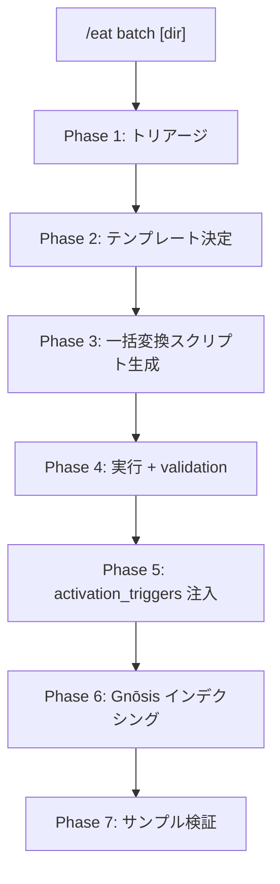

# /eat batch: 大量ファイル一括変換パイプライン

> **Hegemonikón**: S2 Mekhanē (調理) + A2 Krisis (消化)
> **目的**: 外部の大量プロンプト/ドキュメントを Library に一括変換配置する
>
> **制約**: 個別ファイルには /eat+ を使う。batch は10ファイル以上の一括処理用。

---

## 設計思想

| 課題 | 解決 |
|:-----|:-----|
| 大量ファイルの手動変換は非現実的 | Python スクリプトによる自動変換 |
| ファイルごとに品質がバラつく | 統一テンプレートと validation |
| 変換後に死蔵する | activation_triggers + Gnōsis 自動登録 |

> **教訓 (Brain リファクタ)**: 変換は自動化できるが、マッピングの正確性は人間の検証が必要。

---

## 発動条件

| トリガー | 説明 |
|:---------|:-----|
| `/eat batch [ディレクトリ]` | 指定ディレクトリ内の全ファイルを一括変換 |
| 「これ全部 Library に入れて」 | 自然言語トリガー |

---

## パイプライン



---

## 処理フロー

// turbo-all

### Phase 1: トリアージ

1. ディレクトリ内の全ファイルを走査
2. ファイル形式を判定 (XML/HTML/Markdown/JSON/plain)
3. カテゴリ分類: prompt / system-instruction / template / document / other
4. 変換対象/除外対象を Creator に報告

**出力**:

| 項目 | 内容 |
|:-----|:-----|
| 総ファイル数 | {N} |
| 変換対象 | {N} (内訳: prompt {N}, SI {N}, template {N}) |
| 除外 | {N} (理由: binary/duplicate/etc) |

---

### Phase 2: テンプレート決定

カテゴリごとに出力テンプレートを決定:

| カテゴリ | テンプレート | 配置先 |
|:---------|:-------------|:-------|
| prompt | YAML frontmatter + プロンプト本体 | `modules/` |
| dev-protocol | YAML frontmatter + プロトコル定義 | `modules/dev/` |
| system-instruction | YAML frontmatter + SI 本体 | `system-instructions/` |
| template | YAML frontmatter + テンプレート本体 | `templates/{name}/` |

**YAML frontmatter 必須フィールド**:

```yaml
name: "モジュール名"
origin: "{ソース名}"
category: "{カテゴリ}"
hegemonikon_mapping: "{HGK WF/Skill 対応}"
model_target: "universal"
```

---

### Phase 3: 一括変換スクリプト生成

1. Phase 1-2 の結果を基に Python スクリプトを自動生成
2. 変換ロジック: 旧形式解析 → YAML frontmatter 生成 → Markdown 本文整形
3. モデル固有表現の汎用化 (e.g., "Gemini 3 Pro" → "universal")

**スクリプト規約**:

- 入出力パスは引数で指定
- dry-run モード必須
- 変換ログを stdout に出力
- エラー時はスキップして継続

---

### Phase 4: 実行 + validation

1. dry-run で変換結果をプレビュー
2. Creator 承認後に本実行
3. YAML frontmatter の構文チェック (yaml.safe_load)
4. 必須フィールドの存在チェック

---

### Phase 5: activation_triggers 注入

`scripts/add_activation_triggers.py` を再利用:

1. 変換済みファイルに activation_triggers を注入
2. essence (核心3-5行) を抽出・注入

---

### Phase 6: Gnōsis インデクシング

`scripts/index_library.py` を再利用:

1. 新ファイルを prompts テーブルに追加
2. セマンティック検索で検証

---

### Phase 7: サンプル検証

1. 変換済みファイルの3-5個をランダムサンプル
2. YAML frontmatter の正確性を確認
3. HGK マッピングの妥当性を検証
4. Gnōsis 検索で発見可能性を確認

---

## 再利用可能スクリプト群

| スクリプト | 用途 | パス |
|:-----------|:-----|:-----|
| `add_activation_triggers.py` | triggers/essence 注入 | `scripts/` |
| `index_library.py` | Gnōsis インデクシング | `scripts/` |
| `refine_forge_triggers.py` | Forge triggers 精緻化 | `scripts/` |

---
