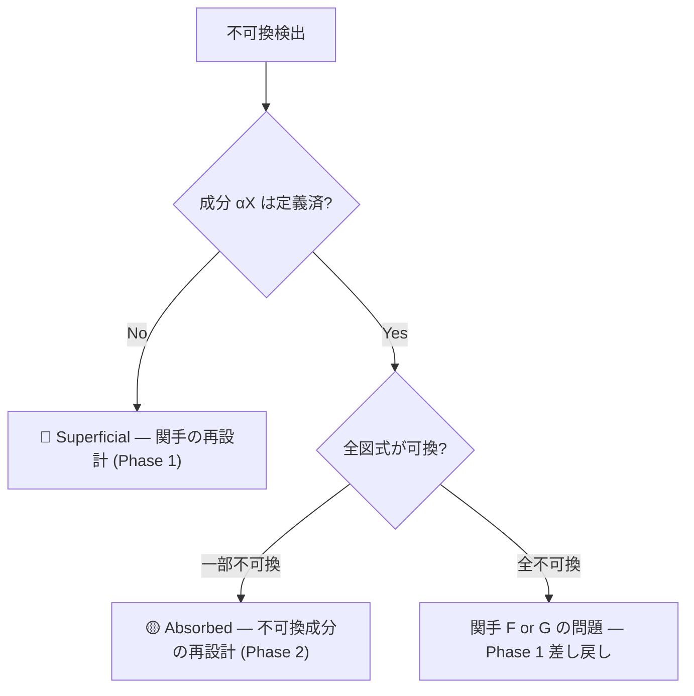

# /fit: 消化品質診断 (Triangle Identity Verification)

> **親クラス (抽象)**: [A2 Krisis SKILL.md § 消化原則](file:///home/makaron8426/oikos/.agent/skills/akribeia/a2-krisis/SKILL.md)
> **目的**: 随伴 F⊣G の三角恒等式が成立しているか検証する（消化 = 分解⇆再構成の往復が恒等的）
> **親コマンド**: /dia

---

## ⚠️ 実行前必須: 親クラス読み込み

> **このステップは省略禁止。必ず実行すること。**

```text
実行手順:
1. view_file ツールで A2 SKILL.md を読み込む
   パス: /home/makaron8426/oikos/.agent/skills/akribeia/a2-krisis/SKILL.md
2. 「消化原則 (Digestion Principle)」セクションを確認
3. 3段階消化レベルと4つのチェックリストを理解
4. 確認後、以下の具体的手順を実行
```

---

## 第一原理: 三角恒等式

> **「消化とは、分解して再構成しても元に戻ること」**
> **「既知を忘却して再構成し直すことが第零原則」** — Creator, 2026-02-10

```
     F = Eat    (取り込み = 自由構成)
Ext ←────────────────────────────→ Int
     G = Forget (忘却    = 第一原理分解)

三角恒等式:
  左: ε_F(X) ∘ F(η_X) = id_F(X)
      取込→分解→再取込→counit = 恒等
  右: G(ε_Y) ∘ η_G(Y) = id_G(Y)
      分解→取込→分解→unit = 恒等
```

| 概念 | v4.0 定義 | v5.0 定義 (随伴) |
|:-----|:-------|:-----------|
| 消化 | 自然変換 α: F ⟹ G | **随伴 F⊣G の確立** |
| 付着 | 可換性崩壊 | **G で分解せず F のみ実行（随伴未確立）** |
| Naturalized | 全可換図式が成立 | **両方の三角恒等式が成立** |
| Drift | — | **1 - ε（構造の非冗長性の欠損）** |

### なぜ三角恒等式が本質か

三角恒等式が崩れている = **分解⇆再構成の往復で元に戻らない** = **随伴がない**

- η ≈ id: 取り込んで(F)分解して(G)戻したら、元のチャンクが全部残る（情報保存）
- ε ≈ id: 分解して(G)再構成して(F)戻したら、元の構造が復元する（非冗長性）
- Drift = 1 - ε: /boot⊣/bye と同型の測定方法

---

## Hegemonikón 哲学

> **「システムの末端、端の端まで、可能な限り統制し、一貫させる」**

| 原理 | 圏論的意味 |
|:-----|:-----------|
| エントロピー最小化 | 可換図式の不成立 = 局所的エントロピー増大 |
| 美的整合性 | 全ての図式が可換 = 美しい |
| 消化 > 吸収 | 自然変換 > 単なるマッピング |

---

## STEP 0: SKILL.md 読込（必須・省略不可）

> **環境強制**: このステップを飛ばして PHASE に進んではならない。
> パスは以下にリテラルで記載されている。「パスがわからない」は発生しない。

// turbo

```
view_file /home/makaron8426/oikos/hegemonikon/.agent/skills/akribeia/a2-krisis/SKILL.md
```

---

## 発動条件

| トリガー | 説明 |
|:---------|:-----|
| `/fit [対象]` | 特定の統合対象を可換性検証 |
| `/fit` | 直近の統合作業を診断 |
| 「馴染んでる？」 | 自然言語トリガー |
| 「可換？」 | 圏論的トリガー |

---

## 実行手順

// turbo-all

### Step 0: 随伴の特定

```yaml
診断対象:
  素材: [消化された外部コンテンツ]
  関手F: [Ext → Int: 取り込み関手（自由構成）]
  関手G: [Int → Ext: 忘却関手（第一原理分解）]
  η: [unit: Id_Ext → G∘F の各成分]
  ε: [counit: F∘G → Id_Int の各成分]
```

---

## 階層的可換性検証プロトコル

### Level 0: 成分列挙 (Component Enumeration)

> 旧: 原子分解 → 新: 自然変換の成分を列挙

```yaml
process:
  1. 外部圏 Ext の対象と射を確認:
     Ext:
       対象: [A, B, C, ...]
       射:   [f: A→B, g: B→C, ...]

  2. 自然変換 α の成分を列挙:
     α:
       αA: F(A) → G(A)   # 概念Aの調理結果
       αB: F(B) → G(B)   # 概念Bの調理結果
       αC: F(C) → G(C)   # 概念Cの調理結果

output: 成分の一覧表
```

### Level 1: 成分検証 (Component Verification)

> 旧: 単体消化 → 新: 各成分 αX が well-defined か

```yaml
process:
  FOR EACH 対象 X in Ext:
    1. αX: F(X) → G(X) が定義されているか？
       - F(X) が特定されているか → 素朴マッピング存在確認
       - G(X) が特定されているか → 消化先WF存在確認
       - αX (変換パッチ) が具体的か → 変換内容の明確性
    2. αX が well-defined か？
       - F(X) の全要素が G(X) に写像されているか (情報ロスなし)
       - G(X) に不要な「付着」がないか

判定:
  ✅ 全成分 well-defined → Level 2 へ
  ⚠️ 一部成分が曖昧 → 成分の再設計
  ❌ 成分が定義できない → 関手の再設計
```

### Level 2: 可換性検証 (Commutativity Verification)

> 旧: 分子消化 → 新: 各射 f に対する可換図式の検証

```yaml
process:
  FOR EACH 射 f: A→B in Ext:
    1. 経路1を追跡: αB ∘ F(f)
       F(A) --F(f)--> F(B) --αB--> G(B)
    2. 経路2を追跡: G(f) ∘ αA
       F(A) --αA--> G(A) --G(f)--> G(B)
    3. 両経路の結果を比較:
       経路1 = 経路2 → ✅ 可換
       経路1 ≠ 経路2 → ⚠️ 不可換

判定:
  ✅ 全射で可換 → Level 3 へ
  ⚠️ 一部不可換 → 不可換な成分を特定し再設計
  ❌ 大部分が不可換 → 関手そのものの問題、Phase 1 へ差し戻し
```

### Level 3: 三角恒等式検証 (Triangle Identity Verification) — v5.0 更新

> v4.0: 自然変換全体の well-definedness → v5.0: 三角恒等式の成立

```yaml
process:
  1. 全成分が well-defined (Level 1 通過)
  2. 全可換図式が成立 (Level 2 通過)
  3. 関手性チェック:
     - F が射の合成を保存: F(g∘f) = F(g)∘F(f)
     - G が射の合成を保存: G(g∘f) = G(g)∘G(f)
  4. 三角恒等式検証:
     左: ε_F(X) ∘ F(η_X) = id_F(X)
       → X を取込(F)→分解(G)→再取込(F)→counit(ε) = 元と同じ？
     右: G(ε_Y) ∘ η_G(Y) = id_G(Y)
       → Y を分解(G)→取込(F)→分解(G)→unit(η) = 元と同じ？
  5. Drift 測定:
     Drift = 1 - ε
     → /boot⊣/bye の Drift と同じ構造

判定:
  🟢 Naturalized — 両方の三角恒等式が成立 (Drift ≤ 20%)
  🟡 Absorbed — η は成立するが ε が不完全、または逆 (20% < Drift ≤ 50%)
  🔴 Superficial — F or G が well-defined でない (Drift > 50%)
```

---

## 診断ステップ (6-Step Process)

### Step 1: 成分存在チェック (Component Existence)

**問い**: 全ての αX が定義されているか？

```python
for X in Ext.objects:
    if alpha[X] is None:
        return "Superficial"  # 成分未定義
    if not is_well_defined(alpha[X]):
        return "Absorbed"     # 成分が曖昧
```

**チェック項目**:

- [ ] 全概念に対して消化先が特定されている
- [ ] 消化パッチ（αX）が具体的に記述されている
- [ ] 情報ロスが発生していない

### Step 2: 境界残存チェック (Boundary Detection)

**問い**: 素材の「形」がまだ見えるか？（可換性の表面的検証）

**チェック項目**:

- [ ] 素材名がそのまま残っていない
- [ ] 「移行元」への参照が本文中にない（Lineageは可）
- [ ] 統合先の用語体系に統一されている
- [ ] 素材固有の概念が Hegemonikón 用語に翻訳されている

### Step 3: 可換性チェック (Commutativity Check)

**問い**: 全ての射 f で αB∘F(f) = G(f)∘αA が成立するか？

```yaml
FOR EACH f: A→B in Ext:
  経路1: F(A) → F(B) → G(B)  # αB ∘ F(f)
  経路2: F(A) → G(A) → G(B)  # G(f) ∘ αA

  可換性: ✅ / ⚠️
  不可換の場合の原因:
    - αA の設計が射 f を考慮していない
    - G(f) が F(f) と構造的に異なる
    - 消化先に「境界」が残っている
```

### Step 3.5: Anti-Spec 検証 (Negative Naturality) — v4.1 追加

**問い**: 自然変換 α は**してはならない変換**を避けているか？

> **導出**: Prompt R&D Lab #48「往復整合プロンプティング」の反仕様 (Anti-Spec) 概念を /fit に統合。
> **圏論的意味**: 自然変換の kernel (核) の検証。α の像が G(X) 内に収まるだけでなく、G(X) の禁止部分集合を避けることを検証する。

```yaml
anti_spec:
  定義: 消化時に「破壊してはならないもの」のリスト
  テンプレート:
    - "αX は既存 WF の cognitive_algebra の意味を変えてはならない"
    - "αX は既存の CCL 文法を破壊してはならない"
    - "αX は SACRED_TRUTH.md に矛盾する変換を導入してはならない"
    - "αX は消化先 WF の lineage を切断してはならない"
    - "{素材固有の Anti-Spec をここに追加}"

process:
  FOR EACH 成分 αX:
    FOR EACH anti_spec_rule:
      1. αX の出力が禁止領域に入っていないか検証
      2. 入っている場合 → ⛔ Anti-Spec 違反
      3. 判定:
         ✅ 全 Anti-Spec をクリア → Step 4 へ
         ⛔ 違反あり → αX の再設計。消化レベルは最大でも Absorbed
```

**チェック項目**:

- [ ] 既存 WF の cognitive_algebra が変更されていない
- [ ] CCL 文法が破壊されていない
- [ ] SACRED_TRUTH.md との矛盾がない
- [ ] 消化先 WF の lineage が維持されている
- [ ] 素材固有の Anti-Spec が定義され、全てクリアしている

### Step 4: 強化度評価 (Empowerment Score)

**問い**: 自然変換 α は価値を生んでいるか？

| 評価軸 | 問い | スコア |
|:-------|:-----|:-------|
| capability_expansion | 消化前にできなかったことができるようになったか？ | 0-3 |
| coherence_improvement | 統合先の一貫性は上がったか？ | -1, 0, +1 |
| cognitive_load_reduction | ユーザーが覚えることは減ったか？ | -1, 0, +1 |

**empowerment_score** = capability + coherence + cognitive (最大5, 最小-2)

### Step 5: 消化レベル判定 (Adjunction Level)

| レベル | 圏論的条件 | 実践的意味 | Drift |
|:-------|:-----------|:-----------|:------|
| 🟢 Naturalized | 両方の三角恒等式が成立 | 境界消失、「元からあった」 | ≤ 20% |
| 🟡 Absorbed | η 成立だが ε 不完全、または逆 | 機能するが境界が見える | 20-50% |
| 🔴 Superficial | F or G が well-defined でない | 関手の再設計が必要 | > 50% |

### Step 6: レポート出力

```
━━━ /fit: 三角恒等式検証レポート (v5.0) ━━━

📋 対象: {素材名}
🔀 随伴: F⊣G (Eat ⊣ Forget)

━━━ 関手検証 ━━━

| 対象 X | F(X) | G(Y) | 関手性 |
|:-------|:-----|:-----|:-------|
| A | {F(A)} | {G(F(A))} | ✅/⚠️ |

━━━ η 検証 (情報保存率) ━━━

  η_X: X → G(F(X))
  X を取り込み(F) → 分解(G) → 元のチャンクが残るか？
  結果: {情報保存率}% — ✅/⚠️

━━━ ε 検証 (構造の非冗長性) ━━━

  ε_Y: F(G(Y)) → Y
  Y を分解(G) → 再構成(F) → 元の構造に戻るか？
  結果: {非冗長性}% — ✅/⚠️

━━━ 三角恒等式 ━━━

  左: ε_F(X) ∘ F(η_X) = id_F(X)? {✅/⚠️}
  右: G(ε_Y) ∘ η_G(Y) = id_G(Y)? {✅/⚠️}

━━━ 判定 ━━━

  消化レベル: [🔴 Superficial / 🟡 Absorbed / 🟢 Naturalized]
  Drift: {1-ε}%
  強化スコア: {N}/5

━━━ 推奨アクション ━━━

| 優先度 | アクション | 理由 |
|:-------|:-----------|:-----|
| P1 | {action} | {reason} |

📌 結論: {総合評価 - 1文で}
```

---

## 消化失敗時の対応



---

## 使用例

### 例1: 完全消化 (Naturalized)

```
/fit M-1 仮想ユーザー座談会 → /syn

━━━ 成分検証 ━━━
| 対象 X | F(X) | G(X) | αX | 状態 |
| ユーザーペルソナ | 新規WF /vox | /syn Persona Mode | Mode追加 | ✅ |
| 多視点評価 | 新規WF /eval | /syn 既存機能 | 包含 | ✅ |
| 専門家召喚 | 独立機能 | /syn Persona Mode | 吸収 | ✅ |

━━━ 可換性検証 ━━━
  f: ユーザーペルソナ → 多視点評価 (ペルソナは評価の一形態)
  経路1: /vox → /eval → /syn 既存 = /syn 多視点
  経路2: /vox → /syn Persona → /syn 多視点 = /syn 多視点
  結果: ✅ 可換

消化レベル: 🟢 Naturalized
📌 M-1 は /syn の一部として自然変換された。
```

### 例2: 部分消化 (Absorbed)

```
/fit HEPHAESTUS → tekhne-maker v6.0

━━━ 可換性検証 ━━━
  f: ArchReview → StressTest (レビューはストレスの前提)
  経路1: HEPH.arch → HEPH.stress → /mek stress = /mek stress
  経路2: HEPH.arch → /mek SAGE → ??? = 「HEPHAESTUS Architecture」用語が残存
  結果: ⚠️ 不可換（SAGE Mode 内に境界が残存）

消化レベル: 🟡 Absorbed
📌 機能は統合済だが、「HEPHAESTUS」用語の境界が可換性を崩している。
推奨: P2 — SAGE Mode 説明から固有名詞を一般化し、可換性を回復する。
```

---

## Artifact 出力保存規則

**保存先**: `<artifact_directory>/fit_<target>.md`

**保存理由**:

1. **可換性の履歴** — 時系列で可換図式の充足率を追跡
2. **改善アクションの記録** — 不可換成分の特定と修正
3. **セッション跨ぎで継続** — 未完の可換性回復を引き継ぎ

---

## Hegemonikon Status

| Module | Workflow | Skill (親クラス) | Status |
|:-------|:---------|:-----------------|:-------|
| A2 Krisis | /fit | [消化原則](file:///home/makaron8426/oikos/.agent/skills/akribeia/a2-krisis/SKILL.md) | v5.0 Ready |

---

*v3.1 — 親子アーキテクチャ適用 (2026-02-07)*
*v4.0 — 自然変換統合。消化診断を可換図式の検証として再設計。Superficial/Absorbed/Naturalized を圏論的に再定義 (2026-02-08)*
*v4.1 — Anti-Spec (反仕様) 追加。Step 3.5 として否定的可換性検証を導入 (2026-02-10)*
*v5.0 — 随伴昇格。可換性→三角恒等式。F⊣G の η(情報保存率)/ε(構造非冗長性)/Drift(1-ε) を導入。Level 0-2 は維持し Level 3 を拡張 (2026-02-10)*
