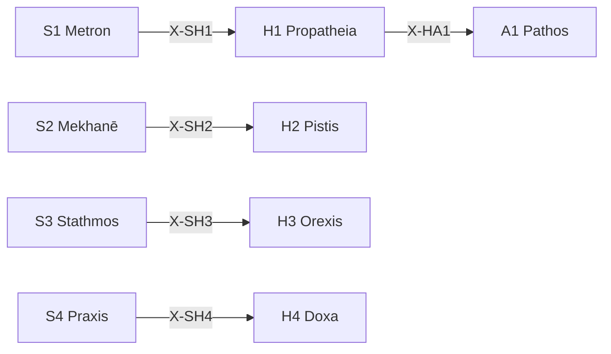

# /h: 動機 Peras (Hormē)

> **Hegemonikón Layer**: Hormē (H-series)
> **定義**: `/h` = `lim(H1·H2·H3·H4)` — L1×L1.75 の極限演算
> **目的**: 傾向・確信・欲求・信念の4定理を**1つの動機的判断に収束**させる
> **派生**: 12派生（H1-H4 各3派生）
>
> **制約**: 全4定理 → 融合(Convergence)。途中の省略は`-`モード実行時のみ許容。

---

## Limit / Colimit

| 演算 | 記号 | 圏論 | 意味 |
|:-----|:-----|:-----|:-----|
| `/h` | `/` | **Limit** | 4定理 → 最適な1収束点 |
| `\h` | `\` | **Colimit** | 4定理 → 全組み合わせに展開 |
| `/h+` | `+` | Limit強度↑ | より深い収束 |
| `/h-` | `-` | Limit強度↓ | 軽い収束 |

### 米田の補題 (Yoneda)

> 各定理 T は Hom(-, T) で完全に決まる。X-series が定理の意味そのもの。
> Limit `/h` = 4定理の動機的射が一致する Cone の頂点。
> @converge = Cone を構築し、動機の収束点を見つける操作。

---

## H-Series 12派生マトリックス

| 定理 | 問い | 派生1 | 派生2 | 派生3 |
|:-----|:-----|:------|:------|:------|
| **H1 Propatheia** | どう反応したい？ | `appr` (接近) | `avoi` (回避) | `arre` (保留) |
| **H2 Pistis** | どれくらい確か？ | `subj` (主観) | `inte` (間主観) | `obje` (客観) |
| **H3 Orexis** | 何を欲している？ | `targ` (対象志向) | `acti` (活動志向) | `stat` (状態志向) |
| **H4 Doxa** | どう信じている？ | `sens` (感覚的) | `conc` (概念的) | `form` (形式的) |

### 派生選択ロジック

```python
from mekhane.fep.derivative_selector import select_derivative

result = select_derivative("H1", problem_context)
# → appr: 接近傾向 → avoi: 回避傾向 → arre: 保留
```

---

## 発動条件

| トリガー | 説明 |
|:---------|:-----|
| `/h` または `/horme` | Hormē シリーズを起動 |
| `/h [1-4]` | 特定の定理を指定して起動 |
| 動機・衝動の分析が必要 | 感情・信念の整理 |

---

## H-series 定理一覧

| # | ID | Name | Greek | 生成 | 役割 |
|:-:|:---|:-----|:------|:-----|:-----|
| 1 | **H1** | Propatheia | Προπάθεια | Flow × Valence | **流動傾向** — 接近/回避の初期反応 |
| 2 | **H2** | Pistis | Πίστις | Flow × Precision | **流動信頼** — 情報源への信頼度評価 |
| 3 | **H3** | Orexis | Ὄρεξις | Value × Valence | **流動欲求** — 欲求の優先順位付け |
| 4 | **H4** | Doxa | Δόξα | Value × Precision | **流動信念** — 信念の形成・蓄積 |

---

## 処理フロー

### `/h` (Limit — 収束) `@converge`

> **米田**: 各定理 Hn は Hom(-, Hn) で完全に決まる。
> @converge = 動機的射の Cone を構築し、「傾向・確信・欲求・信念が整合する唯一の動機」を見つける。

#### ⊕ C0: Precision Weighting (PW) — 実行時精度の決定

> **FEP**: Precision Weighting = 各情報チャネルの信頼度を動的に決定する操作。
> `+`/`-` は均等 PW（省略形）。`pw:` は不均等 PW（一般化）。

**明示指定**: `/h{pw: H2+, H3-}` → H2 (確信) を強化、H3 (欲求) を抑制

**暗黙推定**:

| 条件 | PW 推定 | 理由 |
|:-----|:--------|:-----|
| バイアス警告 (`/h.bias`) | バイアス元- | 偏った傾向を抑制 |
| 感情的文脈 | H1+ | 初期傾向を重視 |
| 知識確定文脈 | H4+ | 信念を重視 |
| 指定なし | 全0 (均等) | default |

→ **pw[H1..H4]** = 各定理の実行時精度重み [-1, +1]

---

**Cone 自動構築** (C1 の射の対比完了後に実行):

// turbo

```bash
cd ~/oikos/hegemonikon && PYTHONPATH=. .venv/bin/python mekhane/fep/cone_builder.py \
  --series H --pw "${PW_H:-}" \
  --file "$(PYTHONPATH=. .venv/bin/python -m mekhane.fep.wf_env_bridge export H)"
```

**射の列挙** (各定理の動機的射を計算):

1. **[H1 Propatheia]** Flow×Valence: Hom(-, H1) = 傾向の射 — 初期反応 (+/-)
2. **[H2 Pistis]** Flow×Precision: Hom(-, H2) = 確信の射 — 信頼度評価
3. **[H3 Orexis]** Value×Valence: Hom(-, H3) = 欲求の射 — 優先順位
4. **[H4 Doxa]** Value×Precision: Hom(-, H4) = 信念の射 — 蓄積

#### ⊕ C1: 射の対比 (Contrast) — Cone の射後検査

> **圏論**: 4つの動機的射が整合するか検査。傾向と信念が矛盾する = Cone が存在しない。

| 定理 | Hom(X, Hn) | pw | 出力要点 (1行) |
|:-----|:-----------|:--:|:---------------|
| H1 | 傾向の射 | {pw₁} | {初期傾向: 接近/回避} |
| H2 | 確信の射 | {pw₂} | {確信度: HIGH/MED/LOW} |
| H3 | 欲求の射 | {pw₃} | {欲求優先: ...} |
| H4 | 信念の射 | {pw₄} | {信念: ...} |

→ **V[outputs]** = 動機的射の散布度 (矛盾度: 0.0-1.0)

#### ⊕ C2: Cone の頂点探索 (Resolve) — PW 加重融合

> **圏論**: V[outputs] + PW 重み に応じて、加重融合で中介射を構築する。
> 統合出力 = Σ(定理_i × (1 + pw_i)) / Σ(1 + pw_i)

| V[outputs] | Cone 状態 | 中介射の構築法 |
|:-----------|:---------|:-------------------|
| > 0.3 | 動機矛盾 | `/dia.root` + **PW 加重融合** |
| > 0.1 | 微妙な葛藤 | **PW 加重融合** (`@reduce(*, pw)`) |
| ≤ 0.1 | 動機一致 | PW ≠ 0 なら加重集約、= 0 なら `Σ` |

#### ⊕ C3: Kalon 普遍性検証 (Verify) — Cone の普遍性

> **圏論**: 「この動機的判断が唯一の自然な収束点か？」を検証。
> `/noe` Phase 3 (Kalon) と同じ原理を `/h` のコンテキストに適用。

##### C3-a: 図式化 — 各定理出力を候補解として配置

| 定理 | 候補解 | 射 |
|:------|:-------|:---|
| H1 Propatheia | 前感情の結論 | 初期傾向 |
| H2 Pistis | 確信の結論 | 信頼度 |
| H3 Orexis | 欲求の結論 | 価値傾向 |
| H4 Doxa | 信念の結論 | 信念記録 |
| C2 | 融合判断 | 統合出力 |

##### C3-b: 因子分解テスト — 候補間の包含関係を判定

> **使用**: `mekhane.fep.universality.kalon_verify()`
> C2 の統合判断が他の全候補を特殊ケースとして含むか検証。

##### C3-c: Kalon スコア + 統合

| 項目 | 圏論的意味 | 内容 |
|:-----|:-------------|:-----|
| 矛盾度 | 射の散布 | V[outputs] = {0.0-1.0} |
| 解消法 | 中介射の構築法 | {root/weighted/simple} |
| **Kalon** | **普遍性の強さ** | {0.0-1.0} — 統合判断の包含力 |
| **動機的判断** | **Cone の頂点** | {1文で} |
| **確信度** | **普遍性 × 確信** | {C/U} ({confidence}%) |

---

### `\h` (Colimit — 展開) `@diverge`

#### ⊗ D1: スキャン (Scan) — 6対の張力評価

| # | 対 | 交差 | 問い | 張力 |
|:-:|:---|:-----|:-----|:----:|
| 1 | H1⊗H2 | (Flow×Val)⊗(Flow×Prec) | 傾向が確信をどう揺さぶるか | 低(同軸Flow) |
| 2 | H1⊗H3 | (Flow×Val)⊗(Val×Val) | 傾向が欲求をどう刺激するか | 中(半直交) |
| 3 | H1⊗H4 | (Flow×Val)⊗(Val×Prec) | 傾向が信念をどう形成するか | **高(完全直交)** |
| 4 | H2⊗H3 | (Flow×Prec)⊗(Val×Val) | 確信が欲求をどう制御するか | **高(完全直交)** |
| 5 | H2⊗H4 | (Flow×Prec)⊗(Val×Prec) | 確信が信念をどう補強するか | 中(半直交) |
| 6 | H3⊗H4 | (Val×Val)⊗(Val×Prec) | 欲求が信念をどう書き換えるか | 低(同軸Val) |

#### ⊗ D2: 深掘り (Probe) — 上位3対

高張力対 (#3, #4, #2 or #5) に `/zet+` → `/noe-` を適用:

- **H1⊗H4**: 傾向(Flow×Val)と信念(Val×Prec)の完全直交 → 直感と信念の乖離
- **H2⊗H3**: 確信(Flow×Prec)と欲求(Val×Val)の完全直交 → 理性と欲望の葛藤

#### ⊗ D3: 盲点レポート

| 項目 | 内容 |
|:-----|:-----|
| 最高張力対 | {pair} (tension: {score}) |
| 盲点 | 1. {発見1} / 2. {発見2} / 3. {発見3} |
| 確信度 | {C/U} ({confidence}%) |
| 記録先 | `/dox.sens` → {path} |

### `/h.bias` (バイアス検出) — CEP-001

> **CCL**: `V[/h]` (CEP-001 FEP記号拡張 B1)

傾向のエントロピーを測定し、認知バイアスを検出する。

**判定ロジック**:

```ccl
V[/h] >> {
    I: V[] > 0.7 { "⚠️ 高バイアス: 傾向が偏っている" >> /dia.root }
    I: V[] > 0.4 { "📊 中程度: 注意が必要" }
    I: V[] <= 0.4 { "✅ バランス良好" }
}
```

**出力**: 傾向エントロピー(0.0-1.0) → 偏り方向(接近過多/回避過多/バランス) → 主要バイアス → 高バイアス時 `/dia.root` 推奨

### `/h [N]` (単体駆動)

SKILL.md を参照し、指定定理のみ実行。

---

## 出力形式

| 項目 | 内容 |
|:-----|:-----|
| 定理 | H{N} {Name} |
| 対象 | {対象} |
| 傾向 | {+/-} 強度: {0-100} |
| 次の推奨 | → A{X} / K{Y} |

---

## X-series 接続



---

## Hegemonikon Status

| Module | Workflow | Status |
|:-------|:---------|:-------|
| H1-H4 | /h | v5.0 Ready |

---

*v5.0 — Limit演算復元 (2026-02-07)*
*v5.1 — 米田の補題統合 (2026-02-08)*
*v5.2 — 米田深層統合。@converge C1-C3 を Cone 構築として再定義 (2026-02-08)*
