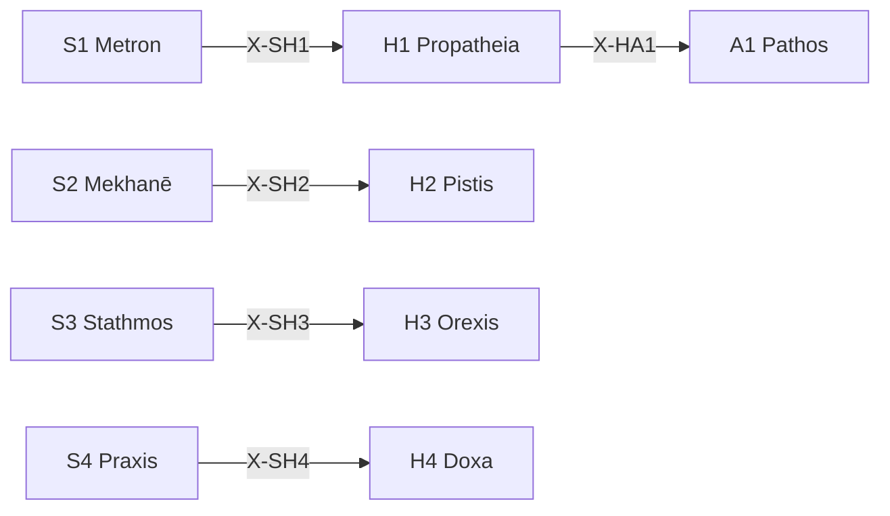

# /h: 動機定理ワークフロー

> **Hegemonikón Layer**: Hormē (H-series)
> **目的**: 傾向・信頼・欲求・信念の4軸で動機を処理する
> **派生**: 12派生（H1-H4 各3派生）

---

## H-Series 12派生マトリックス

| 定理 | 問い | 派生1 | 派生2 | 派生3 |
|:-----|:-----|:------|:------|:------|
| **H1 Propatheia** | どう反応したい？ | `appr` (接近) | `avoi` (回避) | `arre` (保留) |
| **H2 Pistis** | どれくらい確か？ | `subj` (主観) | `inte` (間主観) | `obje` (客観) |
| **H3 Orexis** | 何を欲している？ | `targ` (対象志向) | `acti` (活動志向) | `stat` (状態志向) |
| **H4 Doxa** | どう信じている？ | `sens` (感覚的) | `conc` (概念的) | `form` (形式的) |

### FEP 派生選択

```python
from mekhane.fep.derivative_selector import select_derivative

# 例: 前感情反応
result = select_derivative("H1", "これには惹かれる、興味がある")
# → DerivativeRecommendation(derivative="appr", confidence=0.75)

# 例: 確信レベル
result = select_derivative("H2", "データによると、証拠がある")
# → DerivativeRecommendation(derivative="obje", confidence=0.80)
```

---

## 発動条件

| トリガー | 説明 |
| :-------- | :---- |
| `/h` または `/horme` | Hormē シリーズを起動 |
| `/h [1-4]` | 特定の定理を指定して起動 |
| 動機・衝動の分析が必要 | 感情・信念の整理 |

---

## H-series 定理一覧

| # | ID | Name | Greek | 役割 |
|:-:| :--- | :----- | :------ | :----- |
| 1 | **H1** | Propatheia | Προπάθεια | **流動傾向** — 接近/回避の初期反応 |
| 2 | **H2** | Pistis | Πίστις | **流動信頼** — 情報源への信頼度評価 |
| 3 | **H3** | Orexis | Ὄρεξις | **流動欲求** — 欲求の優先順位付け |
| 4 | **H4** | Doxa | Δόξα | **流動信念** — 信念の形成・蓄積 |

---

## Process

### `/h` (全体駆動)

```text
入力: 状況 S
  ↓
[H1 Propatheia] 初期傾向を検出 (+/-)
  ↓
[H2 Pistis] 情報源の信頼度を評価
  ↓
[H3 Orexis] 欲求を優先順位付け
  ↓
[H4 Doxa] 信念として蓄積
  ↓
出力: 動機的処理結果
```

### `/h.bias` (バイアス検出) — CEP-001

> **CCL**: `V[/h]`
> **Origin**: CEP-001 FEP 記号拡張 B1

傾向のエントロピーを測定し、認知バイアスを検出する。

**判定ロジック**:

```ccl
V[/h] >> {
    I: V[] > 0.7 { "⚠️ 高バイアス: 傾向が偏っている" >> /dia.root }
    I: V[] > 0.4 { "📊 中程度: 注意が必要" }
    I: V[] <= 0.4 { "✅ バランス良好" }
}
```

**出力形式**:

```text
🧠 バイアス検出 (V[/h])
  傾向エントロピー: {0.0-1.0}
  偏りの方向: {接近過多 | 回避過多 | バランス}
  主要バイアス: {確証バイアス | 現状維持 | 損失回避}
  
→ 高バイアス: /dia.root で根源探索を推奨
```

### `/h 1` (H1 Propatheia 単体)

```text
入力: 対象
  ↓
SKILL.md 参照: .agent/skills/horme/h1-propatheia/SKILL.md
  ↓
[STEP 1] 傾向検出（接近 + / 回避 -）
[STEP 2] 傾向の強度評価
  ↓
出力: 傾向ベクトル (方向, 強度)
```

---

## 出力形式

```markdown
┌─[Hegemonikón]──────────────────────┐
│ H{N} {Name}: 動機処理完了          │
│ 対象: {対象}                       │
│ 傾向: {+/-} 強度: {0-100}          │
│ 次の推奨: → A{X} / K{Y}            │
└────────────────────────────────────┘
```

---

## X-series 接続



---

## Hegemonikon Status

| Module | Workflow | Status |
| :------ | :-------- | :------ |
| H1-H4 | /h | v2.1 Ready |
