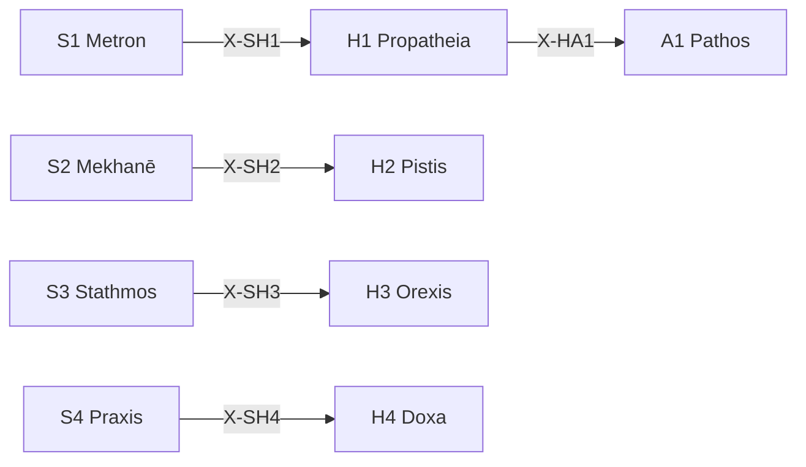

# /h: 動機定理ワークフロー (Hormē)

> **Hegemonikón Layer**: Hormē (H-series)
> **定義**: `/h` = `lim(H1·H2·H3·H4)` — L1×L1.75 の極限演算
> **目的**: 傾向・確信・欲求・信念の4定理を**1つの動機的判断に収束**させる
> **派生**: 12派生（H1-H4 各3派生）
>
> **制約**: 全4定理 → 融合(Convergence)。途中の省略は`-`モード実行時のみ許容。

---

## Limit / Colimit

| 演算 | 記号 | 圏論 | 意味 |
|:-----|:-----|:-----|:-----|
| `/h` | `/` | **Limit** | 4定理 → 最適な1収束点 |
| `\h` | `\` | **Colimit** | 4定理 → 全組み合わせに展開 |
| `/h+` | `+` | Limit強度↑ | より深い収束 |
| `/h-` | `-` | Limit強度↓ | 軽い収束 |

---

## H-Series 12派生マトリックス

| 定理 | 問い | 派生1 | 派生2 | 派生3 |
|:-----|:-----|:------|:------|:------|
| **H1 Propatheia** | どう反応したい？ | `appr` (接近) | `avoi` (回避) | `arre` (保留) |
| **H2 Pistis** | どれくらい確か？ | `subj` (主観) | `inte` (間主観) | `obje` (客観) |
| **H3 Orexis** | 何を欲している？ | `targ` (対象志向) | `acti` (活動志向) | `stat` (状態志向) |
| **H4 Doxa** | どう信じている？ | `sens` (感覚的) | `conc` (概念的) | `form` (形式的) |

### 派生選択ロジック

```python
from mekhane.fep.derivative_selector import select_derivative

result = select_derivative("H1", problem_context)
# → appr: 接近傾向 → avoi: 回避傾向 → arre: 保留
```

---

## 発動条件

| トリガー | 説明 |
|:---------|:-----|
| `/h` または `/horme` | Hormē シリーズを起動 |
| `/h [1-4]` | 特定の定理を指定して起動 |
| 動機・衝動の分析が必要 | 感情・信念の整理 |

---

## H-series 定理一覧

| # | ID | Name | Greek | 生成 | 役割 |
|:-:|:---|:-----|:------|:-----|:-----|
| 1 | **H1** | Propatheia | Προπάθεια | Flow × Valence | **流動傾向** — 接近/回避の初期反応 |
| 2 | **H2** | Pistis | Πίστις | Flow × Precision | **流動信頼** — 情報源への信頼度評価 |
| 3 | **H3** | Orexis | Ὄρεξις | Value × Valence | **流動欲求** — 欲求の優先順位付け |
| 4 | **H4** | Doxa | Δόξα | Value × Precision | **流動信念** — 信念の形成・蓄積 |

---

## 処理フロー

### `/h` (Limit — 収束)

1. **[H1 Propatheia]** Flow×Valence: 初期傾向を検出 (+/-)
2. **[H2 Pistis]** Flow×Precision: 情報源の信頼度を評価
3. **[H3 Orexis]** Value×Valence: 欲求を優先順位付け
4. **[H4 Doxa]** Value×Precision: 信念として蓄積
5. **⊕ Convergence**: 4定理の出力を**1つの動機的判断**に融合

### `\h` (Colimit — 展開)

4定理の**全6対の交差関係**を展開し、動機間の相互作用を可視化する。

| # | 対 | 交差 | 問い |
|:-:|:---|:-----|:-----|
| 1 | H1⊗H2 | (Flow×Val)⊗(Flow×Prec) | 傾向が確信をどう揺さぶるか |
| 2 | H1⊗H3 | (Flow×Val)⊗(Val×Val) | 傾向が欲求をどう刺激するか |
| 3 | H1⊗H4 | (Flow×Val)⊗(Val×Prec) | 傾向が信念をどう形成するか |
| 4 | H2⊗H3 | (Flow×Prec)⊗(Val×Val) | 確信が欲求をどう制御するか |
| 5 | H2⊗H4 | (Flow×Prec)⊗(Val×Prec) | 確信が信念をどう補強するか |
| 6 | H3⊗H4 | (Val×Val)⊗(Val×Prec) | 欲求が信念をどう書き換えるか |

**⊗ Divergence**: 6対の交差から**動機の矛盾・隠れた欲求**を抽出

### `/h.bias` (バイアス検出) — CEP-001

> **CCL**: `V[/h]` (CEP-001 FEP記号拡張 B1)

傾向のエントロピーを測定し、認知バイアスを検出する。

**判定ロジック**:

```ccl
V[/h] >> {
    I: V[] > 0.7 { "⚠️ 高バイアス: 傾向が偏っている" >> /dia.root }
    I: V[] > 0.4 { "📊 中程度: 注意が必要" }
    I: V[] <= 0.4 { "✅ バランス良好" }
}
```

**出力**: 傾向エントロピー(0.0-1.0) → 偏り方向(接近過多/回避過多/バランス) → 主要バイアス → 高バイアス時 `/dia.root` 推奨

### `/h [N]` (単体駆動)

SKILL.md を参照し、指定定理のみ実行。

---

## 出力形式

| 項目 | 内容 |
|:-----|:-----|
| 定理 | H{N} {Name} |
| 対象 | {対象} |
| 傾向 | {+/-} 強度: {0-100} |
| 次の推奨 | → A{X} / K{Y} |

---

## X-series 接続



---

## Hegemonikon Status

| Module | Workflow | Status |
|:-------|:---------|:-------|
| H1-H4 | /h | v5.0 Ready |

---

*v5.0 — Limit演算復元 (2026-02-07)*
