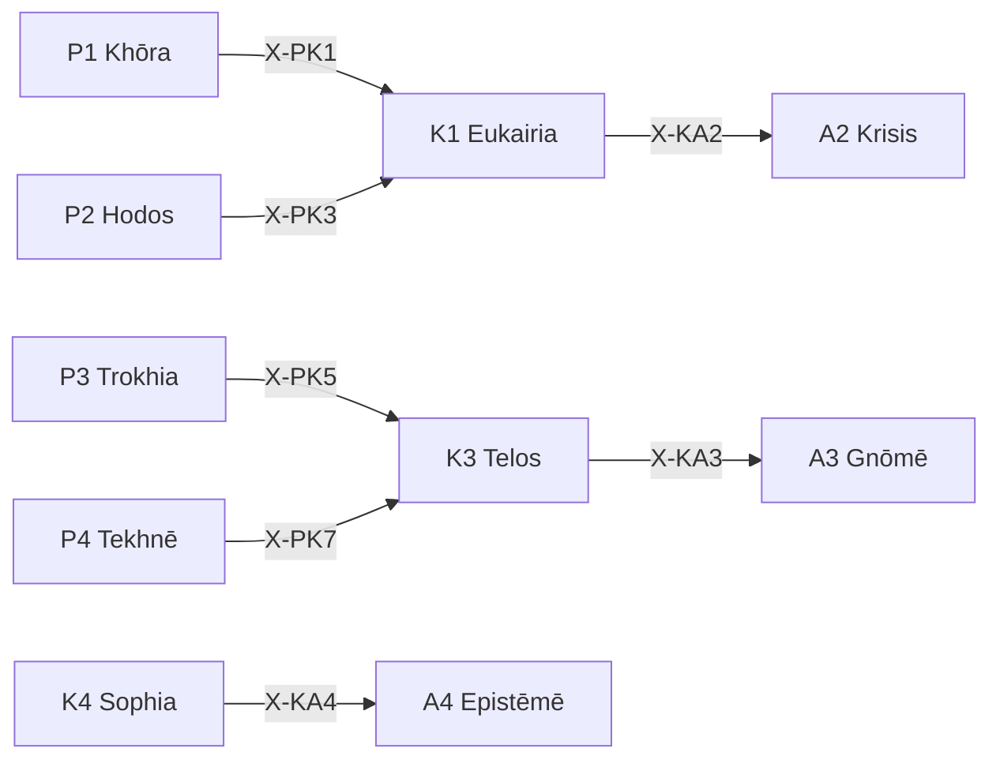

# /k: 文脈定理ワークフロー (12派生対応)

> **Hegemonikón Layer**: Kairos (K-series)
> **目的**: 好機・時間・目的・知恵の4軸で文脈を処理する
> **統合**: /pri (優先順位判定) を吸収済み

---

## 発動条件

| トリガー | 説明 |
| :-------- | :---- |
| `/k` または `/kairos` | Kairos シリーズを起動 |
| `/k [1-4]` | 特定の定理を指定して起動 |
| `/k pri` | **優先順位判定モード** (Eisenhower Matrix) ← 旧 /pri |
| `/k pri auto` | 現在のチャットから自動抽出して分類 |
| タイミング判断が必要 | 今か後か、好機の見極め |
| 「どれを先に？」 | 暗黙的トリガー → `/k pri` |

---

## K-series 定理一覧

| # | ID | Name | Greek | 役割 |
|:-:| :--- | :----- | :------ | :----- |
| 1 | **K1** | Eukairia | Εὐκαιρία | **好機判定** — 今が適時か |
| 2 | **K2** | Chronos | Χρόνος | **時間配置** — 時間軸上の配置 |
| 3 | **K3** | Telos | Τέλος | **目的整合** — 目的との整合確認 |
| 4 | **K4** | Sophia | Σοφία | **知恵適用** — 経験からの知恵 |

---

## Process

### `/k` (全体駆動)

```text
入力: 判断対象 D
  ↓
[K1 Eukairia] 好機判定（今か？待つか？）
  ↓
[K2 Chronos] 時間配置（いつ？どの期間？）
  ↓
[K3 Telos] 目的整合（目的に合うか？）
  ↓
[K4 Sophia] 知恵適用（過去の経験は？）
  ↓
出力: 文脈的判断
```

### `/k 1` (K1 Eukairia 単体)

```text
入力: 行動候補
  ↓
SKILL.md 参照: .agent/skills/kairos/k1-eukairia/SKILL.md
  ↓
[STEP 1] 機会評価
[STEP 2] リスク/リターン分析
[STEP 3] 好機判定（Go/Wait/Pass）
  ↓
出力: 好機判定結果
```

### `/k 3` (K3 Telos 単体)

```text
入力: 行動/判断
  ↓
SKILL.md 参照: .agent/skills/kairos/k3-telos/SKILL.md
  ↓
[STEP 1] 目的の明確化
[STEP 2] 整合性チェック
[STEP 3] 目的-手段整合度
  ↓
出力: 目的整合判定
```

---

## `/k pri`: 優先順位判定モード ← 旧 /pri

> **Origin**: 旧 `/pri.md` v3.0 を吸収
> **目的**: タスク・TODO・アイデアを投げたら、自動的に優先順位・緊急度・時間軸を分類
> **設計思想**: 「雑な入力 → 整理された出力」

### 処理フロー

```text
[Step 0] Precondition Check（発動前確認）
  ↓
[Step 1] タスク抽出 (Input Extraction)
  ↓
[Step 2] 評価 (Evaluation)
  - Goal Alignment (40%)
  - Urgency (30%)
  - Commitment (30%)
  ↓
[Step 3] 分類 (Eisenhower Matrix)
  ↓
[Step 4] Q2 保護メカニズム
  ↓
出力: Priority Decision → Artifact 保存
```

### Eisenhower Matrix

| 象限 | 定義 | アクション |
| :----- |:-----|:-----------|
| **Q1** | 重要 & 緊急 | 🔥 即時実行 |
| **Q2** | 重要 & 非緊急 | 🛡️ 計画・保護 |
| **Q3** | 非重要 & 緊急 | 📤 委任・縮小 |
| **Q4** | 非重要 & 非緊急 | 🗑️ 削除・後回し |

### Urgency マッピング

| 時間軸 | 期限 | urgency 値 |
| :------- | :----- |:----------:|
| **today** | ≤ 24h | 1.0 |
| **3days** | ≤ 72h | 0.8 |
| **week** | ≤ 7d | 0.6 |
| **3weeks** | ≤ 21d | 0.4 |
| **2months** | ≤ 60d | 0.2 |

### Q2 保護メカニズム

> **重要**: Q2 タスクは日常のQ1/Q3に埋もれやすい。強制的に浮上させる。

```yaml
min_q2_ratio: 0.2     # 出力の 20% 以上は Q2 を含める
q2_boost: 0.15        # Q2 タスクの priority_score に +0.15 ボーナス
daily_q2_slot: 1      # Top 3 に必ず 1 つは Q2 を含める
```

### Priority Decision 出力形式

```markdown
┌─[Hegemonikón]──────────────────────────────┐
│ /k pri: 優先順位判定完了                    │
│ 対象: [N]件 | Q2保護: [適用/対象なし]       │
└─────────────────────────────────────────────┘

## 🎯 Priority Decision (Top 5)

| # | Q | Task | Timeline | Score | Reason |
|:-:|:-:| :----- |:---------|------:| :------- |
| 1 | Q1 | タスクA | today | 0.92 | 期限切迫+コア機能 |

## 📊 Eisenhower Matrix

| Q1 (即時) | Q2 (計画) |
|:----------|:----------|
| ... | ... |

| Q3 (委任) | Q4 (削除) |
|:----------|:----------|
| ... | ... |
```

### 実行後の推奨アクション

| 象限 | 推奨アクション |
| :----- |:---------------|
| **Q1** | `/ene` で即時実行 |
| **Q2** | `/s` で計画策定 |
| **Q3** | 委任先を検討 |
| **Q4** | task.md から削除を提案 |

---

## 出力形式（通常モード）

```markdown
┌─[Hegemonikón]──────────────────────┐
│ K{N} {Name}: 文脈処理完了          │
│ 対象: {対象}                       │
│ 判定: {Go/Wait/Pass}               │
│ 時間軸: {即時/短期/中期/長期}       │
│ 次の推奨: → A{X} / O{Y}            │
└────────────────────────────────────┘
```

---

## X-series 接続



---

## 使用例

**例1: 今すぐ行動すべきか？**

```markdown
/k 1
→ K1 Eukairia: 好機判定
→ 機会窓: 狭い（24時間）
→ リスク: 中
→ 判定: Go
```

**例2: 目的と整合しているか？**

```markdown
/k 3
→ K3 Telos: 目的整合確認
→ 目的: 長期生産性向上
→ 行動: 短期的タスク
→ 整合度: 0.7（合格）
```

**例3: タスクの優先順位を判定**

```markdown
/k pri
→ タスク抽出: 8件
→ Q2保護: 2件にブースト適用
→ Top 3: Q1-タスクA, Q2-タスクB, Q1-タスクC
```

---

## Hegemonikon Status

| Module | Workflow | Status |
| :------ | :-------- | :------ |
| K1-K4 + Pri | /k | v3.0 Ready |

---

*v3.0 — /pri absorption (Eisenhower Matrix, Q2保護) (2026-01-29)*
